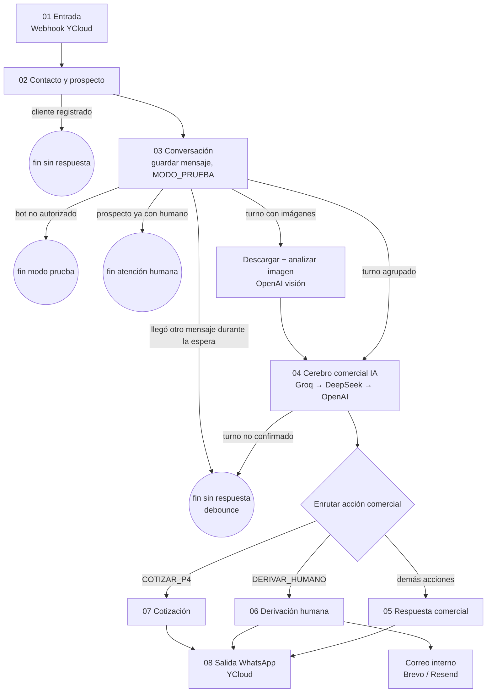
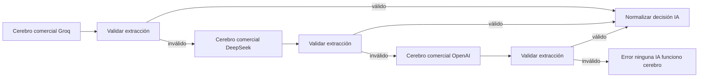

# Arquitectura del workflow Pegaso WhatsApp

Bot comercial de WhatsApp para **Pegaso Adhesivos** (imprenta de etiquetas adhesivas, Ecuador). Atiende prospectos, entiende la conversación con IA, cotiza etiquetas en polipropileno P4 y deriva a un humano cuando corresponde.

Todo corre en **un solo workflow de n8n**. Este documento describe el recorrido de un mensaje de punta a punta y qué archivo del repo implementa cada nodo Code.

## Piezas externas

| Pieza | Uso |
|---|---|
| YCloud | Webhook de mensajes entrantes y API de envío de WhatsApp |
| PostgreSQL | Contactos, prospectos, conversaciones, mensajes, cotizaciones, diseños, configuración |
| Groq → DeepSeek → OpenAI | Modelos de IA en cascada (si uno falla o devuelve algo inválido, se usa el siguiente) |
| OpenAI (visión) | Análisis de imágenes JPEG/PNG/WebP del cliente ("Analizar imagen"); un solo proveedor, sin cascada |
| Brevo → Resend | Correo interno al equipo cuando un prospecto requiere humano (Resend es respaldo) |

Credenciales, API keys y destinatarios de correo viven en los nodos HTTP/credenciales de n8n, **no** en este repo.

## Vista general

## Contratos entre etapas

Cada nodo Code recibe un objeto JSON y devuelve otro enriquecido. Los campos que viajan por todo el flujo son:

- **Identidad**: `telefono` (formato `593…`), `nombre_whatsapp`, `cliente_id`, `contacto_id`, `prospecto_id`, `conversacion_id`, `tipo_actor`.
- **Mensaje**: `mensaje` (el de esta ejecución) / `mensaje_actual` (desde "Preparar contexto IA": el **turno** completo, uno o varios mensajes por línea), `tipo` / `tipo_mensaje`, `canal`, `mensaje_externo_id`.
- **Turno**: `turno_mensaje_ids`, `turno_desde_id`, `turno_hasta_id`, `cantidad_mensajes_turno` (los arma "Resolver turno conversacional"; ver [turno conversacional](etapas/03-conversacion.md#turno-conversacional-debounce)).
- **Media**: imágenes, audios, videos y documentos viajan como texto controlado dentro de `mensaje` / `contenido` (`[IMAGEN] caption` + una línea de sistema; formato en [modelo-datos.md](modelo-datos.md#contenido-de-mensajes-con-media)). `media_turno` (desde "Preparar contexto IA") resume la evidencia visual del turno para "Normalizar decisión IA".
- **Prospecto**: `prospecto_estado`, `prospecto_clasificacion`, `prospecto_requiere_humano`, `prospecto_ciudad`, etc.
- **Decisión IA**: `intencion`, `accion`, `producto`, `cantidad`, `ancho_cm`, `alto_cm`, `forma`, `requiere_humano`, `motivo_derivacion`, `clasificacion_prospecto`, `respuesta_sugerida`.
- **`contexto_comercial`**: JSON persistido en la conversación con la cotización vigente, el handoff y restricciones. Es la "memoria" comercial entre mensajes.

Los nodos Postgres suelen devolver **solo la fila afectada**, no el objeto anterior. Por eso muchos nodos Code recuperan el contrato con `$('Nombre de nodo')` en lugar de confiar en `$input`. Si renombras un nodo en n8n, busca su nombre en `code/` y actualízalo.

---

## 01 · Entrada (`code/01-entrada/`)

Recibe el webhook y lo convierte en un mensaje normalizado. Soporta YCloud y Meta Cloud API directo. Siguen el flujo el **texto** y la **media** (imagen, audio, video, documento): la media entra como un texto controlado; las imágenes JPEG/PNG/WebP con enlace de YCloud quedan marcadas `[MEDIA_PENDIENTE]` para analizarse en la etapa 03, y lo demás como no procesable. Stickers, ubicaciones y contactos siguen sin procesarse.

Configuración detallada de cada nodo: [etapas/01-entrada.md](etapas/01-entrada.md).

| Nodo | Tipo | Archivo |
|---|---|---|
| Webhook YCloud | Webhook | — |
| Normalizar evento WhatsApp | Code | `normalizar-evento-whatsapp.js` |
| IF: ¿Evento WhatsApp procesable? | IF | — (`evento_whatsapp.procesable`) |
| Preparar entrada WhatsApp | Code | `preparar-entrada-whatsapp.js` |
| IF: ¿Apto para flujo de texto? | IF | — (`apto_para_flujo_conversacional`; antes `apto_para_flujo_texto`) |
| When clicking 'Execute workflow' + Mensaje entrante TEST | Trigger manual + Set | — (pruebas manuales) |
| Normalizar mensaje | Code | `normalizar-mensaje.js` |

`Normalizar mensaje` unifica la entrada real y la de prueba, y convierte teléfonos locales `09…` a `5939…`.

## 02 · Contacto y prospecto (`code/02-contacto-prospecto/`)

Identifica quién escribe. Los **clientes registrados** salen del flujo sin respuesta automática. Los demás se tratan como prospectos (se crean si no existen, estado inicial `NUEVO`).

Configuración detallada de cada nodo: [etapas/02-contacto-prospecto.md](etapas/02-contacto-prospecto.md).

| Nodo | Tipo | Archivo |
|---|---|---|
| Buscar Contacto | Postgres select | — |
| Resolver contacto | Code | `resolver-contacto.js` |
| ¿Cliente existente? | IF | — (true = fin) |
| Buscar prospecto | Postgres select | — |
| Resolver prospecto | Code | `resolver-prospecto.js` |
| IF: ¿Prospecto existe? | IF | — |
| Crear prospecto | Postgres insert | — |
| Preparar prospecto creado | Code | `preparar-prospecto-creado.js` |
| Unificar prospecto | Merge | — |

## 03 · Conversación (`code/03-conversacion/`)

Busca o crea la conversación (estado `ACTIVA`), guarda el mensaje entrante, aplica `MODO_PRUEBA`, espera la ventana del **turno conversacional** (3 s por defecto) y arma el contexto para la IA con todos los mensajes del turno. Solo la ejecución del último mensaje sigue (latest-wins); las demás terminan sin respuesta.

Configuración detallada de cada nodo: [etapas/03-conversacion.md](etapas/03-conversacion.md).

| Nodo | Tipo | Archivo |
|---|---|---|
| Buscar conversación | Postgres select | — |
| Resolver conversación prospecto | Code | `resolver-conversacion-prospecto.js` |
| IF: ¿Conversación prospecto existe? | IF | — |
| Crear conversación prospecto | Postgres insert | — |
| Preparar conversación creada | Code | `preparar-conversacion-creada.js` |
| Unificar conversación | Merge | — |
| Preparar conversación | Code | `preparar-conversacion.js` |
| Guardar mensaje entrante | Postgres insert | — |
| Obtener configuración MODO_PRUEBA | Postgres select | — |
| Resolver permiso automatización | Code | `resolver-permiso-automatizacion.js` |
| IF: ¿Puede responder el BOT? | IF | — (false = fin modo prueba) |
| Finalizar mensaje modo prueba | Code | `finalizar-mensaje-modo-prueba.js` |
| ¿Requiere atención humana? | IF | — (true = fin, ya lo atiende una persona) |
| Finalizar mensaje atención humana | Code | `finalizar-mensaje-atencion-humana.js` |
| Esperar ventana de turno | Wait (`debounce_segundos`) | — **nuevo** |
| Recuperar historial conversación | Postgres select | — (ahora después de la espera) |
| Resolver turno conversacional | Code | `resolver-turno-conversacional.js` **nuevo** |
| IF: ¿Procesar turno? | IF | — (`continuar_procesamiento`; false = fin sin respuesta) **nuevo** |
| Preparar media del turno | Code | `preparar-media-turno.js` **nuevo (imágenes)** |
| IF: ¿Hay imágenes por analizar? | IF | — (`analizar_imagen`; false = directo a Preparar contexto IA) **nuevo** |
| Descargar imagen YCloud | HTTP GET (Header Auth YCloud, respuesta File) | — **nuevo** |
| Analizar imagen | Basic LLM Chain + OpenAI Chat Model + Structured Output Parser | prompt `analisis-imagen.md`, schema `analisis-imagen.schema.json` **nuevo** |
| Validar análisis imagen | Code | `validar-analisis-imagen.js` **nuevo** |
| Guardar análisis imagen | Postgres update (`mensajes.contenido`) | — **nuevo** |
| Preparar contexto IA | Code | `preparar-contexto-ia.js` |

El mensaje entrante **siempre** queda guardado, aunque el bot no responda. Los caminos de modo prueba y atención humana no pasan por la espera.

Las imágenes se analizan **solo en la ejecución que gana el turno**, después de la espera: una ráfaga "texto / imagen / texto" es un turno con una sola llamada visual. El análisis queda guardado en `mensajes.contenido`, así que una ejecución posterior no lo repite. Fallos de descarga o de IA no detienen el flujo: la imagen pasa como "no analizada" y el turno se deriva con `IMAGEN_REQUIERE_REVISION`.

## 04 · Cerebro comercial (`code/04-cerebro-comercial/`)

La IA interpreta el mensaje con el historial y el `contexto_comercial`, y devuelve una decisión estructurada (`prompts/cerebro-comercial.md` + `schemas/cerebro-comercial.schema.json`). Luego el código **valida, corrige y consolida** esa decisión: la IA propone, el código decide.

Configuración detallada de cada nodo: [etapas/04-cerebro-comercial.md](etapas/04-cerebro-comercial.md).

| Nodo | Tipo | Archivo |
|---|---|---|
| Cerebro comercial Groq / DeepSeek / OpenAI | LLM + modelo | `prompts/cerebro-comercial.md`, `schemas/cerebro-comercial.schema.json` |
| Validar extracción Cerebro comercial / DeepSeek1 / OpenApi1 | Code (los 3 comparten archivo) | `validar-extraccion-cerebro.js` |
| If GROQ1 / If / If3 | IF | — (`valid`) |
| Error ninguna IA funciono cerebro | Code | `error-ninguna-ia-cerebro.js` |
| Normalizar decisión IA | Code | `normalizar-decision-ia.js` |
| Resolver contexto comercial | Code | `resolver-contexto-comercial.js` |
| Aplicar reglas comerciales determinísticas | Code | `aplicar-reglas-comerciales.js` |
| Guardar contexto comercial | Postgres update | — |
| Preparar actualización prospecto | Code | `preparar-actualizacion-prospecto.js` |
| Actualizar prospecto comercial | Postgres update | — |
| Confirmar turno conversacional | Postgres execute query | — (SQL en [etapas/04](etapas/04-cerebro-comercial.md#confirmar-turno-conversacional--postgres-execute-query--nuevo)) **nuevo** |
| ¿Turno confirmado? | IF | — (`turno_confirmado`; false = fin sin respuesta) **nuevo** |
| Recuperar decisión comercial | Code | `recuperar-decision-comercial.js` |
| Enrutar acción comercial | Switch (Rules, por `accion`) | — (salidas por documentar, pendiente 37) |

Qué hace cada paso de código:

1. **Validar extracción**: rechaza la respuesta si viola el contrato o las reglas (tipos, coherencia acción/intención/motivo, tono, anti-repetición). Un rechazo hace que se pruebe el siguiente proveedor.
2. **Normalizar decisión IA**: une la decisión con el contexto, fija la clasificación A/B/C (nunca baja), la prioridad y la notificación, y limpia el tono.
3. **Resolver contexto comercial**: combina los datos nuevos con la cotización guardada, aplica mínimo de 1000 y decide la acción final.
4. **Aplicar reglas comerciales determinísticas**: bloquea medidas de 1 cm o menos.
5. **Preparar actualización prospecto** y **Recuperar decisión comercial**: preparan el UPDATE del prospecto y recuperan la decisión para el Switch (ver pendientes técnicos 2 y 36).
6. **Confirmar turno conversacional**: antes del Switch, marca `procesado = true` en los mensajes del turno solo si siguen siendo los últimos; si llegó otro mensaje mientras la IA pensaba, esta ejecución termina sin responder y la nueva responde a todo.

Ver detalle de reglas en [reglas-comerciales.md](reglas-comerciales.md).

## 05 · Respuesta comercial (`code/05-respuesta-comercial/`)

Todas las acciones que solo requieren contestar (pedir medidas, informar material, mínimo, ubicación, pago, entrega, diseño, respuesta general…) pasan por aquí.

Configuración detallada de cada nodo: [etapas/05-respuesta-comercial.md](etapas/05-respuesta-comercial.md).

| Nodo | Tipo | Archivo |
|---|---|---|
| Preparar respuesta comercial | Code | `preparar-respuesta-comercial.js` |
| Guardar mensaje saliente | Postgres insert | — (también va a 08 Salida WhatsApp) |
| Marcar mensaje entrante procesado | Postgres update | — **eliminar** (lo reemplaza "Confirmar turno conversacional"; pendiente 38) |
| Actualizar actividad conversación | Postgres update | — |
| Resolver estado prospecto | Code | `resolver-estado-prospecto.js` |
| IF: ¿Actualizar estado prospecto? | IF | — |
| Actualizar estado prospecto | Postgres update | — |
| Finalizar ciclo comercial | Code | `finalizar-ciclo-comercial.js` |
| EXECUTOR MOMENTANEP | Code (temporal) | `executor-momentaneo.js` |

Único cambio de estado aquí: `NUEVO` → `EN_CONVERSACION`.

## 06 · Derivación humana (`code/06-derivacion-humana/`)

Cuando la acción es `DERIVAR_HUMANO`: marca al prospecto, guarda el handoff en el contexto, responde al cliente con un mensaje de transición y avisa al equipo por correo. Reglas en [flujo-handoff.md](flujo-handoff.md); configuración de cada nodo en [etapas/06-derivacion-humana.md](etapas/06-derivacion-humana.md).

| Nodo | Tipo | Archivo |
|---|---|---|
| Preparar derivación humana | Code | `preparar-derivacion-humana.js` |
| Marcar prospecto requiere humano | Postgres update | — |
| Preparar contexto handoff | Code | `preparar-contexto-handoff.js` |
| Guardar contexto handoff | Postgres update | — |
| Preparar mensaje transición humano | Code | `preparar-mensaje-transicion-humano.js` |
| Guardar mensaje transición humano | Postgres insert | — (va a 08 Salida WhatsApp) |
| Finalizar derivación humana | Code (en paralelo al insert, desde Preparar mensaje transición) | `finalizar-derivacion-humana.js` |
| IF: ¿Requiere notificación? | IF | — |
| Peparar notificacion humano | Code | `preparar-notificacion-humano.js` |
| Brevo - Enviar notificación humana | HTTP POST | — (salida Error → Resend) |
| Resend - Enviar notificación humana | HTTP POST | — |

## 07 · Cotización (`code/07-cotizacion/`)

Cuando la acción es `COTIZAR_P4`: un segundo modelo de IA extrae los **detalles** a cotizar (puede haber varios productos en un mensaje), y el código aplica mínimos, catálogo, diseño, producibilidad y precio.

Configuración detallada de cada nodo: [etapas/07-cotizacion.md](etapas/07-cotizacion.md).

| Nodo | Tipo | Archivo |
|---|---|---|
| Extractor → Groq Chat Model / DeepSeek Chat Model / OpenAI Chat Model1 | LLM + modelo | `prompts/extractor-cotizacion.md`, `schemas/extractor-cotizacion.schema.json` |
| Validar extracción Groq / DeepSeek / OpenApi | Code (los 3 comparten archivo) | `validar-extraccion-cotizacion.js` |
| If GROQ / If1 / If2 | IF | — (`valid`) |
| Error ninguna IA funciono | Code | `error-ninguna-ia-cotizacion.js` |
| Aplicar mínimo de impresión | Code | `aplicar-minimo-impresion.js` |
| Preparar datos cotización | Code | `preparar-datos-cotizacion.js` |
| EDT Datos cotización | Set (⚠️ `cliente_id` fijo en 1, pendiente 41) | — |
| Insert cotización | Postgres insert | — |
| EDT Datos del detalle | Set | — |
| EXPANDIR DETALLES | Code (1 item por detalle) | `expandir-detalles.js` |
| Resolver catálogo Pegaso | Code | `resolver-catalogo-pegaso.js` |
| Buscar diseño existente | Postgres select | — |
| Resolver diseño | Code | `resolver-diseno.js` |
| ¿Diseño existe? | IF | — |
| Crear diseño | Postgres insert | — |
| Preparar diseño creado | Code | `preparar-diseno-creado.js` |
| Unificar diseños | Merge | — |
| Validar producibilidad P4 | Code | `validar-producibilidad-p4.js` |
| IF: ¿Cotización producible? | IF | — |
| Insert cotizacion_detalles | Postgres insert | — |
| Calcular precio detalle | Code | `calcular-precio-detalle.js` |
| Calcular resumen cotización | Code | `calcular-resumen-cotizacion.js` |
| Update rows in a table | Postgres update (cotización) | — |
| Recuperar detalles calculados | Code | `recuperar-detalles-calculados.js` |
| Update cotizacion_detalles | Postgres update | — |
| Preparar mensaje cotización | Code | `preparar-mensaje-cotizacion.js` |
| Construir mensaje no producible | Code (rama false) | `construir-mensaje-no-producible.js` |
| Construir mensaje comercial | Code (une ambas ramas) | `construir-mensaje-comercial.js` |
| Guardar mensaje comercial | Postgres insert | — (también va a 08 Salida WhatsApp) |
| Actualizar actividad conversación cotización | Postgres update | — |
| Preparar contexto post cotización | Code | `preparar-contexto-post-cotizacion.js` |
| Guardar contexto post cotización | Postgres update | — |
| Resolver estado post cotización | Code | `resolver-estado-post-cotizacion.js` |
| IF ¿Actualizar prospecto cotizado | IF | — (`actualizar_estado_prospecto`) |
| Actualizar prospecto cotizado | Postgres update | — |
| Finalizar cotización comercial | Code | `finalizar-cotizacion-comercial.js` |

La fórmula de precio vive **solo** en `calcular-precio-detalle.js` (sección "POLÍTICA CENTRAL DE PRECIOS PEGASO").

Los INSERT de cotización y diseños ocurren **antes** de validar producibilidad. Una medida no producible deja una cotización vacía y lleva igual al prospecto a `COTIZADO` (pendientes 5 y 6).

## 08 · Salida WhatsApp (`code/08-salida-whatsapp/`)

Punto común de envío. Lo alimentan los tres nodos que guardan mensajes salientes (respuesta comercial, transición humano y mensaje comercial de cotización). Configuración detallada: [etapas/08-salida-whatsapp.md](etapas/08-salida-whatsapp.md).

| Nodo | Tipo | Archivo |
|---|---|---|
| Preparar envío WhatsApp | Code | `preparar-envio-whatsapp.js` |
| If:¿Enviar por WhatsApp? | IF | — (`enviar_whatsapp`) |
| YCloud Enviar Wts | HTTP POST (Header Auth) | — |

Solo se envía si la ejecución vino de un webhook real de YCloud y el mensaje es de tipo `TEXTO`. En ejecuciones manuales (Mensaje entrante TEST) el mensaje se guarda pero **no** se envía (`motivo_no_envio = EJECUCION_NO_ORIGINADA_EN_WEBHOOK_WHATSAPP`). El número emisor de Pegaso `593962645735` está como valor de respaldo en el código.

---

## Puntos de fin del flujo

| Situación | Dónde termina | ¿Responde al cliente? |
|---|---|---|
| Evento no procesable / sticker, ubicación, contacto | IF de 01 | No |
| Imagen ilegible, no descargable o análisis fallido; audio/video/documento | Derivación humana (`IMAGEN_REQUIERE_REVISION` / `ARCHIVO_NO_PROCESABLE`) | Sí (mensaje sutil) + correo interno |
| Cliente registrado | ¿Cliente existente? | No |
| `MODO_PRUEBA` activo y teléfono no autorizado | Finalizar mensaje modo prueba | No (mensaje guardado) |
| Prospecto ya marcado `requiere_humano` | Finalizar mensaje atención humana | No (mensaje guardado) |
| Llegó otro mensaje durante la espera (o es un reenvío del webhook) | IF: ¿Procesar turno? (false) | No: responde la ejecución del último mensaje, con todo el turno |
| Llegó otro mensaje mientras la IA pensaba | ¿Turno confirmado? (false) | No: ídem |
| Ninguna IA responde válido | Error ninguna IA funciono (cerebro o cotización) | No (ver [pendientes-tecnicos.md](pendientes-tecnicos.md)) |
| Respuesta comercial | Finalizar ciclo comercial | Sí |
| Derivación humana | Finalizar derivación humana | Sí + correo interno |
| Cotización | Finalizar cotización comercial | Sí |
