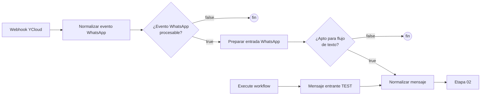

# Etapa 01 · Entrada

Recibe el webhook de YCloud y lo convierte en un mensaje de texto normalizado. Es la única puerta de entrada del bot (más el trigger manual de pruebas).



## Nodos

### Webhook YCloud · Webhook

| Parámetro | Valor |
|---|---|
| HTTP Method | `POST` |
| Path | `whatsapp-ycloud` |
| URL producción | `https://n8npegaso.cognisoftone.com/webhook/whatsapp-ycloud` |
| URL prueba | `https://n8npegaso.cognisoftone.com/webhook-test/whatsapp-ycloud` |
| Authentication | `None` ⚠️ (ver [pendientes técnicos](../pendientes-tecnicos.md)) |
| Respond | `Immediately` (responde 200 a YCloud sin esperar a que termine el flujo) |

Salida: `{ headers, params, query, body }`. El evento de YCloud viene en `body`.

### Normalizar evento WhatsApp · Code

Archivo: [`code/01-entrada/normalizar-evento-whatsapp.js`](../../code/01-entrada/normalizar-evento-whatsapp.js)

Detecta el proveedor y produce un objeto `evento_whatsapp` uniforme:

- **YCloud**: `body.type === 'whatsapp.inbound_message.received'` y existe `body.whatsappInboundMessage`.
- **Meta Cloud API directo**: `body.entry` es un arreglo (soportado por compatibilidad).
- Cualquier otro evento (estados de entrega, lecturas…) queda con `procesable: false`.

Campos de `evento_whatsapp`: `procesable`, `origen` (`YCLOUD` / `META_CLOUD_API`), `telefono_cliente` (solo dígitos, ej. `593987654321`), `nombre_cliente`, `mensaje_id` (wamid), `timestamp` (Unix en segundos), `tipo_mensaje` (`text`, `image`…), `texto`, `caption`, `media_id`, `media_mime_type`, `media_sha256`, `display_phone_number` (número de Pegaso), `waba_id`, `canal: WHATSAPP`, `proveedor_evento_id`. También guarda el body completo en `payload_original`.

### IF: ¿Evento WhatsApp procesable? · IF

Condición: `{{ $json.evento_whatsapp.procesable }}` **is true** (boolean, sin conversión de tipos).
La rama `false` no tiene conexión: el evento se ignora en silencio.

### Preparar entrada WhatsApp · Code

Archivo: [`code/01-entrada/preparar-entrada-whatsapp.js`](../../code/01-entrada/preparar-entrada-whatsapp.js)

Traduce el evento al mismo contrato que usa "Mensaje entrante TEST" y decide si sigue el flujo de texto.

| `tipo_mensaje` de WhatsApp | `tipo` interno |
|---|---|
| text | `TEXTO` |
| image | `IMAGEN` |
| audio | `AUDIO` |
| video | `VIDEO` |
| document | `DOCUMENTO` |
| sticker | `STICKER` |
| location | `UBICACION` |
| contacts | `CONTACTO` |
| interactive | `INTERACTIVO` |
| otro | `DESCONOCIDO` |

Salida: `telefono`, `nombre_whatsapp`, `mensaje` (texto, o caption en imagen/video/documento), `tipo`, `canal`, `mensaje_externo_id`, `meta_whatsapp` (datos extra y multimedia), `apto_para_flujo_texto` (solo `text` con mensaje no vacío) y `requiere_procesamiento_media`.

Lanza error si el evento no es procesable o le falta teléfono o `mensaje_id`.

### IF: ¿Apto para flujo de texto? · IF

Condición: `{{ $json.apto_para_flujo_texto }}` **is true**.
La rama `false` no tiene conexión: **imágenes, audios, documentos, stickers y ubicaciones no reciben respuesta ni se guardan.**

### When clicking 'Execute workflow' + Mensaje entrante TEST · Trigger manual + Set

Permite probar el flujo desde el editor sin WhatsApp. El nodo Set debe entregar el mismo contrato que "Preparar entrada WhatsApp": `telefono`, `nombre_whatsapp`, `mensaje` y opcionalmente `tipo`, `canal`.

En estas ejecuciones el mensaje **se guarda pero no se envía** por WhatsApp (ver etapa 08).

### Normalizar mensaje · Code

Archivo: [`code/01-entrada/normalizar-mensaje.js`](../../code/01-entrada/normalizar-mensaje.js)

Une las dos entradas (real y de prueba) en el contrato mínimo:

| Campo | Regla |
|---|---|
| `telefono` | sin espacios, guiones, paréntesis ni `+`; si empieza con `0` se reemplaza por `593` (`0987654321` → `593987654321`) |
| `nombre_whatsapp` | `nombre_whatsapp` o `nombre` |
| `mensaje` | recortado; `''` si no viene |
| `tipo` | en mayúsculas, por defecto `TEXTO` |
| `canal` | en mayúsculas, por defecto `WHATSAPP` |
| `mensaje_externo_id` | wamid del mensaje |
| `recibido_at` | hora de ejecución en n8n (ISO) |

## Contrato de salida de la etapa

```json
{
  "telefono": "593987654321",
  "nombre_whatsapp": "Ana Pérez",
  "mensaje": "Hola, necesito etiquetas de 10x5 cm",
  "tipo": "TEXTO",
  "canal": "WHATSAPP",
  "mensaje_externo_id": "wamid.TEST001",
  "recibido_at": "2026-10-07T23:00:01.000Z"
}
```

## Pruebas

`tests/fixtures/01-*.json` (ejecutar con `npm test`): texto, imagen y evento no procesable de YCloud; preparación de texto e imagen; normalización con teléfono local.
