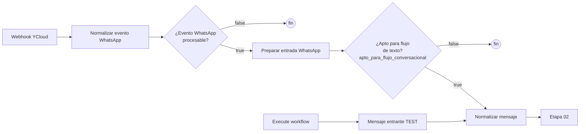

# Etapa 01 · Entrada

Recibe el webhook de YCloud y lo convierte en un mensaje normalizado (texto, o descriptor controlado si es imagen, audio, video o documento). Es la única puerta de entrada del bot (más el trigger manual de pruebas). Aquí **no** se descarga ni se analiza la media: eso lo hace la etapa 03 en la ejecución que gana el turno ([Imágenes del turno](03-conversacion.md#imágenes-del-turno)).



## Nodos

### Webhook YCloud · Webhook

| Parámetro | Valor |
|---|---|
| HTTP Method | `POST` |
| Path | `whatsapp-ycloud` |
| URL producción | `https://n8npegaso.cognisoftone.com/webhook/whatsapp-ycloud` |
| URL prueba | `https://n8npegaso.cognisoftone.com/webhook-test/whatsapp-ycloud` |
| Authentication | `None` ⚠️ (ver [pendientes técnicos](../pendientes-tecnicos.md)) |
| Respond | `Immediately` (responde 200 a YCloud sin esperar a que termine el flujo) |

Salida: `{ headers, params, query, body }`. El evento de YCloud viene en `body`.

### Normalizar evento WhatsApp · Code

Archivo: [`code/01-entrada/normalizar-evento-whatsapp.js`](../../code/01-entrada/normalizar-evento-whatsapp.js)

Detecta el proveedor y produce un objeto `evento_whatsapp` uniforme:

- **YCloud**: `body.type === 'whatsapp.inbound_message.received'` y existe `body.whatsappInboundMessage`.
- **Meta Cloud API directo**: `body.entry` es un arreglo (soportado por compatibilidad).
- Cualquier otro evento (estados de entrega, lecturas…) queda con `procesable: false`.

Campos de `evento_whatsapp`: `procesable`, `origen` (`YCLOUD` / `META_CLOUD_API`), `telefono_cliente` (solo dígitos, ej. `593987654321`), `nombre_cliente`, `mensaje_id` (wamid), `timestamp` (Unix en segundos), `tipo_mensaje` (`text`, `image`…), `texto`, `caption`, `media_id`, `media_mime_type`, `media_sha256`, `media_link` (v1.1, solo YCloud: `image.link`, `audio.link`, etc.), `display_phone_number` (número de Pegaso), `waba_id`, `canal: WHATSAPP`, `proveedor_evento_id`. También guarda el body completo en `payload_original`.

`media_link` tiene la forma `https://api.ycloud.com/v2/whatsapp/media/download/{id}?sig=…&payload=…`. Según YCloud se puede bajar sin credencial durante unos minutos y **con la cabecera `X-API-Key` durante 30 días**. Meta Cloud API directo no trae enlace (solo `id`), así que esas imágenes van a revisión humana.

### IF: ¿Evento WhatsApp procesable? · IF

Condición: `{{ $json.evento_whatsapp.procesable }}` **is true** (boolean, sin conversión de tipos).
La rama `false` no tiene conexión: el evento se ignora en silencio.

### Preparar entrada WhatsApp · Code

Archivo: [`code/01-entrada/preparar-entrada-whatsapp.js`](../../code/01-entrada/preparar-entrada-whatsapp.js)

Traduce el evento al mismo contrato que usa "Mensaje entrante TEST" y decide si sigue el flujo de texto.

| `tipo_mensaje` de WhatsApp | `tipo` interno |
|---|---|
| text | `TEXTO` |
| image | `IMAGEN` |
| audio | `AUDIO` |
| video | `VIDEO` |
| document | `DOCUMENTO` |
| sticker | `STICKER` |
| location | `UBICACION` |
| contacts | `CONTACTO` |
| interactive | `INTERACTIVO` |
| otro | `DESCONOCIDO` |

Salida (v2.0): `telefono`, `nombre_whatsapp`, `mensaje`, `tipo`, `canal`, `mensaje_externo_id`, `meta_whatsapp` (datos extra y multimedia, con `media.link_permitido`, `media.soportada`, `media.motivo_no_procesable`), `apto_para_flujo_texto` (solo `text` con mensaje no vacío), **`apto_para_flujo_conversacional`** (texto, o imagen/audio/video/documento), `media_soportada` y `requiere_procesamiento_media`.

`mensaje` según el tipo (es lo que se guarda en `mensajes.contenido`; formato en [modelo-datos.md](../modelo-datos.md#contenido-de-mensajes-con-media)):

| Caso | `mensaje` |
|---|---|
| Texto | el texto |
| Imagen JPEG/PNG/WebP con enlace YCloud permitido | `[IMAGEN] caption` + `\n[MEDIA_PENDIENTE] {"mime_type","media_id","link"}` |
| Imagen soportada sin enlace válido (Meta, host distinto) | `[IMAGEN] caption` + `\n[CONTEXTO DE IMAGEN · revision=SI · motivo=IMAGEN_NO_DESCARGABLE] …` |
| Imagen de otro formato, audio, video, documento | `[TIPO] caption` + `\n[ARCHIVO NO PROCESABLE · tipo=… · mime=…] …` |
| Sticker, ubicación, contacto, interactivo | igual que antes (no entra al flujo) |

Seguridad:

- Solo se acepta un enlace que cumpla `^https://api\.ycloud\.com/v2/whatsapp/media/download/<id>(?<query>)?$` y tenga como máximo 2048 caracteres. Así la credencial de YCloud nunca se envía a otro host: cubre el SSRF y trucos como `https://api.ycloud.com@otro-host/…`.
- El caption se aplana a una línea (máx. 1000 caracteres): el cliente no puede fabricar una línea `[MEDIA_PENDIENTE]` ni `[CONTEXTO DE IMAGEN …]`.
- Los stickers quedan fuera a propósito: no aportan información y derivarlos a un asesor sería ruido.

Lanza error si el evento no es procesable o le falta teléfono o `mensaje_id`.

### IF: ¿Apto para flujo de texto? · IF

| Campo | Valor |
|---|---|
| Condición | `{{ $json.apto_para_flujo_conversacional }}` **is true** (**cambio manual**: antes `{{ $json.apto_para_flujo_texto }}`) |
| Nombre | se puede dejar igual; opcional renombrar a "IF: ¿Apto para flujo conversacional?" (ningún código lo referencia por nombre) |

La rama `false` no tiene conexión: **stickers, ubicaciones, contactos y mensajes interactivos** no reciben respuesta ni se guardan. Imágenes, audios, videos y documentos siguen al flujo y quedan guardados.

### When clicking 'Execute workflow' + Mensaje entrante TEST · Trigger manual + Set

Permite probar el flujo desde el editor sin WhatsApp. El nodo Set debe entregar el mismo contrato que "Preparar entrada WhatsApp": `telefono`, `nombre_whatsapp`, `mensaje` y opcionalmente `tipo`, `canal`.

En estas ejecuciones el mensaje **se guarda pero no se envía** por WhatsApp (ver etapa 08).

### Normalizar mensaje · Code

Archivo: [`code/01-entrada/normalizar-mensaje.js`](../../code/01-entrada/normalizar-mensaje.js)

Une las dos entradas (real y de prueba) en el contrato mínimo:

| Campo | Regla |
|---|---|
| `telefono` | sin espacios, guiones, paréntesis ni `+`; si empieza con `0` se reemplaza por `593` (`0987654321` → `593987654321`) |
| `nombre_whatsapp` | `nombre_whatsapp` o `nombre` |
| `mensaje` | recortado; `''` si no viene |
| `tipo` | en mayúsculas, por defecto `TEXTO` |
| `canal` | en mayúsculas, por defecto `WHATSAPP` |
| `mensaje_externo_id` | wamid del mensaje |
| `recibido_at` | hora de ejecución en n8n (ISO) |

## Contrato de salida de la etapa

```json
{
  "telefono": "593987654321",
  "nombre_whatsapp": "Ana Pérez",
  "mensaje": "Hola, necesito etiquetas de 10x5 cm",
  "tipo": "TEXTO",
  "canal": "WHATSAPP",
  "mensaje_externo_id": "wamid.TEST001",
  "recibido_at": "2026-10-07T23:00:01.000Z"
}
```

## Pruebas

`tests/fixtures/01-*.json` (ejecutar con `npm test`): texto, imagen (con `media_link`) y evento no procesable de YCloud; preparación de texto, imagen con enlace, imagen sin caption, imagen GIF, audio, enlace no permitido con caption malicioso y sticker; normalización con teléfono local.
