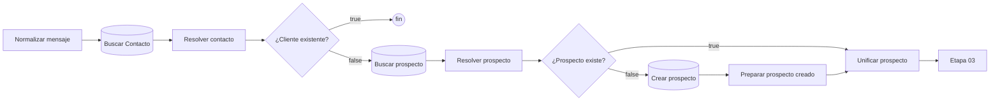

# Etapa 02 · Contacto y prospecto

Identifica quién escribe. Si es un **cliente registrado**, el bot no interviene. Si no, se busca o crea el **prospecto**.



Todos los nodos Postgres usan la credencial **Postgres account 2** y el esquema **`pegaso`**.

## Nodos

### Buscar Contacto · Postgres Select

| Parámetro | Valor |
|---|---|
| Tabla | `pegaso.contactos` |
| Return All | no · Limit `1` |
| Condición | `whatsapp` **=** `{{ $json.telefono }}` |

Equivale a `SELECT * FROM pegaso.contactos WHERE whatsapp = :telefono LIMIT 1`.

`contactos.whatsapp` debe estar guardado en el mismo formato que produce "Normalizar mensaje" (`5939…`, solo dígitos). Si está como `09…` o `+593…`, el cliente no se reconoce y se trata como prospecto.

### Resolver contacto · Code

Archivo: [`code/02-contacto-prospecto/resolver-contacto.js`](../../code/02-contacto-prospecto/resolver-contacto.js)

Recupera el mensaje con `$('Normalizar mensaje')` y agrega `contacto_existe` (id > 0), `contacto_id`, `cliente_id`, `contacto_nombre` y `es_cliente_registrado` (contacto con `cliente_id`).

### ¿Cliente existente? · IF

Condición: `{{ $json.es_cliente_registrado }}` **is true**.

- `true` → sin conexión: **los clientes registrados no reciben respuesta automática** y su mensaje no se guarda.
- `false` → Buscar prospecto. Incluye contactos sin `cliente_id`.

### Buscar prospecto · Postgres Select

| Parámetro | Valor |
|---|---|
| Tabla | `pegaso.prospectos` |
| Return All | no · Limit `1` |
| Condiciones | 3 condiciones combinadas con `AND` (por documentar: no se ven en la captura) |

### Resolver prospecto · Code

Archivo: [`code/02-contacto-prospecto/resolver-prospecto.js`](../../code/02-contacto-prospecto/resolver-prospecto.js)

Mapea la fila a `prospecto_existe`, `prospecto_id`, `prospecto_estado`, `prospecto_nombre`, `prospecto_producto_interes`, `prospecto_ciudad`, `prospecto_provincia`, `prospecto_ultima_intencion`, `prospecto_ultima_accion` y `prospecto_requiere_humano`.

### IF: ¿Prospecto existe? · IF

Condición: `{{ $json.prospecto_existe }}` **is true**.
`true` → Unificar prospecto (entrada 1). `false` → Crear prospecto.

### Crear prospecto · Postgres Insert

Tabla `pegaso.prospectos`, modo *Map Each Column Manually*:

| Columna | Valor |
|---|---|
| `id` | vacío (lo genera la base) |
| `telefono` | `{{ $json.telefono }}` |
| `nombre_whatsapp` | `{{ $json.nombre_whatsapp }}` |
| `canal` | `{{ $json.canal }}` |
| `origen` | `WHATSAPP` |
| `fuente` | vacío |
| `estado` | `NUEVO` |
| `producto_interes`, `ciudad`, `provincia`, `ultima_intencion`, `ultima_accion` | vacío |
| `requiere_humano` | `false` |
| `activo` | `true` |
| `creado_at`, `actualizado_at` | `null` |

### Preparar prospecto creado · Code

Archivo: [`code/02-contacto-prospecto/preparar-prospecto-creado.js`](../../code/02-contacto-prospecto/preparar-prospecto-creado.js)

Convierte la fila insertada al mismo contrato que "Resolver prospecto" (recupera el resto con `$('Resolver prospecto')`), con `prospecto_existe: true`.

### Unificar prospecto · Merge

Modo `Append`, 2 entradas: (1) rama `true` de "¿Prospecto existe?", (2) "Preparar prospecto creado". En cada ejecución solo llega una, así que la salida es un único item.

Su nombre es importante: lo leen "Resolver conversación prospecto" y el IF "¿Requiere atención humana?" con `$('Unificar prospecto')`.

## Contrato de salida de la etapa

Lo de la etapa 01 más:

```json
{
  "contacto_existe": false, "contacto_id": null, "cliente_id": null, "contacto_nombre": null,
  "es_cliente_registrado": false,
  "prospecto_existe": true, "prospecto_id": 16, "prospecto_estado": "NUEVO",
  "prospecto_nombre": "Ana Pérez", "prospecto_producto_interes": null,
  "prospecto_ciudad": null, "prospecto_provincia": null,
  "prospecto_ultima_intencion": null, "prospecto_ultima_accion": null,
  "prospecto_requiere_humano": false
}
```

## Pruebas

`tests/fixtures/02-*.json`: sin contacto, cliente registrado, contacto sin cliente, prospecto inexistente, prospecto con humano y prospecto recién creado.
