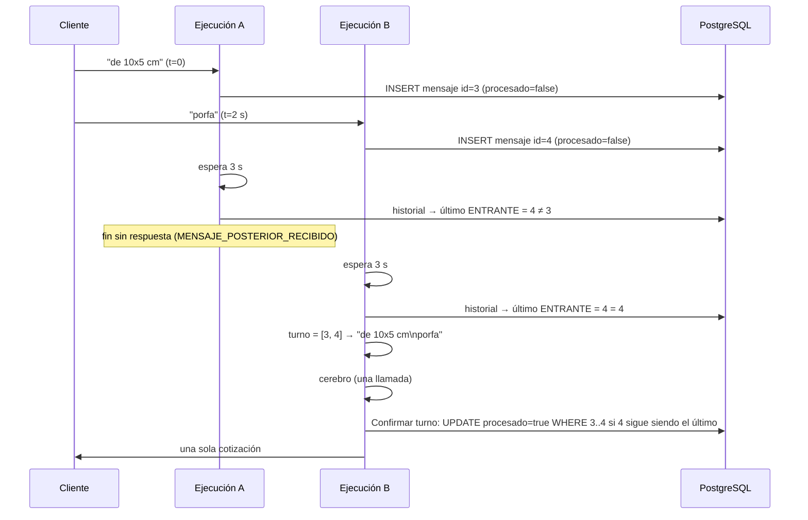
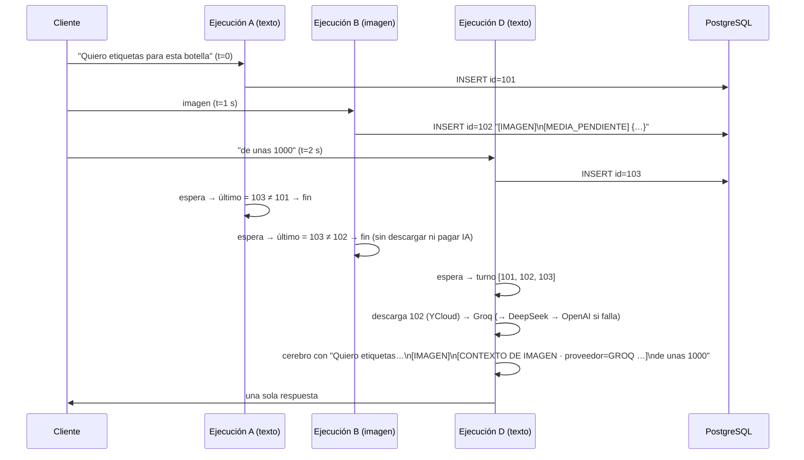

# Etapa 03 · Conversación

Busca o crea la conversación, **guarda el mensaje entrante**, decide si el bot puede responder (`MODO_PRUEBA` y atención humana), **espera la ventana del turno conversacional** (debounce) y arma el contexto para el cerebro comercial con todos los mensajes del turno.

```mermaid
flowchart LR
    U[Unificar prospecto] --> BC[(Buscar conversación)]
    BC --> RC[Resolver conversación prospecto]
    RC --> IC{¿Conversación<br/>prospecto existe?}
    IC -->|true| UC[Unificar conversación]
    IC -->|false| CC[(Crear conversación prospecto)]
    CC --> PCC[Preparar conversación creada] --> UC
    UC --> PC[Preparar conversación]
    PC --> GM[(Guardar mensaje entrante)]
    GM --> MP[(Obtener configuración MODO_PRUEBA)]
    MP --> RP[Resolver permiso automatización]
    RP --> IB{¿Puede responder<br/>el BOT?}
    IB -->|false| FMP[Finalizar mensaje modo prueba]
    IB -->|true| IH{¿Requiere<br/>atención humana?}
    IH -->|true| FAH[Finalizar mensaje atención humana]
    IH -->|false| W[/Esperar ventana de turno/]
    W --> RH[(Recuperar historial conversación)]
    RH --> RT[Resolver turno conversacional]
    RT --> IT{¿Procesar turno?}
    IT -->|false| FIN([fin sin respuesta:<br/>llegó un mensaje posterior])
    IT -->|true| ID{IF: ¿Derivación directa<br/>por entrada?}
    ID -->|true| E06[Etapa 06 · Preparar derivación humana]
    ID -->|false| PM[Preparar media del turno]
    PM --> IM{¿Hay imágenes<br/>por analizar?}
    IM -->|false| CIA[Preparar contexto IA]
    IM -->|true| DI[Descargar imagen YCloud<br/>HTTP, continúa ante error]
    DI --> AG[Analizar imagen Groq Basic LLM] --> VG[Validar análisis imagen Groq] --> IG{¿Análisis Groq<br/>válido?}
    IG -->|true| CIA
    IG -->|false| AD[Analizar imagen DeepSeek1] --> VD[Validar análisis imagen DeepSeek] --> IDS{¿Análisis DeepSeek<br/>válido?}
    IDS -->|true| CIA
    IDS -->|false| AO[Analizar imagen Open IA] --> VO[Validar análisis imagen OpenAI] --> IO{¿Análisis OpenAI<br/>válido?}
    IO -->|true| CIA
    IO -->|false| PDF[Preparar derivación imagen fallida] --> E06
    CIA --> E04[Etapa 04 · Cerebro comercial]
```



Nodos nuevos (debounce): **Esperar ventana de turno** (Wait), **Resolver turno conversacional** (Code) e **IF: ¿Procesar turno?** (IF). La confirmación atómica del turno está en la etapa 04 ("Confirmar turno conversacional" e "¿Turno confirmado?"). Ver [Turno conversacional](#turno-conversacional-debounce).

Nodos de imágenes: **Preparar media del turno** (Code), **IF: ¿Hay imágenes por analizar?** (IF), **Descargar imagen YCloud** (HTTP), la cascada visual **Groq → DeepSeek → OpenAI** (un *Basic LLM Chain*, un validador Code y un IF por proveedor) y **Preparar derivación imagen fallida** (Code). Ver [Imágenes del turno](#imágenes-del-turno).

Nodo reubicado (entradas no soportadas): **IF: ¿Derivación directa por entrada?** va aquí, después de "IF: ¿Procesar turno?", porque la derivación necesita `prospecto_id` y `conversacion_id`, que la etapa 01 todavía no tiene. Ver [IF: ¿Derivación directa por entrada?](#if-derivación-directa-por-entrada--if).

Credencial **Postgres account 2**, esquema **`pegaso`**.

## Nodos

### Buscar conversación · Postgres Select

| Parámetro | Valor |
|---|---|
| Tabla | `pegaso.conversaciones` |
| Return All | no · Limit `1` |
| Condiciones | 3 condiciones combinadas con `AND` (por documentar: no se ven en la captura) |
| Sort | ninguno ⚠️ |

### Resolver conversación prospecto · Code

Archivo: [`code/03-conversacion/resolver-conversacion-prospecto.js`](../../code/03-conversacion/resolver-conversacion-prospecto.js)

Toma el prospecto de `$('Unificar prospecto')` y agrega `conversacion_existe` (id > 0), `conversacion_id`, `conversacion_estado`, `conversacion_cliente_id` / `conversacion_contacto_id` / `conversacion_prospecto_id` y `conversacion_contexto_comercial` (la memoria guardada; "Preparar conversación" la parsea). "Buscar conversación" no limita columnas, así que la fila trae `contexto_comercial`.

### IF: ¿Conversación prospecto existe? · IF

Condición: `{{ $json.conversacion_existe }}` **is true**.
`true` → Unificar conversación (entrada 1). `false` → Crear conversación prospecto.

### Crear conversación prospecto · Postgres Insert

Tabla `pegaso.conversaciones`, *Map Each Column Manually*:

| Columna | Valor |
|---|---|
| `id` | vacío |
| `cliente_id`, `contacto_id` | vacío |
| `telefono` | `{{ $json.telefono }}` |
| `canal` | `{{ $json.canal }}` |
| `estado` | `ACTIVA` |
| `ultimo_mensaje_at` | `{{ $json.recibido_at }}` |
| `creada_at` | vacío |
| `prospecto_id` | `{{ $json.prospecto_id }}` |
| … | hay más columnas debajo (por documentar) |

n8n muestra un ⚠️ junto a *Values to Send*: suele indicar que las columnas de la tabla cambiaron y conviene refrescar el mapeo.

### Preparar conversación creada · Code

Archivo: [`code/03-conversacion/preparar-conversacion-creada.js`](../../code/03-conversacion/preparar-conversacion-creada.js)

Valida que el INSERT devolvió `id > 0` (si no, detiene la ejecución) y marca `conversacion_nueva: true`.

### Unificar conversación · Merge

`Append`, 2 entradas: (1) rama `true` de "¿Conversación prospecto existe?", (2) "Preparar conversación creada".

### Preparar conversación · Code

Archivo: [`code/03-conversacion/preparar-conversacion.js`](../../code/03-conversacion/preparar-conversacion.js)

Normaliza ids, determina `tipo_actor` (CLIENTE > CONTACTO > PROSPECTO > DESCONOCIDO) y deja `contexto_comercial` como objeto (`{}` si no hay). Es la fuente de identidad para los nodos siguientes, que la leen con `$('Preparar conversación')`.

### Guardar mensaje entrante · Postgres Insert

Tabla `pegaso.mensajes`:

| Columna | Valor |
|---|---|
| `id` | vacío |
| `conversacion_id` | `{{ $json.conversacion_id }}` |
| `cliente_id` | `{{ $json.cliente_id }}` |
| `direccion` | `ENTRANTE` |
| `tipo` | `{{ $json.tipo }}` |
| `contenido` | `{{ $json.mensaje }}` |
| `mensaje_externo_id` | `{{ $json.mensaje_externo_id }}` |
| `enviado_at` | `{{ $json.recibido_at }}` |
| `procesado` | `false` |

Sin cambios de configuración para imágenes: `tipo` llega como `IMAGEN` / `AUDIO` / `VIDEO` / `DOCUMENTO` y `contenido` como el descriptor de la etapa 01 (`[IMAGEN] caption` + línea de sistema). *Verificar* que la columna `tipo` no tenga un `CHECK` que solo admita `TEXTO`.

A partir de aquí el mensaje **siempre queda guardado**, aunque el bot no responda. En los caminos de modo prueba y atención humana queda con `procesado = false`. Su `id` (salida del INSERT) es la referencia del debounce: "Resolver turno conversacional" lo lee con `$('Guardar mensaje entrante').first().json.id`.

### Obtener configuración MODO_PRUEBA · Postgres Select

| Parámetro | Valor actual | Cambio recomendado (debounce configurable) |
|---|---|---|
| Tabla | `pegaso.configuracion_bot` | igual |
| Return All | no · Limit `1` | **sí** |
| Condiciones | `clave` **=** `MODO_PRUEBA` | 1) `clave` **=** `MODO_PRUEBA` · 2) `clave` **=** `DEBOUNCE_WHATSAPP` |
| Combine Conditions | — | **OR** |

El nombre del nodo no cambia. El cambio es **opcional**: sin la fila `DEBOUNCE_WHATSAPP` (o sin cambiar este nodo) el debounce usa 3000 ms y 600 s. Si la tabla no tiene ninguna de las dos filas el nodo no devuelve items y el flujo se detiene, igual que hoy.

### Resolver permiso automatización · Code

Archivo: [`code/03-conversacion/resolver-permiso-automatizacion.js`](../../code/03-conversacion/resolver-permiso-automatizacion.js) (v2.0)

Busca entre las filas la de `clave = MODO_PRUEBA` y lee su `valor_json` = `{ "activo": true, "telefonos_permitidos": ["593…"] }` (objeto o texto JSON). Decide:

| Situación | `puede_responder_bot` | `motivo_bloqueo_bot` |
|---|---|---|
| `activo: false` | `true` | — |
| `activo: true` y teléfono en la lista | `true` | — |
| `activo: true` y teléfono fuera de la lista | `false` | `MODO_PRUEBA_TELEFONO_NO_AUTORIZADO` |
| teléfono vacío | `false` | `MODO_PRUEBA_TELEFONO_NO_IDENTIFICADO` |
| sin fila de configuración | `false` (se asume modo prueba activo) | `MODO_PRUEBA_TELEFONO_NO_AUTORIZADO` |
| `valor_json` sin `activo` ⚠️ | `true` | — |

Los teléfonos se comparan solo con dígitos y exactos: guárdalos como `5939…`.

También resuelve la configuración del turno desde la fila `DEBOUNCE_WHATSAPP` (`valor_json` = `{ "debounce_ms": 3000, "turno_max_antiguedad_segundos": 600 }`):

| Campo de salida | Por defecto | Rango aceptado |
|---|---|---|
| `debounce_ms` | `3000` | 0–15000 (se acota) |
| `debounce_segundos` | `3` | `debounce_ms / 1000`; lo usa el Wait |
| `turno_max_antiguedad_segundos` | `600` | 60–86400 |
| `debounce_configurado` | `false` | `true` si existe la fila |

### IF: ¿Puede responder el BOT? · IF

Condición: `{{ $json.puede_responder_bot }}` **is true**.
`true` → ¿Requiere atención humana?. `false` → Finalizar mensaje modo prueba.

### Finalizar mensaje modo prueba · Code

Archivo: [`code/03-conversacion/finalizar-mensaje-modo-prueba.js`](../../code/03-conversacion/finalizar-mensaje-modo-prueba.js)

Cierra la ejecución con `flujo: MODO_PRUEBA`, `mensaje_guardado: true`, `respuesta_automatica: false` y el motivo del bloqueo.

### ¿Requiere atención humana? · IF

Condición: `{{ $('Unificar prospecto').first().json.prospecto_requiere_humano === true }}` **is true**.
Lee el dato directamente del Merge de la etapa 02 (no del nodo anterior).
`true` → Finalizar mensaje atención humana. `false` → **Esperar ventana de turno** (antes iba directo a Recuperar historial conversación).

Orden de prioridad: primero `MODO_PRUEBA`, luego atención humana.

### Finalizar mensaje atención humana · Code

Archivo: [`code/03-conversacion/finalizar-mensaje-atencion-humana.js`](../../code/03-conversacion/finalizar-mensaje-atencion-humana.js)

Cierra con `flujo: ATENCION_HUMANA`, `motivo: PROSPECTO_DERIVADO_A_HUMANO`. No responde ni avisa al asesor; el mensaje queda en la base para que lo vea la persona que atiende. No pasa por el debounce: sin espera ni consultas extra.

### Esperar ventana de turno · Wait — NUEVO

| Campo | Valor |
|---|---|
| NOMBRE | `Esperar ventana de turno` |
| TIPO | **Wait** (n8n-nodes-base.wait) |
| ENTRADA | salida `false` de "¿Requiere atención humana?" (item de "Resolver permiso automatización") |
| CONFIGURACIÓN | *Resume*: **After Time Interval** · *Wait Unit*: **Seconds** |
| EXPRESIONES | *Wait Amount*: `{{ $('Resolver permiso automatización').first().json.debounce_segundos }}` |
| CONEXIÓN DESDE | ¿Requiere atención humana? → salida **false** (reemplaza la conexión a "Recuperar historial conversación") |
| CONEXIÓN HACIA | Recuperar historial conversación |

Pasa el item sin cambios, así que "Recuperar historial conversación" sigue funcionando con `{{ $json.conversacion_id }}`. Con esperas de menos de 65 s n8n no guarda la ejecución en la base: la mantiene en memoria. Si n8n se reinicia durante la espera, esa ejecución se pierde; el mensaje queda `procesado = false` y lo absorbe el siguiente turno.

### Recuperar historial conversación · Postgres Select

| Parámetro | Valor |
|---|---|
| Tabla | `pegaso.mensajes` |
| Return All | **sí** (sin límite) |
| Condición | `conversacion_id` **=** `{{ $json.conversacion_id }}` |
| Sort | `enviado_at` **ASC** |

Sin cambios de configuración; ahora va **después** de la espera, así que también trae los mensajes que llegaron durante la ventana. Devuelve todos los mensajes de la conversación, incluidos los del turno actual. Lo leen "Resolver turno conversacional" (`$input`) y "Preparar contexto IA" (`$('Recuperar historial conversación').all()`).

### Resolver turno conversacional · Code — NUEVO

Archivo: [`code/03-conversacion/resolver-turno-conversacional.js`](../../code/03-conversacion/resolver-turno-conversacional.js)

| Campo | Valor |
|---|---|
| NOMBRE | `Resolver turno conversacional` |
| TIPO | **Code** (JavaScript, *Run Once for All Items*) |
| ENTRADA | filas de "Recuperar historial conversación" |
| CONFIGURACIÓN | pegar el archivo (o `npm run build` cuando el nodo exista) |
| EXPRESIONES | dentro del código: `$('Guardar mensaje entrante').first().json` (id y `enviado_at` de este mensaje) y `$('Resolver permiso automatización').first().json` (antigüedad máxima) |
| CONEXIÓN DESDE | Recuperar historial conversación |
| CONEXIÓN HACIA | IF: ¿Procesar turno? |

Decide sin IA:

| Situación | `continuar_procesamiento` | `resultado_turno` | `motivo_no_procesamiento` |
|---|---|---|---|
| este mensaje es el último ENTRANTE válido | `true` | `PROCESAR` | `null` |
| llegó un ENTRANTE posterior | `false` | `DEBOUNCE_SUPERSEDED` | `MENSAJE_POSTERIOR_RECIBIDO` |
| esta fila es un reenvío del webhook (mismo `mensaje_externo_id` que una fila anterior) | `false` | `DUPLICADO` | `MENSAJE_DUPLICADO` |
| este mensaje ya está `procesado = true` (re-ejecución) | `false` | `YA_PROCESADO` | `TURNO_YA_PROCESADO` |

Si procesa, el turno son los ENTRANTE válidos con `procesado = false`, posteriores al último SALIENTE **anterior a este mensaje**, hasta este mensaje y con no más de `turno_max_antiguedad_segundos` de antigüedad respecto de él. Salida: `turno_texto` (un mensaje por línea, en orden), `turno_mensajes`, `turno_mensaje_ids`, `turno_desde_id`, `turno_hasta_id`, `cantidad_mensajes_turno`, `mensajes_descartados_por_antiguedad`. Lanza error solo si falta el id de "Guardar mensaje entrante" o la fila no aparece en el historial.

### IF: ¿Procesar turno? · IF — NUEVO

| Campo | Valor |
|---|---|
| NOMBRE | `IF: ¿Procesar turno?` |
| TIPO | **If** |
| ENTRADA | item de "Resolver turno conversacional" |
| CONFIGURACIÓN | una condición *Boolean* → **is true** |
| EXPRESIONES | `{{ $json.continuar_procesamiento }}` |
| CONEXIÓN DESDE | Resolver turno conversacional |
| CONEXIÓN HACIA | `true` → **IF: ¿Derivación directa por entrada?** · `false` → **sin conexión** (la ejecución termina bien; la salida de "Resolver turno conversacional" muestra el motivo) |

### IF: ¿Derivación directa por entrada? · IF

| Campo | Valor |
|---|---|
| NOMBRE | `IF: ¿Derivación directa por entrada?` |
| TIPO | **If** |
| VA DESPUÉS DE | IF: ¿Procesar turno? (rama **true**) |
| VA ANTES DE | `true` → **Preparar derivación humana** (etapa 06) · `false` → **Preparar media del turno** |
| CONFIGURACIÓN | una condición *Boolean* → **is true** |
| EXPRESIONES | `{{ $('Normalizar mensaje').first().json.derivacion_directa === true }}` |
| CREDENCIAL | ninguna |
| SALIDA ESPERADA | el item de "Resolver turno conversacional" sin cambios |

`derivacion_directa` lo pone "Preparar entrada no soportada" (etapa 01) en ubicaciones, contactos, mensajes interactivos, tipos desconocidos y media sin `media_id`; en el resto de mensajes "Normalizar mensaje" lo deja en `false`. La entrada no soportada ya pasó por la identidad (etapa 02), se guardó (`Guardar mensaje entrante`) y ganó el debounce, así que "Preparar derivación humana" encuentra `conversacion_id` y `prospecto_id` en "Preparar conversación". Si el cliente escribe algo después, esta ejecución pierde el turno y el texto siguiente lo atiende el cerebro con la línea `[ENTRADA NO SOPORTADA …]` en el turno.

### Preparar media del turno · Code — NUEVO

Archivo: [`code/03-conversacion/preparar-media-turno.js`](../../code/03-conversacion/preparar-media-turno.js)

| Campo | Valor |
|---|---|
| NOMBRE | `Preparar media del turno` |
| TIPO | **Code** (JavaScript, *Run Once for All Items*) |
| VA DESPUÉS DE | IF: ¿Derivación directa por entrada? (rama **false**) |
| VA ANTES DE | IF: ¿Hay imágenes por analizar? |
| CONFIGURACIÓN | pegar el archivo (o `npm run build` cuando el nodo exista) |
| EXPRESIONES | dentro del código: `$('Resolver turno conversacional').first().json` (turno) y `$('Preparar conversación').first().json` (producto de interés y medidas previas para el contexto visual) |
| CREDENCIAL | ninguna |
| SALIDA ESPERADA | sin imágenes pendientes: **1 item** `{ analizar_imagen: false, imagenes_por_analizar: 0, imagenes_descartadas }`. Con imágenes: **1 item por imagen** `{ analizar_imagen: true, mensaje_id, conversacion_id, mime_type, media_link, caption, contenido_base, texto_turno_cliente, contexto_comercial_breve, indice_imagen }` |

Busca en `turno_mensajes` las filas `tipo = IMAGEN` con una línea `[MEDIA_PENDIENTE] {json}` y saca el `link`. Revalida el MIME (JPEG/PNG/WebP) y el enlace: `https` a `api.ycloud.com/v2/whatsapp/media/download/…`, sin puerto ni usuario, máximo 2048 caracteres; el token firmado de la query (`?sig=…`) se acepta. Analiza como máximo 3 por turno, un item por imagen. Las que no pasan quedan pendientes: "Preparar contexto IA" las marca "no analizadas" y el turno se deriva. Las filas `TEXTO` nunca se interpretan como media, aunque el cliente copie el formato.

### IF: ¿Hay imágenes por analizar? · IF — NUEVO

| Campo | Valor |
|---|---|
| NOMBRE | `IF: ¿Hay imágenes por analizar?` |
| TIPO | **If** |
| VA DESPUÉS DE | Preparar media del turno |
| VA ANTES DE | `true` → Descargar imagen YCloud · `false` → Preparar contexto IA |
| CONFIGURACIÓN | una condición *Boolean* → **is true** |
| EXPRESIONES | `{{ $json.analizar_imagen }}` |
| CREDENCIAL | ninguna |
| SALIDA ESPERADA | `true`: los N items de imagen · `false`: el item único sin imágenes (turno solo de texto: mismo camino que antes) |

### Descargar imagen YCloud · HTTP Request — NUEVO

| Campo | Valor |
|---|---|
| NOMBRE | `Descargar imagen YCloud` |
| TIPO | **HTTP Request** |
| VA DESPUÉS DE | IF: ¿Hay imágenes por analizar? (rama **true**) |
| VA ANTES DE | Analizar imagen Groq Basic LLM |
| CONFIGURACIÓN | *Method* `GET` · *URL* expresión de abajo · *Authentication*: **Generic Credential Type → Header Auth** · *Send Query/Headers/Body*: no · *Options → Response → Response Format*: **File**, *Put Output in Field*: `imagen` · *Options → Timeout*: `20000` · *Options → Redirects*: dejar el valor por defecto (seguir) |
| SETTINGS | *Retry On Fail*: sí, *Max Tries* `2`, *Wait Between Tries* `1000` · ***On Error*: Continue (using regular output)** |
| EXPRESIONES | *URL*: `{{ $json.media_link }}` |
| CREDENCIAL | **la misma Header Auth de "YCloud Enviar Wts"** ("Header Auth account 2": cabecera `X-API-Key`). No escribir la API key en el nodo ni en el repo |
| SALIDA ESPERADA | por imagen: item con `binary.imagen` (la imagen) · si falla (403, 404, timeout): item con `json.error` y sin binario; sigue el flujo |

No tiene archivo en `code/`: es un nodo HTTP. El enlace ya fue validado dos veces, así que solo apunta a `https://api.ycloud.com/v2/whatsapp/media/download/…` y la API key no sale de YCloud. WhatsApp limita las imágenes a 5 MB. El nodo HTTP no tiene un límite de tamaño propio: el timeout y el host fijo son la contención (ver pendientes).

Este es el **único** nodo que tiene la imagen. Los fallbacks no la reciben por su conexión (entran desde un validador Code), así que los validadores de Groq y DeepSeek la vuelven a adjuntar: ver [Cascada visual](#cascada-visual-groq--deepseek--openai).

### Cascada visual: Groq → DeepSeek → OpenAI

Cada imagen pasa por hasta tres proveedores. Cada uno tiene su *Basic LLM Chain*, su validador Code y su IF; el siguiente solo recibe las imágenes que el anterior no pudo analizar.

| Proveedor | Analizador (Basic LLM Chain) | Validador (Code) | IF | true → | false → |
|---|---|---|---|---|---|
| 1 | `Analizar imagen Groq Basic LLM` | `Validar análisis imagen Groq` | `IF: ¿Análisis Groq válido?` | Preparar contexto IA | Analizar imagen DeepSeek1 |
| 2 | `Analizar imagen DeepSeek1` | `Validar análisis imagen DeepSeek` | `IF: ¿Análisis DeepSeek válido?` | Preparar contexto IA | Analizar imagen Open IA |
| 3 | `Analizar imagen Open IA` | `Validar análisis imagen OpenAI` | `IF: ¿Análisis OpenAI válido?` | Preparar contexto IA | Preparar derivación imagen fallida |

Los tres IF tienen la misma condición: *Boolean* `{{ $json.analisis_valido }}` **is true**.

**La imagen en los fallbacks.** "Analizar imagen DeepSeek1" y "Analizar imagen Open IA" reciben el item de un validador Code, que por sí solo no trae el binario. Por eso los validadores de Groq y DeepSeek, cuando el análisis es inválido, vuelven a adjuntar `binary.imagen` tomándolo de "Descargar imagen YCloud" por `pairedItem` (`$('Descargar imagen YCloud').itemMatching(i)`). El validador de OpenAI no lo adjunta: no hay otro proveedor. Si la descarga falló, no hay binario que adjuntar: el error queda `DESCARGA_FALLIDA` y los proveedores siguientes fallan igual, hasta la derivación.

### Analizar imagen Groq Basic LLM / Analizar imagen DeepSeek1 / Analizar imagen Open IA · Basic LLM Chain

| Campo | Valor |
|---|---|
| NOMBRE | `Analizar imagen Groq Basic LLM` · `Analizar imagen DeepSeek1` · `Analizar imagen Open IA` |
| TIPO | **Basic LLM Chain** (`@n8n/n8n-nodes-langchain.chainLlm`) |
| VA DESPUÉS DE | Groq: Descargar imagen YCloud · DeepSeek: IF: ¿Análisis Groq válido? (false) · OpenAI: IF: ¿Análisis DeepSeek válido? (false) |
| VA ANTES DE | el validador de su proveedor |
| CONFIGURACIÓN | *Source for Prompt*: **Define below** · *Prompt (User Message)*: `Analiza la imagen adjunta y responde con el JSON indicado.` · *Require Specific Output Format*: **sí** · *Chat Messages*: (1) **System**: contenido de [`prompts/analisis-imagen.md`](../../prompts/analisis-imagen.md) (lo carga `npm run build`); (2) **User** → *Message Type* **Image (Binary)** → *Image Data Field Name* `imagen` → *Image Details* **Auto** |
| SETTINGS | ***On Error*: Continue (using regular output)** · sin *Retry* (el siguiente proveedor es el reintento) |
| EXPRESIONES | dentro del prompt de sistema: `$('Preparar media del turno').item.json.caption`, `.texto_turno_cliente`, `.contexto_comercial_breve` (emparejados por item; el `pairedItem` de los validadores mantiene el emparejamiento en los fallbacks) |
| CREDENCIAL | la del subnodo de modelo de cada proveedor (credenciales de n8n; nunca en el repo) |
| SALIDA ESPERADA | por imagen: `{ output: { contenido_detectado, …, resumen_para_cerebro } }` · si falló la descarga, el modelo o el parser: `{ error: "…" }` |

Los tres comparten el prompt [`prompts/analisis-imagen.md`](../../prompts/analisis-imagen.md) (mapeado a los tres en `workflows/pegaso-whatsapp.map.json`) y el schema [`schemas/analisis-imagen.schema.json`](../../schemas/analisis-imagen.schema.json) en su *Structured Output Parser* (*Schema Type*: **Define using JSON Schema**, *Auto-Fix Format*: no). Cada uno usa un modelo con visión de su proveedor y *Sampling Temperature* `0`.

⚠️ El map solo conoce el nombre del parser de la V1 (`Schema análisis imagen`). Los nombres de los parsers de DeepSeek y OpenAI no están en el repo: agrégalos al map cuando `npm run status` los liste como "nodo sin mapear".

⚠️ DeepSeek no tiene hoy un modelo con entrada de imagen en su API pública. Si "Analizar imagen DeepSeek1" usa un modelo de DeepSeek, fallará siempre y solo sumará latencia antes de OpenAI (ver pendientes técnicos).

### Validar análisis imagen Groq / DeepSeek / OpenAI · Code

Archivos (uno por nodo, **misma lógica**; solo cambia el bloque de configuración del inicio):

| Nodo | Archivo | `PROVEEDOR` | Origen del item (`NODOS_ORIGEN`) | Empareja por posición | Reenvía la imagen si es inválido |
|---|---|---|---|---|---|
| `Validar análisis imagen Groq` | [`validar-analisis-imagen-groq.js`](../../code/03-conversacion/validar-analisis-imagen-groq.js) | `GROQ` | Preparar media del turno | sí (respaldo) | sí |
| `Validar análisis imagen DeepSeek` | [`validar-analisis-imagen-deepseek.js`](../../code/03-conversacion/validar-analisis-imagen-deepseek.js) | `DEEPSEEK` | Preparar media del turno → Validar análisis imagen Groq | no | sí |
| `Validar análisis imagen OpenAI` | [`validar-analisis-imagen-openai.js`](../../code/03-conversacion/validar-analisis-imagen-openai.js) | `OPENAI` | Preparar media del turno → Validar análisis imagen DeepSeek → Validar análisis imagen Groq | no | no (último) |

Están separados porque el proveedor y el origen no pueden ser iguales en los tres nodos (un archivo compartido haría que `npm run extract` avise de contenido distinto).

| Campo | Valor |
|---|---|
| TIPO | **Code** (JavaScript, *Run Once for All Items*) |
| VA DESPUÉS DE | el analizador de su proveedor |
| VA ANTES DE | el IF de su proveedor (`IF: ¿Análisis Groq válido?` / `DeepSeek` / `OpenAI`) |
| CONFIGURACIÓN | pegar el archivo (o `npm run build`) |
| EXPRESIONES | dentro del código: `$(nodo).itemMatching(i)` sobre los nodos de origen (por `pairedItem`) y `$('Descargar imagen YCloud').itemMatching(i).binary` para reenviar la imagen |
| CREDENCIAL | ninguna |
| SALIDA ESPERADA | por imagen, el contrato común de abajo, con `pairedItem: { item: i }` y, si es inválido y hay siguiente proveedor, `binary.imagen` |

Contrato común de salida (ejemplo válido de Groq):

```json
{
  "mensaje_id": 102,
  "conversacion_id": 41,
  "proveedor_analisis": "GROQ",
  "analisis_valido": true,
  "requiere_revision": false,
  "motivo_revision": null,
  "comprobante_detectado": false,
  "contenido_detectado": "ENVASE_O_PRODUCTO",
  "confianza": "ALTA",
  "error_analisis": null,
  "detalle_error": null,
  "analisis": { "contenido_detectado": "ENVASE_O_PRODUCTO", "producto_probable": "salsa en botella", "…": "…" },
  "indice_imagen": 0,
  "contenido_base": "[IMAGEN] esta es la botella de 500 ml",
  "contenido_actualizado": "[IMAGEN] esta es la botella de 500 ml\n[CONTEXTO DE IMAGEN · proveedor=GROQ · contenido=ENVASE_O_PRODUCTO · confianza=ALTA · revision=NO] Fotografía de una botella de plástico transparente vacía y sin etiqueta. Envase: botella cilíndrica. Sin medidas visibles."
}
```

Reglas:

- Acepta `output` objeto (parser), `text` con JSON (con o sin cercas \`\`\`json) o `error`.
- **Inválido** (error del nodo, descarga fallida, sin salida estructurada, JSON inválido o schema incumplido): `analisis_valido: false`, `requiere_revision: true`, `motivo_revision: ANALISIS_NO_DISPONIBLE`, `analisis: null`, `error_analisis` (`DESCARGA_FALLIDA`, `DESCARGA_O_IA_FALLIDA`, `SALIDA_VACIA`, `JSON_INVALIDO`, `SCHEMA_INVALIDO`…) y la línea `[CONTEXTO DE IMAGEN · proveedor=… · revision=SI · motivo=ANALISIS_NO_DISPONIBLE] La imagen no pudo revisarse automáticamente.`. El detalle técnico queda en `detalle_error` para la ejecución; nunca llega al cerebro ni al cliente.
- **Válido** con revisión: si la IA la pide (su motivo, u `OTRO` si dijo `NINGUNO`), si `confianza = BAJA` (`CONFIANZA_BAJA`) o si el contenido es `NO_DETERMINABLE` (`IMAGEN_AMBIGUA`).
- `comprobante_detectado = true` solo si el contenido es `COMPROBANTE_PAGO`. Es evidencia y **no confirma el pago**. El texto visible de un comprobante se descarta para no guardar datos bancarios.
- `NO_RELACIONADO`: anula `producto_probable`.
- `contenido_actualizado` = `contenido_base` (`[IMAGEN] caption`) + `[CONTEXTO DE IMAGEN · proveedor=… · contenido=… · confianza=… · revision=NO|SI(· motivo=…)] resumen. Producto probable… Envase… Texto visible… Colores… Sin medidas visibles.`

### Preparar derivación imagen fallida · Code — NUEVO

Archivo: [`code/03-conversacion/preparar-derivacion-imagen-fallida.js`](../../code/03-conversacion/preparar-derivacion-imagen-fallida.js)

| Campo | Valor |
|---|---|
| NOMBRE | `Preparar derivación imagen fallida` |
| TIPO | **Code** (JavaScript, *Run Once for All Items*) |
| VA DESPUÉS DE | IF: ¿Análisis OpenAI válido? (rama **false**) |
| VA ANTES DE | Preparar derivación humana (etapa 06) |
| CONFIGURACIÓN | pegar el archivo (o `npm run build`) |
| EXPRESIONES | dentro del código: `$('Preparar conversación')`, `$('Unificar prospecto')`, `$('Normalizar mensaje')`, `$('Resolver turno conversacional')` |
| CREDENCIAL | ninguna |
| SALIDA ESPERADA | **1 item** (aunque fallen varias imágenes) con el contrato de "Preparar derivación humana" |

Fija: `intencion = OTRO`, `accion = DERIVAR_HUMANO`, `requiere_humano = true`, `handoff_motivo = motivo_derivacion = IMAGEN_REQUIERE_REVISION`, `handoff_clasificacion = clasificacion_handoff = REVISION_IMAGEN`, `handoff_prioridad = prioridad_derivacion = MEDIA`, `requiere_notificacion = handoff_requiere_notificacion = true`, `origen_derivacion = ANALISIS_IMAGEN`, `analisis_imagen_fallido = true`, `derivacion_directa = true`, `derivacion_directa_motivo = FALLO_TOTAL_ANALISIS_IMAGEN`. Recupera la identidad (`conversacion_id`, `prospecto_id`, `cliente_id`, `contacto_id`, `telefono`, `nombre_whatsapp`, datos del prospecto) y `contexto_comercial` de los nodos anteriores, y arma `mensaje_actual` / `handoff_mensaje_cliente` con el texto y los captions del turno, sin enlaces ni líneas de sistema. No lanza error: si la identidad no aparece, lo informa "Preparar derivación humana". El cliente recibe "Permítame un momento por favor, ya revisamos la imagen que nos envió." (lo fija "Preparar mensaje transición humano" por el motivo).

Esta ruta **no** pasa por "Confirmar turno conversacional": el turno queda `procesado = false`, pero el mensaje de transición (SALIENTE) delimita el siguiente turno, así que no se vuelve a analizar.

### Sin "Guardar análisis imagen"

La cadena actual no persiste el análisis: `mensajes.contenido` de la imagen se queda con `[MEDIA_PENDIENTE] {…link…}`. Consecuencias: si llega otro mensaje mientras se analiza, la ejecución nueva vuelve a descargar y analizar la imagen (paga la IA dos veces), y en turnos futuros el historial muestra la imagen solo con su caption (sin enlace: "Preparar contexto IA" lo borra), sin lo que mostraba. "Preparar contexto IA" deja listo `media_actualizaciones: [{ mensaje_id, contenido }]` por si se agrega un Postgres *Update* (`id` = `mensaje_id`, `contenido` = `contenido`) después de él. Ver pendientes técnicos.

### Preparar contexto IA · Code

Archivo: [`code/03-conversacion/preparar-contexto-ia.js`](../../code/03-conversacion/preparar-contexto-ia.js) (v4.0)

Entradas: salida `false` de "IF: ¿Hay imágenes por analizar?" y salida `true` de **cada** IF de la cascada (Groq, DeepSeek, OpenAI). n8n ejecuta este nodo una vez por cada rama que le llega con items; por eso el nodo **espera a tener todas las imágenes resueltas**:

- `imagenes_esperadas` = items de "Preparar media del turno" con `analizar_imagen = true`.
- Si alguna imagen falló en los tres proveedores (salida no válida de "Validar análisis imagen OpenAI"), **no devuelve items**: ese turno lo atiende "Preparar derivación imagen fallida" y no hay respuesta del cerebro además del handoff.
- Si todavía hay menos análisis válidos (sumando los tres validadores) que imágenes esperadas, **no devuelve items**: falta que un fallback termine. La ejecución que ve todas las imágenes resueltas es la que sigue.

Lee el historial con `$('Recuperar historial conversación').all()`, el turno con `$('Resolver turno conversacional')` y los análisis con `$('Validar análisis imagen Groq' | 'DeepSeek' | 'OpenAI').all()` (el primero válido por `mensaje_id`). Junta la identidad de `$('Preparar conversación')` con todo eso y arma lo que lee el prompt del cerebro comercial:

- Identidad y prospecto: `conversacion_id`, `prospecto_id`, `tipo_actor`, `prospecto_estado`, `prospecto_clasificacion` (calculada desde el estado si no viene: NUEVO → C), etc.
- `mensaje_actual` = **el turno completo**, uno por línea y en orden. Sin imágenes es el `turno_texto`. Cada mensaje de imagen analizado se **sustituye** por su `contenido_actualizado` (`[IMAGEN] caption` + `[CONTEXTO DE IMAGEN · proveedor=…]`), sin duplicar el caption; los demás mensajes del turno se conservan; las imágenes que siguen con `[MEDIA_PENDIENTE]` pasan a `[CONTEXTO DE IMAGEN · revision=SI · motivo=IMAGEN_NO_ANALIZADA] …`. El resto del objeto: `mensaje_disparador` (el mensaje de esta ejecución, sin enlace), `turno_mensaje_ids`, `turno_desde_id`, `turno_hasta_id`, `cantidad_mensajes_turno` y `tipo_mensaje`. Si "Resolver turno conversacional" no se ejecutó, el turno es solo el mensaje de "Preparar conversación".
- **`media_turno`**: `cantidad_media`, `imagenes_analizadas`, `comprobante_detectado`, `requiere_revision_humana`, `proveedores_analisis` y `motivo_derivacion` (`ARCHIVO_NO_PROCESABLE` si hay audio, video, documento o formato no soportado; si no, `ENTRADA_NO_SOPORTADA` si hay una línea `[ENTRADA NO SOPORTADA …]`; si no, `IMAGEN_REQUIERE_REVISION` si alguna imagen tiene `revision=SI`; si no, `null`). Solo se leen las líneas de sistema de filas que no son `TEXTO`. Lo usa "Normalizar decisión IA".
- **`media_actualizaciones`**: `[{ mensaje_id, contenido }]` de las imágenes analizadas, listo para un futuro UPDATE de `mensajes.contenido`.
- **Nunca** entrega enlaces de media al cerebro: borra las líneas `[MEDIA_PENDIENTE]` también del historial.
- `contexto_comercial`: la memoria guardada **completa** (`...previo`, incluidos `handoff`, `ultima_restriccion_comercial`, `cotizacion.producto`, `cantidad_solicitada`…), con `prospecto`, `ubicacion`, `diseno` y `cotizacion` actualizados. `cotizacion.cantidad` cae a `cantidad_cotizable` / `cantidad_solicitada`.
- `historial` (mensajes con contenido, **sin** los mensajes del turno ni reenvíos del webhook), `cantidad_mensajes_historial`, `ultimo_mensaje_saliente` y `mensajes_salientes_recientes`.

## Turno conversacional (debounce)

El cliente suele escribir en partes ("de 10x5 cm" + "porfa"). Cada mensaje dispara una ejecución; sin control, cada una llamaría a la IA y respondería (dos cotizaciones). Regla: **responde solo la ejecución del último mensaje, y responde a todo lo pendiente**. La IA no participa en esta decisión.



**Dos puntos de control:**

1. **Después de la espera** ("Resolver turno conversacional"): descarta, antes de gastar IA, las ejecuciones que ya tienen un mensaje posterior. Reutiliza "Recuperar historial conversación": no agrega consultas.
2. **Antes de actuar** ("Confirmar turno conversacional", etapa 04, justo antes del Switch): un único `UPDATE … SET procesado = true` condicionado a que el mensaje siga siendo el último ENTRANTE. Si llegó otro mientras la IA pensaba, no confirma, no responde, y sus mensajes (que siguen `false`) entran en el turno de la ejecución nueva.

**Por qué no alcanza con `MAX(mensajes.id)` solo en el primer punto:** si "porfa" llega cuando A ya pasó el control y está en la IA, A cotizaría "de 10x5 cm" y B volvería a incluirlo (sigue `false`): dos cotizaciones. El segundo control cierra esa carrera sin columnas nuevas ni locks: la comparación y la marca son una sola sentencia SQL.

**`MAX(id)` es confiable** como orden de llegada: `id` es una secuencia y el INSERT de cada ejecución termina antes de su espera. Dos INSERT casi simultáneos pueden confirmar en orden distinto a su id; la diferencia es de milisegundos frente a una ventana de 3 s, y el segundo control lo vuelve a verificar.

**Definición de turno (opción elegida: ENTRANTE pendientes desde el último SALIENTE, con tope de antigüedad):**

| Opción | Regla | Problema |
|---|---|---|
| A | ENTRANTE posteriores al último SALIENTE | depende de que el saliente se guarde; un turno sin respuesta (fallo de IA) o bloqueado se arrastra para siempre |
| B | ENTRANTE con `procesado = false` | hoy `procesado` es inconsistente (pendiente técnico 39): en 06 y 07 los entrantes quedan `false` y se repetirían |
| C | ventana de tiempo fija (p. ej. últimos 30 s) | corta preguntas lentas y mezcla turnos ya respondidos |
| **Elegida** | B ∩ A ∩ tope de 600 s | `procesado` pasa a tener un único escritor ("Confirmar turno conversacional"), así que B queda consistente; A evita repetir lo ya respondido aunque falte la marca; el tope evita arrastrar mensajes viejos (bloqueados por MODO_PRUEBA o previos al despliegue) |

**Ventana:** 3000 ms por defecto (`DEBOUNCE_WHATSAPP.debounce_ms`, 0–15000). No hay tope de duración del turno: si el cliente escribe un mensaje cada 2 s, el bot responde 3 s después del último. Es lo deseado en WhatsApp y evita complejidad; `turno_max_antiguedad_segundos` (600) solo limita qué mensajes viejos entran.

### Casos verificados

| Caso | Resultado | Fixture |
|---|---|---|
| 1. Un mensaje | turno = ese mensaje | `03-resolver-turno--mensaje-unico` |
| 2. Dos mensajes rápidos | el primero termina sin respuesta; el segundo agrupa ambos | `03-resolver-turno--dos-mensajes-*`, `03-preparar-contexto-ia--turno-agrupado` |
| 3. Cuatro mensajes | un turno con los cuatro en orden | `03-resolver-turno--cuatro-mensajes` |
| 4. "de 10x5 cm" + "porfa" | una sola cotización | `03-resolver-turno--dos-mensajes-gana-ultimo` |
| 5. "Como es la metodología" + "de trabajo?" | una sola respuesta | `03-resolver-turno--pregunta-partida` |
| 6. "Si estoy de acuerdo" / "páseme una cuenta" / "por favor" | DERIVAR_HUMANO, SOLICITA_DATOS_PAGO, ALTA, notificación | `03-resolver-turno--acepta-y-pide-cuenta`, `04-normalizar-decision-ia--turno-agrupado-datos-pago` |
| 7. "10x5" y 20 s después "y serían 2000" | turno nuevo; la memoria conserva 10x5 y se recotiza 2000 | `03-resolver-turno--nuevo-turno-tras-respuesta`, `03-preparar-contexto-ia--nuevo-turno-con-memoria`, `04-resolver-contexto-comercial--nuevo-turno-cambia-cantidad` |
| 8. `requiere_humano` | se guardan y no se responde (no llega al debounce) | `03-finalizar-mensaje-atencion-humana` |
| Reenvío del webhook | solo responde la fila original | `03-resolver-turno--duplicado-*` |
| Turno anterior falló en la IA | el siguiente mensaje lo reabsorbe | `03-resolver-turno--reintento-tras-fallo-ia` |
| Mensajes viejos sin procesar | quedan fuera del turno | `03-resolver-turno--descarta-antiguos` |
| Mensaje durante una cotización ya confirmada | no repite lo confirmado | `03-resolver-turno--en-vuelo-excluye-confirmados` |

## Imágenes del turno

Una imagen no es un flujo aparte: es un mensaje más del turno y la analiza la **ejecución que gana el turno**, después de la espera.



Decisiones:

| Tema | Decisión | Por qué |
|---|---|---|
| Dónde se analiza | En el ganador del turno, después de "IF: ¿Procesar turno?" | Analizar en la etapa 01 (antes de guardar) retrasaría el INSERT de la imagen: un texto posterior se guardaría y respondería antes, sin la imagen (dos respuestas). Así la imagen se guarda en orden de llegada y el debounce no cambia |
| Descarga | **Opción C**: HTTP Request con el `link` de YCloud + credencial Header Auth, respuesta binaria pasada al modelo | A (pasar el link al modelo) expondría un enlace firmado a un tercero y caduca en minutos sin la API key; B (endpoint por id) no está documentado para entrantes. Con `X-API-Key` el link sirve 30 días, de sobra para un turno de segundos |
| Dónde queda la interpretación | En memoria: `contenido_actualizado` de los validadores, que "Preparar contexto IA" mete en el turno. No se persiste (no hay "Guardar análisis imagen") | `media_actualizaciones` queda lista para un UPDATE futuro (pendiente técnico) |
| Proveedores | Cascada Groq → DeepSeek → OpenAI con validador e IF por proveedor | Un fallo de un proveedor no manda la imagen a un humano si otro puede analizarla |
| Varias imágenes | Hasta 3 por turno, un item cada una | Álbumes de 2–3 fotos son comunes; más de 3 pasan a revisión humana |
| Llega otro mensaje mientras se analiza | El ganador viejo no confirma el turno (etapa 04); el nuevo vuelve a analizar la imagen | Sin locks ni columnas nuevas |
| Análisis válido con revisión (ilegible, ambigua, confianza baja) | Sigue al cerebro con `revision=SI`; "Normalizar decisión IA" deriva con `IMAGEN_REQUIERE_REVISION` | La IA visual respondió; quien decide es el cerebro |
| Fallo en los tres proveedores | "Preparar derivación imagen fallida" → ruta estándar de handoff, sin pasar por el cerebro | El cliente recibe "Permítame un momento por favor, ya revisamos la imagen que nos envió." y el asesor el correo de siempre |

Casos verificados (imágenes):

| Caso | Resultado | Fixture |
|---|---|---|
| 1. Botella + "si, es esta botella" | analizada, sin derivar, resumen para el cerebro | `03-validar-analisis-imagen-groq--botella-confirmada` |
| 2. Botella + "cuánto me cuestan 1000 etiquetas…" | `PEDIR_MEDIDAS`, sin medidas inventadas | `03-validar-analisis-imagen-groq--botella-confirmada` ("Sin medidas visibles"), `04-normalizar-decision-ia--imagen-botella-pide-medidas` |
| 3. Etiqueta + "este es el diseño" | `ETIQUETA_O_DISENO` con texto y colores | `03-validar-analisis-imagen-groq--diseno-etiqueta` |
| 4. Transferencia + "ya pagué" | `REPORTAR_PAGO` / `DERIVAR_HUMANO` / `ENVIA_COMPROBANTE` / A / ALTA / notificación | `03-validar-analisis-imagen-groq--comprobante`, `03-preparar-contexto-ia--comprobante-en-turno`, `04-normalizar-decision-ia--imagen-comprobante`, `06-preparar-mensaje-transicion-humano--envia-comprobante` |
| 5. Imagen ilegible (análisis válido con revisión) | `DERIVAR_HUMANO` + `IMAGEN_REQUIERE_REVISION` desde el cerebro | `03-validar-analisis-imagen-groq--ilegible`, `04-normalizar-decision-ia--imagen-requiere-revision`, `06-preparar-mensaje-transicion-humano--imagen-requiere-revision`, `06-preparar-notificacion-humano--imagen-requiere-revision` |
| 5b. Groq falla, DeepSeek u OpenAI analizan | el siguiente proveedor recibe la imagen y el contexto usa su análisis | `03-validar-analisis-imagen-groq--schema-invalido`, `--descarga-fallida`, `03-validar-analisis-imagen-deepseek--*`, `03-preparar-contexto-ia--comprobante-en-turno`, `03-preparar-contexto-ia--espera-fallback-imagen` |
| 5c. Fallan los tres proveedores | derivación directa sin error técnico visible y sin respuesta del cerebro | `03-validar-analisis-imagen-openai--fallo-total`, `03-preparar-contexto-ia--fallo-total-imagen-no-continua`, `03-preparar-derivacion-imagen-fallida--fallo-total`, `06-preparar-derivacion-humana--imagen-fallida` |
| 6. MIME no soportado / audio | salida controlada → `ARCHIVO_NO_PROCESABLE` | `01-preparar-entrada--imagen-formato-no-soportado`, `01-preparar-entrada--audio-no-procesable`, `03-preparar-contexto-ia--archivo-no-procesable` |
| 7. Texto normal | sin cambios (mismo camino) | `03-preparar-media-turno--sin-imagenes` y todos los fixtures anteriores |
| 8. Imagen sin caption | la IA visual produce el contexto sola | `01-preparar-entrada--imagen-sin-caption`, `03-validar-analisis-imagen-groq--ilegible` |
| 9. Foto irrelevante | `NO_RELACIONADO`, sin producto inventado, sin derivar | `03-validar-analisis-imagen-groq--foto-no-relacionada` |
| 10. Texto / imagen / texto | un turno, una llamada visual, contexto en orden | `03-preparar-media-turno--texto-imagen-texto`, `03-preparar-contexto-ia--texto-imagen-texto`, `03-preparar-media-turno--imagen-ya-analizada` |
| Seguridad | enlace fuera de `api.ycloud.com` o caption que imita líneas de sistema: no se descarga | `01-preparar-entrada--imagen-link-no-permitido`, `03-preparar-media-turno--enlace-no-permitido`, `03-preparar-contexto-ia--imagen-no-analizada` |

## Contrato de salida de la etapa

Entrada del cerebro comercial (resumido):

```json
{
  "conversacion_id": 41, "prospecto_id": 16, "cliente_id": null, "contacto_id": null,
  "tipo_actor": "PROSPECTO", "telefono": "593987654321", "nombre_whatsapp": "Ana Pérez",
  "prospecto_estado": "NUEVO", "prospecto_clasificacion": "C", "prospecto_requiere_humano": false,
  "mensaje_actual": "de 10x5 cm\nporfa", "mensaje_disparador": "porfa", "tipo_mensaje": "TEXTO",
  "turno_mensaje_ids": [3, 4], "turno_desde_id": 3, "turno_hasta_id": 4, "cantidad_mensajes_turno": 2,
  "contexto_comercial": {
    "prospecto": { "id": 16, "estado": "NUEVO", "clasificacion": "C", "producto_interes": null,
                   "requiere_humano": false, "ultima_intencion": null, "ultima_accion": null },
    "ubicacion": { "ciudad": null, "provincia": null },
    "diseno": { "estado": null },
    "cotizacion": { "existe": false, "id": null, "estado": null, "cantidad": null, "ancho_cm": null,
                    "alto_cm": null, "forma": null, "precio_total": null, "moneda": "USD" }
  },
  "historial": [ { "direccion": "ENTRANTE", "contenido": "Hola", "tipo": "TEXTO", "enviado_at": "2026-10-07T22:50:00.000Z" } ],
  "cantidad_mensajes_historial": 2,
  "ultimo_mensaje_saliente": "¿En qué medidas necesita sus etiquetas?"
}
```

La memoria guardada viaja completa dentro de `contexto_comercial` (en el ejemplo, una conversación sin memoria previa).

## Pruebas

`tests/fixtures/03-*.json`: conversación existente (con memoria) y nueva, INSERT sin id, las cinco variantes de `MODO_PRUEBA`, la configuración del debounce, los dos cierres, el historial, el turno agrupado, la memoria conservada, los casos de `resolver-turno` (tabla de [casos verificados](#casos-verificados)) y los de imágenes (`03-preparar-media-turno--*`, `03-validar-analisis-imagen-{groq,deepseek,openai}--*`, `03-preparar-contexto-ia--*` con media y espera de la cascada, `03-preparar-derivacion-imagen-fallida--*`; tabla de [imágenes del turno](#imágenes-del-turno)). La descarga y las IA visuales se prueban en n8n.
