# Etapa 03 · Conversación

Busca o crea la conversación, **guarda el mensaje entrante**, decide si el bot puede responder (`MODO_PRUEBA` y atención humana) y arma el contexto para el cerebro comercial.

```mermaid
flowchart LR
    U[Unificar prospecto] --> BC[(Buscar conversación)]
    BC --> RC[Resolver conversación prospecto]
    RC --> IC{¿Conversación<br/>prospecto existe?}
    IC -->|true| UC[Unificar conversación]
    IC -->|false| CC[(Crear conversación prospecto)]
    CC --> PCC[Preparar conversación creada] --> UC
    UC --> PC[Preparar conversación]
    PC --> GM[(Guardar mensaje entrante)]
    GM --> MP[(Obtener configuración MODO_PRUEBA)]
    MP --> RP[Resolver permiso automatización]
    RP --> IB{¿Puede responder<br/>el BOT?}
    IB -->|false| FMP[Finalizar mensaje modo prueba]
    IB -->|true| IH{¿Requiere<br/>atención humana?}
    IH -->|true| FAH[Finalizar mensaje atención humana]
    IH -->|false| RH[(Recuperar historial conversación)]
    RH --> CIA[Preparar contexto IA] --> E04[Etapa 04 · Cerebro comercial]
```



Credencial **Postgres account 2**, esquema **`pegaso`**.

## Nodos

### Buscar conversación · Postgres Select

| Parámetro | Valor |
|---|---|
| Tabla | `pegaso.conversaciones` |
| Return All | no · Limit `1` |
| Condiciones | 3 condiciones combinadas con `AND` (por documentar: no se ven en la captura) |
| Sort | ninguno ⚠️ |

### Resolver conversación prospecto · Code

Archivo: [`code/03-conversacion/resolver-conversacion-prospecto.js`](../../code/03-conversacion/resolver-conversacion-prospecto.js)

Toma el prospecto de `$('Unificar prospecto')` y agrega `conversacion_existe` (id > 0), `conversacion_id`, `conversacion_estado` y `conversacion_cliente_id` / `conversacion_contacto_id` / `conversacion_prospecto_id`.

⚠️ No propaga `contexto_comercial` de la fila encontrada (pendiente técnico 1).

### IF: ¿Conversación prospecto existe? · IF

Condición: `{{ $json.conversacion_existe }}` **is true**.
`true` → Unificar conversación (entrada 1). `false` → Crear conversación prospecto.

### Crear conversación prospecto · Postgres Insert

Tabla `pegaso.conversaciones`, *Map Each Column Manually*:

| Columna | Valor |
|---|---|
| `id` | vacío |
| `cliente_id`, `contacto_id` | vacío |
| `telefono` | `{{ $json.telefono }}` |
| `canal` | `{{ $json.canal }}` |
| `estado` | `ACTIVA` |
| `ultimo_mensaje_at` | `{{ $json.recibido_at }}` |
| `creada_at` | vacío |
| `prospecto_id` | `{{ $json.prospecto_id }}` |
| … | hay más columnas debajo (por documentar) |

n8n muestra un ⚠️ junto a *Values to Send*: suele indicar que las columnas de la tabla cambiaron y conviene refrescar el mapeo.

### Preparar conversación creada · Code

Archivo: [`code/03-conversacion/preparar-conversacion-creada.js`](../../code/03-conversacion/preparar-conversacion-creada.js)

Valida que el INSERT devolvió `id > 0` (si no, detiene la ejecución) y marca `conversacion_nueva: true`.

### Unificar conversación · Merge

`Append`, 2 entradas: (1) rama `true` de "¿Conversación prospecto existe?", (2) "Preparar conversación creada".

### Preparar conversación · Code

Archivo: [`code/03-conversacion/preparar-conversacion.js`](../../code/03-conversacion/preparar-conversacion.js)

Normaliza ids, determina `tipo_actor` (CLIENTE > CONTACTO > PROSPECTO > DESCONOCIDO) y deja `contexto_comercial` como objeto (`{}` si no hay). Es la fuente de identidad para los nodos siguientes, que la leen con `$('Preparar conversación')`.

### Guardar mensaje entrante · Postgres Insert

Tabla `pegaso.mensajes`:

| Columna | Valor |
|---|---|
| `id` | vacío |
| `conversacion_id` | `{{ $json.conversacion_id }}` |
| `cliente_id` | `{{ $json.cliente_id }}` |
| `direccion` | `ENTRANTE` |
| `tipo` | `{{ $json.tipo }}` |
| `contenido` | `{{ $json.mensaje }}` |
| `mensaje_externo_id` | `{{ $json.mensaje_externo_id }}` |
| `enviado_at` | `{{ $json.recibido_at }}` |
| `procesado` | `false` |

A partir de aquí el mensaje **siempre queda guardado**, aunque el bot no responda. En los caminos de modo prueba y atención humana queda con `procesado = false`.

### Obtener configuración MODO_PRUEBA · Postgres Select

| Parámetro | Valor |
|---|---|
| Tabla | `pegaso.configuracion_bot` |
| Return All | no · Limit `1` |
| Condición | `clave` **=** `MODO_PRUEBA` |

### Resolver permiso automatización · Code

Archivo: [`code/03-conversacion/resolver-permiso-automatizacion.js`](../../code/03-conversacion/resolver-permiso-automatizacion.js)

Lee `valor_json` = `{ "activo": true, "telefonos_permitidos": ["593…"] }` y decide:

| Situación | `puede_responder_bot` | `motivo_bloqueo_bot` |
|---|---|---|
| `activo: false` | `true` | — |
| `activo: true` y teléfono en la lista | `true` | — |
| `activo: true` y teléfono fuera de la lista | `false` | `MODO_PRUEBA_TELEFONO_NO_AUTORIZADO` |
| teléfono vacío | `false` | `MODO_PRUEBA_TELEFONO_NO_IDENTIFICADO` |
| sin fila de configuración | `false` (se asume modo prueba activo) | `MODO_PRUEBA_TELEFONO_NO_AUTORIZADO` |
| `valor_json` sin `activo` ⚠️ | `true` | — |

Los teléfonos se comparan solo con dígitos y exactos: guárdalos como `5939…`.

### IF: ¿Puede responder el BOT? · IF

Condición: `{{ $json.puede_responder_bot }}` **is true**.
`true` → ¿Requiere atención humana?. `false` → Finalizar mensaje modo prueba.

### Finalizar mensaje modo prueba · Code

Archivo: [`code/03-conversacion/finalizar-mensaje-modo-prueba.js`](../../code/03-conversacion/finalizar-mensaje-modo-prueba.js)

Cierra la ejecución con `flujo: MODO_PRUEBA`, `mensaje_guardado: true`, `respuesta_automatica: false` y el motivo del bloqueo.

### ¿Requiere atención humana? · IF

Condición: `{{ $('Unificar prospecto').first().json.prospecto_requiere_humano === true }}` **is true**.
Lee el dato directamente del Merge de la etapa 02 (no del nodo anterior).
`true` → Finalizar mensaje atención humana. `false` → Recuperar historial conversación.

Orden de prioridad: primero `MODO_PRUEBA`, luego atención humana.

### Finalizar mensaje atención humana · Code

Archivo: [`code/03-conversacion/finalizar-mensaje-atencion-humana.js`](../../code/03-conversacion/finalizar-mensaje-atencion-humana.js)

Cierra con `flujo: ATENCION_HUMANA`, `motivo: PROSPECTO_DERIVADO_A_HUMANO`. No responde ni avisa al asesor; el mensaje queda en la base para que lo vea la persona que atiende.

### Recuperar historial conversación · Postgres Select

| Parámetro | Valor |
|---|---|
| Tabla | `pegaso.mensajes` |
| Return All | **sí** (sin límite) |
| Condición | `conversacion_id` **=** `{{ $json.conversacion_id }}` |
| Sort | `enviado_at` **ASC** |

Devuelve **todos** los mensajes de la conversación en orden cronológico, incluido el mensaje actual (ya guardado).

### Preparar contexto IA · Code

Archivo: [`code/03-conversacion/preparar-contexto-ia.js`](../../code/03-conversacion/preparar-contexto-ia.js)

Junta la identidad de `$('Preparar conversación')` con el historial y arma lo que lee el prompt del cerebro comercial:

- Identidad y prospecto: `conversacion_id`, `prospecto_id`, `tipo_actor`, `prospecto_estado`, `prospecto_clasificacion` (calculada desde el estado si no viene: NUEVO → C), etc.
- `mensaje_actual`, `tipo_mensaje`.
- `contexto_comercial` con `prospecto`, `ubicacion`, `diseno` y `cotizacion`.
- `historial` (mensajes con contenido), `cantidad_mensajes_historial`, `ultimo_mensaje_saliente` (el último del arreglo con dirección `SALIENTE`) y `mensajes_salientes_recientes`.

## Contrato de salida de la etapa

Entrada del cerebro comercial (resumido):

```json
{
  "conversacion_id": 41, "prospecto_id": 16, "cliente_id": null, "contacto_id": null,
  "tipo_actor": "PROSPECTO", "telefono": "593987654321", "nombre_whatsapp": "Ana Pérez",
  "prospecto_estado": "NUEVO", "prospecto_clasificacion": "C", "prospecto_requiere_humano": false,
  "mensaje_actual": "Hola, necesito etiquetas de 10x5 cm", "tipo_mensaje": "TEXTO",
  "contexto_comercial": {
    "prospecto": { "id": 16, "estado": "NUEVO", "clasificacion": "C", "producto_interes": null,
                   "requiere_humano": false, "ultima_intencion": null, "ultima_accion": null },
    "ubicacion": { "ciudad": null, "provincia": null },
    "diseno": { "estado": null },
    "cotizacion": { "existe": false, "id": null, "estado": null, "cantidad": null, "ancho_cm": null,
                    "alto_cm": null, "forma": null, "precio_total": null, "moneda": "USD" }
  },
  "historial": [ { "direccion": "ENTRANTE", "contenido": "Hola", "tipo": "TEXTO", "enviado_at": "2026-10-07T22:50:00.000Z" } ],
  "cantidad_mensajes_historial": 3,
  "ultimo_mensaje_saliente": "¿En qué medidas necesita sus etiquetas?"
}
```

## Pruebas

`tests/fixtures/03-*.json`: conversación existente/nueva, INSERT sin id, las cinco variantes de `MODO_PRUEBA`, los dos cierres y el historial.
