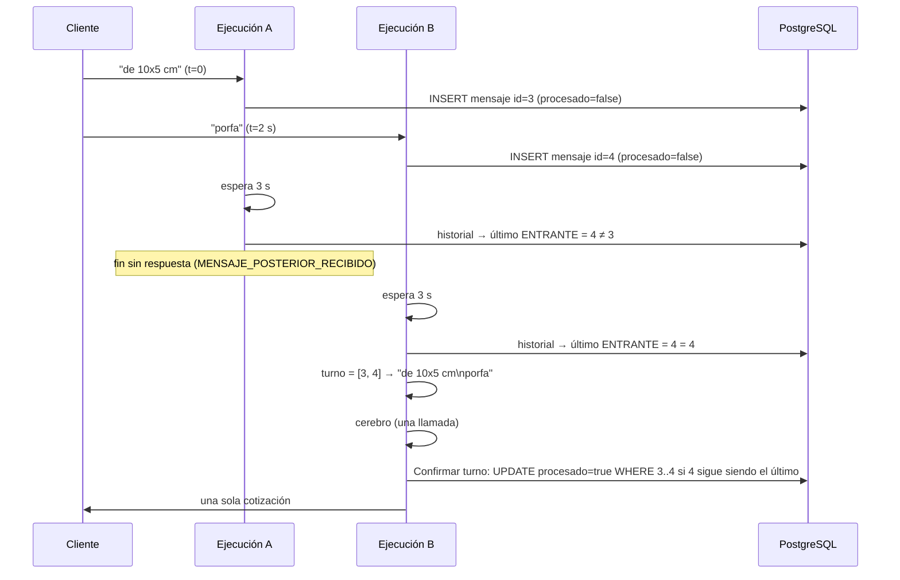

# Etapa 03 · Conversación

Busca o crea la conversación, **guarda el mensaje entrante**, decide si el bot puede responder (`MODO_PRUEBA` y atención humana), **espera la ventana del turno conversacional** (debounce) y arma el contexto para el cerebro comercial con todos los mensajes del turno.

```mermaid
flowchart LR
    U[Unificar prospecto] --> BC[(Buscar conversación)]
    BC --> RC[Resolver conversación prospecto]
    RC --> IC{¿Conversación<br/>prospecto existe?}
    IC -->|true| UC[Unificar conversación]
    IC -->|false| CC[(Crear conversación prospecto)]
    CC --> PCC[Preparar conversación creada] --> UC
    UC --> PC[Preparar conversación]
    PC --> GM[(Guardar mensaje entrante)]
    GM --> MP[(Obtener configuración MODO_PRUEBA)]
    MP --> RP[Resolver permiso automatización]
    RP --> IB{¿Puede responder<br/>el BOT?}
    IB -->|false| FMP[Finalizar mensaje modo prueba]
    IB -->|true| IH{¿Requiere<br/>atención humana?}
    IH -->|true| FAH[Finalizar mensaje atención humana]
    IH -->|false| W[/Esperar ventana de turno/]
    W --> RH[(Recuperar historial conversación)]
    RH --> RT[Resolver turno conversacional]
    RT --> IT{¿Procesar turno?}
    IT -->|false| FIN([fin sin respuesta:<br/>llegó un mensaje posterior])
    IT -->|true| CIA[Preparar contexto IA] --> E04[Etapa 04 · Cerebro comercial]
```



Nodos nuevos (debounce): **Esperar ventana de turno** (Wait), **Resolver turno conversacional** (Code) e **IF: ¿Procesar turno?** (IF). La confirmación atómica del turno está en la etapa 04 ("Confirmar turno conversacional" e "¿Turno confirmado?"). Ver [Turno conversacional](#turno-conversacional-debounce).

Credencial **Postgres account 2**, esquema **`pegaso`**.

## Nodos

### Buscar conversación · Postgres Select

| Parámetro | Valor |
|---|---|
| Tabla | `pegaso.conversaciones` |
| Return All | no · Limit `1` |
| Condiciones | 3 condiciones combinadas con `AND` (por documentar: no se ven en la captura) |
| Sort | ninguno ⚠️ |

### Resolver conversación prospecto · Code

Archivo: [`code/03-conversacion/resolver-conversacion-prospecto.js`](../../code/03-conversacion/resolver-conversacion-prospecto.js)

Toma el prospecto de `$('Unificar prospecto')` y agrega `conversacion_existe` (id > 0), `conversacion_id`, `conversacion_estado`, `conversacion_cliente_id` / `conversacion_contacto_id` / `conversacion_prospecto_id` y `conversacion_contexto_comercial` (la memoria guardada; "Preparar conversación" la parsea). "Buscar conversación" no limita columnas, así que la fila trae `contexto_comercial`.

### IF: ¿Conversación prospecto existe? · IF

Condición: `{{ $json.conversacion_existe }}` **is true**.
`true` → Unificar conversación (entrada 1). `false` → Crear conversación prospecto.

### Crear conversación prospecto · Postgres Insert

Tabla `pegaso.conversaciones`, *Map Each Column Manually*:

| Columna | Valor |
|---|---|
| `id` | vacío |
| `cliente_id`, `contacto_id` | vacío |
| `telefono` | `{{ $json.telefono }}` |
| `canal` | `{{ $json.canal }}` |
| `estado` | `ACTIVA` |
| `ultimo_mensaje_at` | `{{ $json.recibido_at }}` |
| `creada_at` | vacío |
| `prospecto_id` | `{{ $json.prospecto_id }}` |
| … | hay más columnas debajo (por documentar) |

n8n muestra un ⚠️ junto a *Values to Send*: suele indicar que las columnas de la tabla cambiaron y conviene refrescar el mapeo.

### Preparar conversación creada · Code

Archivo: [`code/03-conversacion/preparar-conversacion-creada.js`](../../code/03-conversacion/preparar-conversacion-creada.js)

Valida que el INSERT devolvió `id > 0` (si no, detiene la ejecución) y marca `conversacion_nueva: true`.

### Unificar conversación · Merge

`Append`, 2 entradas: (1) rama `true` de "¿Conversación prospecto existe?", (2) "Preparar conversación creada".

### Preparar conversación · Code

Archivo: [`code/03-conversacion/preparar-conversacion.js`](../../code/03-conversacion/preparar-conversacion.js)

Normaliza ids, determina `tipo_actor` (CLIENTE > CONTACTO > PROSPECTO > DESCONOCIDO) y deja `contexto_comercial` como objeto (`{}` si no hay). Es la fuente de identidad para los nodos siguientes, que la leen con `$('Preparar conversación')`.

### Guardar mensaje entrante · Postgres Insert

Tabla `pegaso.mensajes`:

| Columna | Valor |
|---|---|
| `id` | vacío |
| `conversacion_id` | `{{ $json.conversacion_id }}` |
| `cliente_id` | `{{ $json.cliente_id }}` |
| `direccion` | `ENTRANTE` |
| `tipo` | `{{ $json.tipo }}` |
| `contenido` | `{{ $json.mensaje }}` |
| `mensaje_externo_id` | `{{ $json.mensaje_externo_id }}` |
| `enviado_at` | `{{ $json.recibido_at }}` |
| `procesado` | `false` |

A partir de aquí el mensaje **siempre queda guardado**, aunque el bot no responda. En los caminos de modo prueba y atención humana queda con `procesado = false`. Su `id` (salida del INSERT) es la referencia del debounce: "Resolver turno conversacional" lo lee con `$('Guardar mensaje entrante').first().json.id`.

### Obtener configuración MODO_PRUEBA · Postgres Select

| Parámetro | Valor actual | Cambio recomendado (debounce configurable) |
|---|---|---|
| Tabla | `pegaso.configuracion_bot` | igual |
| Return All | no · Limit `1` | **sí** |
| Condiciones | `clave` **=** `MODO_PRUEBA` | 1) `clave` **=** `MODO_PRUEBA` · 2) `clave` **=** `DEBOUNCE_WHATSAPP` |
| Combine Conditions | — | **OR** |

El nombre del nodo no cambia. El cambio es **opcional**: sin la fila `DEBOUNCE_WHATSAPP` (o sin cambiar este nodo) el debounce usa 3000 ms y 600 s. Si la tabla no tiene ninguna de las dos filas el nodo no devuelve items y el flujo se detiene, igual que hoy.

### Resolver permiso automatización · Code

Archivo: [`code/03-conversacion/resolver-permiso-automatizacion.js`](../../code/03-conversacion/resolver-permiso-automatizacion.js) (v2.0)

Busca entre las filas la de `clave = MODO_PRUEBA` y lee su `valor_json` = `{ "activo": true, "telefonos_permitidos": ["593…"] }` (objeto o texto JSON). Decide:

| Situación | `puede_responder_bot` | `motivo_bloqueo_bot` |
|---|---|---|
| `activo: false` | `true` | — |
| `activo: true` y teléfono en la lista | `true` | — |
| `activo: true` y teléfono fuera de la lista | `false` | `MODO_PRUEBA_TELEFONO_NO_AUTORIZADO` |
| teléfono vacío | `false` | `MODO_PRUEBA_TELEFONO_NO_IDENTIFICADO` |
| sin fila de configuración | `false` (se asume modo prueba activo) | `MODO_PRUEBA_TELEFONO_NO_AUTORIZADO` |
| `valor_json` sin `activo` ⚠️ | `true` | — |

Los teléfonos se comparan solo con dígitos y exactos: guárdalos como `5939…`.

También resuelve la configuración del turno desde la fila `DEBOUNCE_WHATSAPP` (`valor_json` = `{ "debounce_ms": 3000, "turno_max_antiguedad_segundos": 600 }`):

| Campo de salida | Por defecto | Rango aceptado |
|---|---|---|
| `debounce_ms` | `3000` | 0–15000 (se acota) |
| `debounce_segundos` | `3` | `debounce_ms / 1000`; lo usa el Wait |
| `turno_max_antiguedad_segundos` | `600` | 60–86400 |
| `debounce_configurado` | `false` | `true` si existe la fila |

### IF: ¿Puede responder el BOT? · IF

Condición: `{{ $json.puede_responder_bot }}` **is true**.
`true` → ¿Requiere atención humana?. `false` → Finalizar mensaje modo prueba.

### Finalizar mensaje modo prueba · Code

Archivo: [`code/03-conversacion/finalizar-mensaje-modo-prueba.js`](../../code/03-conversacion/finalizar-mensaje-modo-prueba.js)

Cierra la ejecución con `flujo: MODO_PRUEBA`, `mensaje_guardado: true`, `respuesta_automatica: false` y el motivo del bloqueo.

### ¿Requiere atención humana? · IF

Condición: `{{ $('Unificar prospecto').first().json.prospecto_requiere_humano === true }}` **is true**.
Lee el dato directamente del Merge de la etapa 02 (no del nodo anterior).
`true` → Finalizar mensaje atención humana. `false` → **Esperar ventana de turno** (antes iba directo a Recuperar historial conversación).

Orden de prioridad: primero `MODO_PRUEBA`, luego atención humana.

### Finalizar mensaje atención humana · Code

Archivo: [`code/03-conversacion/finalizar-mensaje-atencion-humana.js`](../../code/03-conversacion/finalizar-mensaje-atencion-humana.js)

Cierra con `flujo: ATENCION_HUMANA`, `motivo: PROSPECTO_DERIVADO_A_HUMANO`. No responde ni avisa al asesor; el mensaje queda en la base para que lo vea la persona que atiende. No pasa por el debounce: sin espera ni consultas extra.

### Esperar ventana de turno · Wait — NUEVO

| Campo | Valor |
|---|---|
| NOMBRE | `Esperar ventana de turno` |
| TIPO | **Wait** (n8n-nodes-base.wait) |
| ENTRADA | salida `false` de "¿Requiere atención humana?" (item de "Resolver permiso automatización") |
| CONFIGURACIÓN | *Resume*: **After Time Interval** · *Wait Unit*: **Seconds** |
| EXPRESIONES | *Wait Amount*: `{{ $('Resolver permiso automatización').first().json.debounce_segundos }}` |
| CONEXIÓN DESDE | ¿Requiere atención humana? → salida **false** (reemplaza la conexión a "Recuperar historial conversación") |
| CONEXIÓN HACIA | Recuperar historial conversación |

Pasa el item sin cambios, así que "Recuperar historial conversación" sigue funcionando con `{{ $json.conversacion_id }}`. Con esperas de menos de 65 s n8n no guarda la ejecución en la base: la mantiene en memoria. Si n8n se reinicia durante la espera, esa ejecución se pierde; el mensaje queda `procesado = false` y lo absorbe el siguiente turno.

### Recuperar historial conversación · Postgres Select

| Parámetro | Valor |
|---|---|
| Tabla | `pegaso.mensajes` |
| Return All | **sí** (sin límite) |
| Condición | `conversacion_id` **=** `{{ $json.conversacion_id }}` |
| Sort | `enviado_at` **ASC** |

Sin cambios de configuración; ahora va **después** de la espera, así que también trae los mensajes que llegaron durante la ventana. Devuelve todos los mensajes de la conversación, incluidos los del turno actual. Lo leen "Resolver turno conversacional" (`$input`) y "Preparar contexto IA" (`$('Recuperar historial conversación').all()`).

### Resolver turno conversacional · Code — NUEVO

Archivo: [`code/03-conversacion/resolver-turno-conversacional.js`](../../code/03-conversacion/resolver-turno-conversacional.js)

| Campo | Valor |
|---|---|
| NOMBRE | `Resolver turno conversacional` |
| TIPO | **Code** (JavaScript, *Run Once for All Items*) |
| ENTRADA | filas de "Recuperar historial conversación" |
| CONFIGURACIÓN | pegar el archivo (o `npm run build` cuando el nodo exista) |
| EXPRESIONES | dentro del código: `$('Guardar mensaje entrante').first().json` (id y `enviado_at` de este mensaje) y `$('Resolver permiso automatización').first().json` (antigüedad máxima) |
| CONEXIÓN DESDE | Recuperar historial conversación |
| CONEXIÓN HACIA | IF: ¿Procesar turno? |

Decide sin IA:

| Situación | `continuar_procesamiento` | `resultado_turno` | `motivo_no_procesamiento` |
|---|---|---|---|
| este mensaje es el último ENTRANTE válido | `true` | `PROCESAR` | `null` |
| llegó un ENTRANTE posterior | `false` | `DEBOUNCE_SUPERSEDED` | `MENSAJE_POSTERIOR_RECIBIDO` |
| esta fila es un reenvío del webhook (mismo `mensaje_externo_id` que una fila anterior) | `false` | `DUPLICADO` | `MENSAJE_DUPLICADO` |
| este mensaje ya está `procesado = true` (re-ejecución) | `false` | `YA_PROCESADO` | `TURNO_YA_PROCESADO` |

Si procesa, el turno son los ENTRANTE válidos con `procesado = false`, posteriores al último SALIENTE **anterior a este mensaje**, hasta este mensaje y con no más de `turno_max_antiguedad_segundos` de antigüedad respecto de él. Salida: `turno_texto` (un mensaje por línea, en orden), `turno_mensajes`, `turno_mensaje_ids`, `turno_desde_id`, `turno_hasta_id`, `cantidad_mensajes_turno`, `mensajes_descartados_por_antiguedad`. Lanza error solo si falta el id de "Guardar mensaje entrante" o la fila no aparece en el historial.

### IF: ¿Procesar turno? · IF — NUEVO

| Campo | Valor |
|---|---|
| NOMBRE | `IF: ¿Procesar turno?` |
| TIPO | **If** |
| ENTRADA | item de "Resolver turno conversacional" |
| CONFIGURACIÓN | una condición *Boolean* → **is true** |
| EXPRESIONES | `{{ $json.continuar_procesamiento }}` |
| CONEXIÓN DESDE | Resolver turno conversacional |
| CONEXIÓN HACIA | `true` → Preparar contexto IA · `false` → **sin conexión** (la ejecución termina bien; la salida de "Resolver turno conversacional" muestra el motivo) |

### Preparar contexto IA · Code

Archivo: [`code/03-conversacion/preparar-contexto-ia.js`](../../code/03-conversacion/preparar-contexto-ia.js) (v3.0)

Entrada directa: salida `true` de "¿Procesar turno?" (antes: "Recuperar historial conversación"). Lee el historial con `$('Recuperar historial conversación').all()` y el turno con `$('Resolver turno conversacional')`. Junta la identidad de `$('Preparar conversación')` con ambos y arma lo que lee el prompt del cerebro comercial:

- Identidad y prospecto: `conversacion_id`, `prospecto_id`, `tipo_actor`, `prospecto_estado`, `prospecto_clasificacion` (calculada desde el estado si no viene: NUEVO → C), etc.
- `mensaje_actual` = **el turno completo** (`turno_texto`); `mensaje_disparador` = el mensaje de esta ejecución; `turno_mensaje_ids`, `turno_desde_id`, `turno_hasta_id`, `cantidad_mensajes_turno`; `tipo_mensaje`. Si "Resolver turno conversacional" no se ejecutó, el turno es solo el mensaje de "Preparar conversación".
- `contexto_comercial`: la memoria guardada **completa** (`...previo`, incluidos `handoff`, `ultima_restriccion_comercial`, `cotizacion.producto`, `cantidad_solicitada`…), con `prospecto`, `ubicacion`, `diseno` y `cotizacion` actualizados. `cotizacion.cantidad` cae a `cantidad_cotizable` / `cantidad_solicitada`.
- `historial` (mensajes con contenido, **sin** los mensajes del turno ni reenvíos del webhook), `cantidad_mensajes_historial`, `ultimo_mensaje_saliente` y `mensajes_salientes_recientes`.

## Turno conversacional (debounce)

El cliente suele escribir en partes ("de 10x5 cm" + "porfa"). Cada mensaje dispara una ejecución; sin control, cada una llamaría a la IA y respondería (dos cotizaciones). Regla: **responde solo la ejecución del último mensaje, y responde a todo lo pendiente**. La IA no participa en esta decisión.



**Dos puntos de control:**

1. **Después de la espera** ("Resolver turno conversacional"): descarta, antes de gastar IA, las ejecuciones que ya tienen un mensaje posterior. Reutiliza "Recuperar historial conversación": no agrega consultas.
2. **Antes de actuar** ("Confirmar turno conversacional", etapa 04, justo antes del Switch): un único `UPDATE … SET procesado = true` condicionado a que el mensaje siga siendo el último ENTRANTE. Si llegó otro mientras la IA pensaba, no confirma, no responde, y sus mensajes (que siguen `false`) entran en el turno de la ejecución nueva.

**Por qué no alcanza con `MAX(mensajes.id)` solo en el primer punto:** si "porfa" llega cuando A ya pasó el control y está en la IA, A cotizaría "de 10x5 cm" y B volvería a incluirlo (sigue `false`): dos cotizaciones. El segundo control cierra esa carrera sin columnas nuevas ni locks: la comparación y la marca son una sola sentencia SQL.

**`MAX(id)` es confiable** como orden de llegada: `id` es una secuencia y el INSERT de cada ejecución termina antes de su espera. Dos INSERT casi simultáneos pueden confirmar en orden distinto a su id; la diferencia es de milisegundos frente a una ventana de 3 s, y el segundo control lo vuelve a verificar.

**Definición de turno (opción elegida: ENTRANTE pendientes desde el último SALIENTE, con tope de antigüedad):**

| Opción | Regla | Problema |
|---|---|---|
| A | ENTRANTE posteriores al último SALIENTE | depende de que el saliente se guarde; un turno sin respuesta (fallo de IA) o bloqueado se arrastra para siempre |
| B | ENTRANTE con `procesado = false` | hoy `procesado` es inconsistente (pendiente técnico 39): en 06 y 07 los entrantes quedan `false` y se repetirían |
| C | ventana de tiempo fija (p. ej. últimos 30 s) | corta preguntas lentas y mezcla turnos ya respondidos |
| **Elegida** | B ∩ A ∩ tope de 600 s | `procesado` pasa a tener un único escritor ("Confirmar turno conversacional"), así que B queda consistente; A evita repetir lo ya respondido aunque falte la marca; el tope evita arrastrar mensajes viejos (bloqueados por MODO_PRUEBA o previos al despliegue) |

**Ventana:** 3000 ms por defecto (`DEBOUNCE_WHATSAPP.debounce_ms`, 0–15000). No hay tope de duración del turno: si el cliente escribe un mensaje cada 2 s, el bot responde 3 s después del último. Es lo deseado en WhatsApp y evita complejidad; `turno_max_antiguedad_segundos` (600) solo limita qué mensajes viejos entran.

### Casos verificados

| Caso | Resultado | Fixture |
|---|---|---|
| 1. Un mensaje | turno = ese mensaje | `03-resolver-turno--mensaje-unico` |
| 2. Dos mensajes rápidos | el primero termina sin respuesta; el segundo agrupa ambos | `03-resolver-turno--dos-mensajes-*`, `03-preparar-contexto-ia--turno-agrupado` |
| 3. Cuatro mensajes | un turno con los cuatro en orden | `03-resolver-turno--cuatro-mensajes` |
| 4. "de 10x5 cm" + "porfa" | una sola cotización | `03-resolver-turno--dos-mensajes-gana-ultimo` |
| 5. "Como es la metodología" + "de trabajo?" | una sola respuesta | `03-resolver-turno--pregunta-partida` |
| 6. "Si estoy de acuerdo" / "páseme una cuenta" / "por favor" | DERIVAR_HUMANO, SOLICITA_DATOS_PAGO, ALTA, notificación | `03-resolver-turno--acepta-y-pide-cuenta`, `04-normalizar-decision-ia--turno-agrupado-datos-pago` |
| 7. "10x5" y 20 s después "y serían 2000" | turno nuevo; la memoria conserva 10x5 y se recotiza 2000 | `03-resolver-turno--nuevo-turno-tras-respuesta`, `03-preparar-contexto-ia--nuevo-turno-con-memoria`, `04-resolver-contexto-comercial--nuevo-turno-cambia-cantidad` |
| 8. `requiere_humano` | se guardan y no se responde (no llega al debounce) | `03-finalizar-mensaje-atencion-humana` |
| Reenvío del webhook | solo responde la fila original | `03-resolver-turno--duplicado-*` |
| Turno anterior falló en la IA | el siguiente mensaje lo reabsorbe | `03-resolver-turno--reintento-tras-fallo-ia` |
| Mensajes viejos sin procesar | quedan fuera del turno | `03-resolver-turno--descarta-antiguos` |
| Mensaje durante una cotización ya confirmada | no repite lo confirmado | `03-resolver-turno--en-vuelo-excluye-confirmados` |

## Contrato de salida de la etapa

Entrada del cerebro comercial (resumido):

```json
{
  "conversacion_id": 41, "prospecto_id": 16, "cliente_id": null, "contacto_id": null,
  "tipo_actor": "PROSPECTO", "telefono": "593987654321", "nombre_whatsapp": "Ana Pérez",
  "prospecto_estado": "NUEVO", "prospecto_clasificacion": "C", "prospecto_requiere_humano": false,
  "mensaje_actual": "de 10x5 cm\nporfa", "mensaje_disparador": "porfa", "tipo_mensaje": "TEXTO",
  "turno_mensaje_ids": [3, 4], "turno_desde_id": 3, "turno_hasta_id": 4, "cantidad_mensajes_turno": 2,
  "contexto_comercial": {
    "prospecto": { "id": 16, "estado": "NUEVO", "clasificacion": "C", "producto_interes": null,
                   "requiere_humano": false, "ultima_intencion": null, "ultima_accion": null },
    "ubicacion": { "ciudad": null, "provincia": null },
    "diseno": { "estado": null },
    "cotizacion": { "existe": false, "id": null, "estado": null, "cantidad": null, "ancho_cm": null,
                    "alto_cm": null, "forma": null, "precio_total": null, "moneda": "USD" }
  },
  "historial": [ { "direccion": "ENTRANTE", "contenido": "Hola", "tipo": "TEXTO", "enviado_at": "2026-10-07T22:50:00.000Z" } ],
  "cantidad_mensajes_historial": 2,
  "ultimo_mensaje_saliente": "¿En qué medidas necesita sus etiquetas?"
}
```

La memoria guardada viaja completa dentro de `contexto_comercial` (en el ejemplo, una conversación sin memoria previa).

## Pruebas

`tests/fixtures/03-*.json`: conversación existente (con memoria) y nueva, INSERT sin id, las cinco variantes de `MODO_PRUEBA`, la configuración del debounce, los dos cierres, el historial, el turno agrupado, la memoria conservada y los casos de `resolver-turno` (tabla de [casos verificados](#casos-verificados)).
