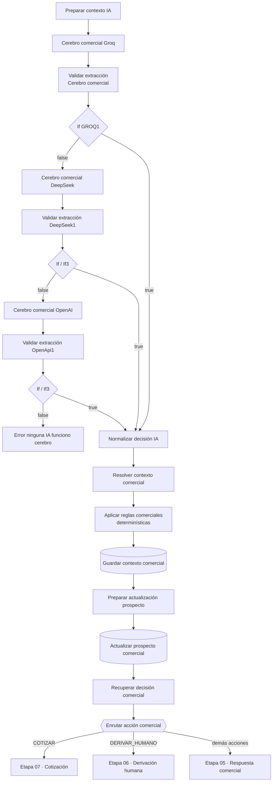

# Etapa 04 · Cerebro comercial

La IA interpreta el mensaje y devuelve una decisión estructurada; el código la **valida**, la **corrige** con reglas fijas, guarda la memoria comercial, actualiza el prospecto y enruta según la acción. La IA propone, el código decide.



Credencial **Postgres account 2**, esquema **`pegaso`**. Los nodos Postgres de tipo Update devuelven **la fila actualizada**, no el item que recibieron; por eso varios nodos Code recuperan datos con `$('Nombre del nodo')`.

## Nodos

### Cerebro comercial Groq / DeepSeek / OpenAI · LLM

Mismo prompt y mismo schema en los tres: [`prompts/cerebro-comercial.md`](../../prompts/cerebro-comercial.md) y [`schemas/cerebro-comercial.schema.json`](../../schemas/cerebro-comercial.schema.json). El prompt lee los datos de `$('Preparar contexto IA')`. Groq es el principal; DeepSeek y OpenAI son respaldo.

Salida: `output` con `intencion`, `accion`, `producto`, `material`, `cantidad`, `ancho_cm`, `alto_cm`, `forma`, `ciudad_detectada`, `provincia_detectada`, `datos_suficientes_para_cotizar`, `requiere_humano`, `motivo_derivacion`, `requiere_notificacion`, `clasificacion_prospecto` y `respuesta_sugerida`.

### Validar extracción Cerebro comercial / DeepSeek1 / OpenApi1 · Code

Archivo (compartido por los tres): [`code/04-cerebro-comercial/validar-extraccion-cerebro.js`](../../code/04-cerebro-comercial/validar-extraccion-cerebro.js)

Solo **rechaza**; no corrige. Devuelve la decisión con `valid` y `validation_reason`. Principales motivos de rechazo:

| Regla | Ejemplo de rechazo |
|---|---|
| Contrato | texto que no es JSON, falta un campo, enum o tipo inválido, número ≤ 0 |
| Respuesta | vacía (salvo `COTIZAR_P4`), con 😊, empieza con "Perfecto", "Entendemos" o "Con gusto le explico", o igual al último mensaje saliente |
| `COTIZAR_P4` | sin cantidad o sin medidas, lado ≤ 1 cm, `datos_suficientes_para_cotizar` falso, requiere humano o clasificación C |
| `PEDIR_MEDIDAS` / `PEDIR_PRODUCTO` / `PEDIR_FORMA` | se piden datos que ya existen |
| `MEDIDA_NO_PRODUCIBLE` | la medida no tiene un lado ≤ 1 cm, o lleva humano/notificación/motivo |
| `INFORMAR_*` | la intención no es la `CONSULTAR_*` correspondiente |
| Derivación | `DERIVAR_HUMANO` sin `requiere_humano`, sin motivo o sin notificación; intenciones que obligan a derivar (REPORTAR_PAGO, CONFIRMAR_PEDIDO, SOLICITAR_LLAMADA, SOLICITAR_HUMANO, NEGOCIAR, RECLAMO) con otra acción; motivo que no corresponde a la intención |
| Pago | CONSULTAR_PAGO solo admite `INFORMAR_METODOLOGIA_PAGO` o `DERIVAR_HUMANO` + `SOLICITA_DATOS_PAGO` + clasificación A |
| Clasificación | ACEPTAR_COTIZACION, CONFIRMAR_PEDIDO, REPORTAR_PAGO, SOLICITA_DATOS_PAGO y ENVIA_COMPROBANTE deben ser A |

Si hay medidas y falta la cantidad, pone `cantidad = 1000`. Esto ocurre después de la comprobación de `COTIZAR_P4`, así que para cotizar la IA debe enviar la cantidad (el prompt le indica usar 1000).

### If GROQ1 / If / If3 · IF

Condición: `{{ $json.valid }}` **is true** (captura de "If GROQ1"; "If" e "If3" se asumen iguales).
`true` → Normalizar decisión IA. `false` → siguiente proveedor; después de OpenAI, "Error ninguna IA funciono cerebro".

### Error ninguna IA funciono cerebro · Code

Archivo: [`code/04-cerebro-comercial/error-ninguna-ia-cerebro.js`](../../code/04-cerebro-comercial/error-ninguna-ia-cerebro.js)

Devuelve un item fijo (`status: AI_EXTRACTION_FAILED`). El cliente no recibe respuesta (pendiente técnico 4).

### Normalizar decisión IA · Code

Archivo: [`code/04-cerebro-comercial/normalizar-decision-ia.js`](../../code/04-cerebro-comercial/normalizar-decision-ia.js)

Une la decisión validada (`$json`) con la identidad de `$('Preparar contexto IA')` y arma un contrato único:

- **Clasificación A/B/C**: la mayor entre la anterior, la de la IA y el mínimo por intención ([reglas-comerciales §9](../reglas-comerciales.md#9-clasificación-de-prospectos-abc)).
- `etiqueta_grande` (lado corto > 10 o lado largo > 15 cm), `debe_pedir_ciudad_despues_cotizacion`, `cierre_cordial`.
- `requiere_notificacion = requiere_humano` y `prioridad_derivacion`: ALTA para pago, comprobante, pedido, reclamo y problemas; MEDIA para el resto de derivaciones; NORMAL sin derivación.
- Limpia el tono de `respuesta_sugerida` (quita 😊 y aperturas como "¡Perfecto!").
- Lanza error si `requiere_humano = true` con una acción distinta de `DERIVAR_HUMANO`.

No conserva `historial` ni `ultimo_mensaje_saliente` (pendiente técnico 19).

### Resolver contexto comercial · Code

Archivo: [`code/04-cerebro-comercial/resolver-contexto-comercial.js`](../../code/04-cerebro-comercial/resolver-contexto-comercial.js)

Combina los datos del mensaje con `contexto_comercial.cotizacion` de `$('Preparar contexto IA')` (lo nuevo gana), asume 1000 unidades si hay medidas sin cantidad, redondea a múltiplos de 1000 y **decide la acción final** en el orden de [reglas-comerciales §10](../reglas-comerciales.md#cómo-se-decide-la-acción-final). Para `PEDIR_MEDIDAS` fija el texto estándar; para `COTIZAR_P4` vacía la respuesta (la arma el cotizador).

Construye el `contexto_comercial` nuevo: el anterior más `cotizacion` con `producto`, `material`, `cantidad_solicitada`, `cantidad_cotizable`, `cantidad_ajustada`, `cantidad_asumida`, `ancho_cm`, `alto_cm` y `forma`.

⚠️ `MEDIDA_NO_PRODUCIBLE` no está entre las acciones que respeta: con medidas y una intención de cotizar se convierte en `COTIZAR_P4` (pendiente técnico 2).

### Aplicar reglas comerciales determinísticas · Code

Archivo: [`code/04-cerebro-comercial/aplicar-reglas-comerciales.js`](../../code/04-cerebro-comercial/aplicar-reglas-comerciales.js)

Si un lado mide 1 cm o menos: `accion = RESPONDER_NO_PRODUCIBLE`, sin humano ni notificación, respuesta fija y la restricción guardada en `contexto_comercial` (`cotizacion.producible = false`, `ultima_restriccion_comercial`). Si no, devuelve el item igual con `solicitud_producible: true`.

### Guardar contexto comercial · Postgres Update

Tabla `pegaso.conversaciones`, *Map Each Column Manually*, columna de búsqueda `id`:

| Columna | Valor |
|---|---|
| `id` (búsqueda) | `{{ $json.conversacion_id }}` |
| `ultimo_mensaje_at` | `{{ $('Preparar conversación').first().json.recibido_at }}` |
| `contexto_comercial` | `{{ JSON.stringify($json.contexto_comercial) }}` |

Confirma que `conversaciones.contexto_comercial` existe. Como el contexto que entra a la IA llega reconstruido y sin la cotización guardada (pendiente técnico 1), este UPDATE **reemplaza** la memoria anterior en cada mensaje.

Salida: la fila de `conversaciones`.

### Preparar actualización prospecto · Code

Archivo: [`code/04-cerebro-comercial/preparar-actualizacion-prospecto.js`](../../code/04-cerebro-comercial/preparar-actualizacion-prospecto.js)

Prepara los campos `prospecto_*_update` que usa el nodo siguiente: estado actual (no lo cambia), producto de interés, ciudad y provincia (conserva los anteriores si el mensaje no trae nuevos), última intención, última acción, `requiere_humano` y `prospecto_actualizado_at`. Lanza error si no hay `prospecto_id`.

⚠️ Lee `$input`, que por la conexión actual es la **fila de conversaciones** devuelta por "Guardar contexto comercial", no la decisión. Resultado: estado `NUEVO`, intención, acción, producto y ciudad en `null` y `requiere_humano = false` en cada mensaje (pendiente técnico 36).

### Actualizar prospecto comercial · Postgres Update

Tabla `pegaso.prospectos`, columna de búsqueda `id`:

| Columna | Valor |
|---|---|
| `id` (búsqueda) | `{{ $json.prospecto_id_update }}` |
| `estado` | `{{ $json.prospecto_estado_update }}` |
| `producto_interes` | `{{ $json.prospecto_producto_interes_update }}` |
| `ciudad` | `{{ $json.prospecto_ciudad_update }}` |
| `provincia` | `{{ $json.prospecto_provincia_update }}` |
| `ultima_intencion` | `{{ $json.prospecto_ultima_intencion_update }}` |
| `ultima_accion` | `{{ $json.prospecto_ultima_accion_update }}` |
| `requiere_humano` | `{{ $json.prospecto_requiere_humano_update }}` |
| `actualizado_at` | `{{ $json.prospecto_actualizado_at }}` |

Salida: la fila de `prospectos`. "Resolver estado prospecto" (etapa 05) la lee con `$('Actualizar prospecto comercial')`.

### Recuperar decisión comercial · Code

Archivo: [`code/04-cerebro-comercial/recuperar-decision-comercial.js`](../../code/04-cerebro-comercial/recuperar-decision-comercial.js)

Recupera la decisión con `$('Resolver contexto comercial')` (el UPDATE solo devolvió la fila) y agrega `prospecto_actualizado: true`. Lanza error si no hay `accion`.

⚠️ Lee "Resolver contexto comercial" y no "Aplicar reglas comerciales determinísticas": el cambio a `RESPONDER_NO_PRODUCIBLE` no llega al Switch (pendiente técnico 2).

### Enrutar acción comercial · Switch

Modo **Rules**, una salida por acción más **Fallback**. Salidas visibles en el canvas (los nombres largos aparecen cortados):

| Salida | Acción del cerebro | Rama |
|---|---|---|
| COTIZAR | `COTIZAR_P4` (verificar que la regla compare con ese valor) | 07 Cotización |
| PEDIR_MEDIDAS, PEDIR_PRODU…, PEDIR_FORMA | `PEDIR_MEDIDAS`, `PEDIR_PRODUCTO`, `PEDIR_FORMA` | 05 Respuesta |
| INFORMAR_M…, INFORMAR_MI…, INFORMAR_UB…, INFORMAR_M…, INFORMAR_M…, INFORMAR_EN…, INFORMAR_DI… | `INFORMAR_MATERIAL`, `_MINIMO`, `_UBICACION`, `_METODOLOGIA`, `_METODOLOGIA_PAGO`, `_ENTREGA`, `_DISENO` | 05 Respuesta |
| RESPONDER_… (dos salidas) | `RESPONDER_GENERAL` y otra por confirmar | 05 Respuesta |
| REGISTRA… (dos salidas) | `REGISTRAR_ACEPTACION` y otra por confirmar | 05 Respuesta |
| MEDIDA_NO_P… | `MEDIDA_NO_PRODUCIBLE` | por confirmar |
| DERIVAR_HUM… | `DERIVAR_HUMANO` | 06 Derivación |
| PEDIR_CANTID…, ENVIAR_DA…, VALIDAR_A… | ninguna: el validador no admite esas acciones | — |
| Fallback | cualquier otra | por confirmar |

Por documentar: el valor exacto de cada regla y a qué nodo va cada salida, en especial Fallback (pendiente técnico 37).

## Contrato de salida de la etapa

Lo que recibe cada rama (resumido, caso "Hola, necesito etiquetas de 10x5 cm"):

```json
{
  "conversacion_id": 41, "prospecto_id": 16, "cliente_id": null, "tipo_actor": "PROSPECTO",
  "telefono": "593987654321", "nombre_whatsapp": "Ana Pérez",
  "mensaje_actual": "Hola, necesito etiquetas de 10x5 cm",
  "intencion": "SOLICITAR_COTIZACION", "accion": "COTIZAR_P4",
  "cantidad": 1000, "cantidad_solicitada": 1000, "cantidad_cotizable": 1000,
  "ancho_cm": 10, "alto_cm": 5, "forma": "RECTANGULAR", "datos_suficientes_para_cotizar": true,
  "clasificacion_prospecto": "B", "requiere_humano": false, "motivo_derivacion": "NINGUNO",
  "requiere_notificacion": false, "prioridad_derivacion": "NORMAL", "respuesta_sugerida": "",
  "contexto_comercial": { "cotizacion": { "cantidad_cotizable": 1000, "ancho_cm": 10, "alto_cm": 5, "forma": "RECTANGULAR" } },
  "prospecto_actualizado": true
}
```

## Pruebas

`tests/fixtures/04-*.json`: validaciones (JSON inválido, cotizar sin cantidad, medida de 1 cm, repetición, pago sin A, tono), error sin IA, normalización (clasificación que no baja, derivación de pago, incoherencia), decisión final (cotizar, redondeo, pedir medidas, pregunta informativa con cotización previa, medida no producible), reglas determinísticas, actualización de prospecto (diseño y conexión actual) y recuperación de la decisión.
