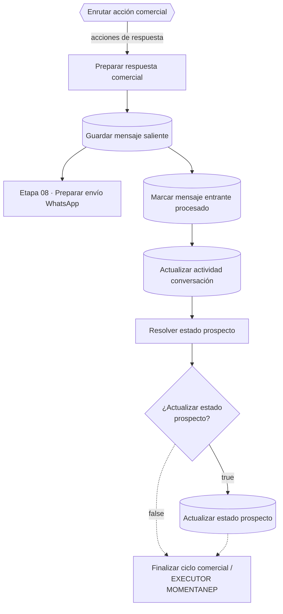

# Etapa 05 · Respuesta comercial

Rama de las acciones que solo requieren contestar (pedir datos, informar material, mínimo, ubicación, metodología, pago, entrega, diseño, aceptación, respuesta general). Guarda la respuesta, la envía, marca el mensaje entrante como procesado y aplica el único cambio de estado de esta rama: `NUEVO` → `EN_CONVERSACION`.

Las líneas punteadas son supuestas: la conexión exacta de "Finalizar ciclo comercial" y "EXECUTOR MOMENTANEP" está por documentar.

Credencial **Postgres account 2**, esquema **`pegaso`**. En los mapeos, las columnas que aparecen vacías no reciben valor.

## Nodos

### Preparar respuesta comercial · Code

Archivo: [`code/05-respuesta-comercial/preparar-respuesta-comercial.js`](../../code/05-respuesta-comercial/preparar-respuesta-comercial.js)

Procesa todos los items. Exige `conversacion_id` y `respuesta_sugerida` no vacía (si falta, lanza error con el nombre de la acción). Si la respuesta repite `ultimo_mensaje_saliente`, la cambia por *"¿Qué parte desea que revisemos o aclaremos por favor?"*; hoy no ocurre porque ese campo no llega hasta aquí (pendiente técnico 19).

Salida: `respuesta_final`, `respuesta_duplicada_evitable` y `mensaje_saliente` (`conversacion_id`, `cliente_id`, `direccion: SALIENTE`, `tipo: TEXTO`, `contenido`).

### Guardar mensaje saliente · Postgres Insert

Tabla `pegaso.mensajes`:

| Columna | Valor |
|---|---|
| `id` | vacío |
| `conversacion_id` | `{{ $json.mensaje_saliente.conversacion_id }}` |
| `cliente_id` | `{{ $json.mensaje_saliente.cliente_id }}` |
| `direccion` | `SALIENTE` |
| `tipo` | `TEXTO` |
| `contenido` | `{{ $json.respuesta_final }}` |
| `mensaje_externo_id` | vacío |
| `enviado_at` | `{{ $now }}` |
| `procesado` | `true` |

Se guarda **antes** de enviarse: si YCloud falla, el mensaje queda en la base como enviado. El id que devuelve YCloud no se guarda.

Salida: la fila insertada; va a la etapa 08 y a "Marcar mensaje entrante procesado".

### Marcar mensaje entrante procesado · Postgres Update

Tabla `pegaso.mensajes`, columna de búsqueda **`mensaje_externo_id`**:

| Columna | Valor |
|---|---|
| `mensaje_externo_id` (búsqueda) | `{{ $('Preparar conversación').first().json.mensaje_externo_id }}` |
| `id`, `enviado_at` | vacíos |
| `procesado` | `true` |

⚠️ En pruebas con "Mensaje entrante TEST" el `mensaje_externo_id` es `null`, el UPDATE no encuentra filas y la rama puede detenerse aquí (pendiente técnico 38).

### Actualizar actividad conversación · Postgres Update

Tabla `pegaso.conversaciones`, columna de búsqueda `id`:

| Columna | Valor |
|---|---|
| `id` (búsqueda) | `{{ $('Preparar conversación').first().json.conversacion_id }}` |
| `ultimo_mensaje_at` | `{{ $('Preparar conversación').first().json.recibido_at }}` |
| `cliente_id`, `creada_at`, `prospecto_id` | vacíos |

Repite el valor que ya escribió "Guardar contexto comercial" (hora del mensaje entrante, no de la respuesta). n8n muestra ⚠️ junto a *Values to Update*: conviene refrescar las columnas (pendiente técnico 40).

Salida: la fila de `conversaciones` (su `estado` es el de la conversación, p. ej. `ACTIVA`).

### Resolver estado prospecto · Code

Archivo: [`code/05-respuesta-comercial/resolver-estado-prospecto.js`](../../code/05-respuesta-comercial/resolver-estado-prospecto.js)

Toma el estado del prospecto de `$('Actualizar prospecto comercial')` (o de `$('Recuperar decisión comercial')`), nunca del `estado` de la conversación que entra. Solo admite NUEVO, EN_CONVERSACION, COTIZADO, PEDIDO_CONFIRMADO y REQUIERE_HUMANO; con otro estado lanza error (pendiente técnico 10).

Única transición: `NUEVO` → `EN_CONVERSACION`. Salida: `prospecto_id_estado_update`, `prospecto_estado_anterior`, `prospecto_estado_nuevo` y `actualizar_estado_prospecto`.

### IF: ¿Actualizar estado prospecto? · IF

Condición: `{{ $json.actualizar_estado_prospecto }}` **is true**.

### Actualizar estado prospecto · Postgres Update

Tabla `pegaso.prospectos`, columna de búsqueda `id`:

| Columna | Valor |
|---|---|
| `id` (búsqueda) | `{{ $json.prospecto_id_estado_update }}` |
| `estado` | `{{ $json.prospecto_estado_nuevo }}` |
| `actualizado_at` | `{{ $now }}` |

### Finalizar ciclo comercial · Code

Archivo: [`code/05-respuesta-comercial/finalizar-ciclo-comercial.js`](../../code/05-respuesta-comercial/finalizar-ciclo-comercial.js)

Item fijo de cierre (`message: 'Finalizado el siclo comercial'`). No propaga datos.

### EXECUTOR MOMENTANEP · Code (temporal)

Archivo: [`code/05-respuesta-comercial/executor-momentaneo.js`](../../code/05-respuesta-comercial/executor-momentaneo.js)

Marcador de fin (`message: 'LLEGO AL FINAL.'`).

## Efecto en la base

| Tabla | Cambio |
|---|---|
| `mensajes` | nueva fila SALIENTE `procesado = true`; la ENTRANTE pasa a `procesado = true` |
| `conversaciones` | `ultimo_mensaje_at` |
| `prospectos` | `estado = EN_CONVERSACION` si era `NUEVO` |

## Pruebas

`tests/fixtures/05-*.json`: respuesta informativa, respuesta repetida, acción sin texto y las transiciones de estado (NUEVO, COTIZADO y estado fuera de catálogo).
