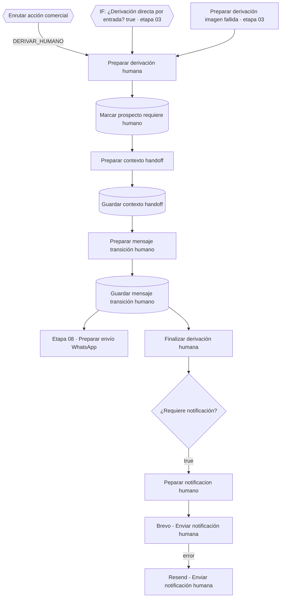

# Etapa 06 · Derivación humana

Rama `DERIVAR_HUMANO`: silencia al bot para este prospecto, guarda el handoff en la memoria comercial, responde al cliente con un mensaje de transición y avisa al equipo por correo. Las reglas de motivo, prioridad y textos están en [flujo-handoff.md](../flujo-handoff.md); aquí va la configuración de cada nodo.



Es la **única** ruta de handoff: las tres entradas (cerebro, entrada no soportada e imagen que falló en los tres proveedores) llegan a "Preparar derivación humana" y comparten persistencia, mensaje de transición y notificación. "Finalizar derivación humana" puede colgar de "Guardar mensaje transición humano" (como en el diagrama) o directamente de "Preparar mensaje transición humano" en paralelo al INSERT: lee el contrato con `$()` y no depende de su entrada.

Credencial **Postgres account 2**, esquema **`pegaso`**.

## Nodos

### Preparar derivación humana · Code

Archivo: [`code/06-derivacion-humana/preparar-derivacion-humana.js`](../../code/06-derivacion-humana/preparar-derivacion-humana.js)

Único nodo que **decide** el handoff: motivo (de la IA o deducido de la intención), clasificación del handoff, prioridad y si se notifica. Guarda aparte el mensaje original del cliente (`mensaje_cliente_original`). v4.0 acepta tres orígenes:

| Entrada | Viene de | Qué trae |
|---|---|---|
| Cerebro comercial | Switch "Enrutar acción comercial" → `DERIVAR_HUMANO` | la decisión completa (`Recuperar decisión comercial`) |
| Entrada no soportada | "IF: ¿Derivación directa por entrada?" (true) | la salida de "Resolver turno conversacional", sin decisión: el motivo, la clasificación y la prioridad se leen de `$('Normalizar mensaje')` (`derivacion_motivo`, `derivacion_clasificacion`, `derivacion_prioridad`) con `intencion = OTRO` |
| Imagen fallida | "Preparar derivación imagen fallida" | el contrato completo con `origen_derivacion = ANALISIS_IMAGEN` |

Reglas:

- **Identidad** con respaldo en orden: entrada → "Recuperar decisión comercial" → "Preparar contexto IA" → "Preparar conversación" → "Unificar prospecto". Lanza error solo si `conversacion_id` o `prospecto_id` no aparecen en ninguno.
- **Motivo**: se respeta el explícito. `NINGUNO`, ausente, u `OTRO` cuando la intención es concreta, se deduce: `CONSULTAR_PAGO` → `SOLICITA_DATOS_PAGO`, `REPORTAR_PAGO` → `REPORTA_PAGO`, `CONFIRMAR_PEDIDO` / `ACEPTAR_COTIZACION` → `DESEA_CONTINUAR_PEDIDO`, `NEGOCIAR` → `NEGOCIACION_COMERCIAL`, `RECLAMO`, `SOLICITAR_LLAMADA` → `SOLICITA_LLAMADA`, `SOLICITAR_HUMANO` → `SOLICITA_HABLAR_CON_PERSONA`.
- **Clasificación** (si no viene): `CIERRE_COMERCIAL`, `POSTVENTA`, `NEGOCIACION`, `CONTACTO_DIRECTO`, `REVISION_IMAGEN`, `REVISION_ARCHIVO` o `REVISION_COMERCIAL`.
- **Prioridad** = la mayor entre la recibida y la mínima del motivo (ALTA: pago, comprobante, pedido, reclamo, problemas; MEDIA: negociación, llamada, persona, imagen, archivo, diseño, entrada no soportada). Nunca baja una ALTA.
- **Notificación** = la pedida, **o** motivo notificable, **o** prioridad ALTA.
- Salida nueva: `origen_derivacion` (`CEREBRO_COMERCIAL`, `ENTRADA_NO_SOPORTADA`, `ANALISIS_IMAGEN`; `DERIVACION_DIRECTA` si una directa no trae origen), `derivacion_directa`, `derivacion_directa_motivo`, `analisis_imagen_fallido` y `contexto_comercial` (para que "Guardar contexto handoff" no borre la memoria).

### Marcar prospecto requiere humano · Postgres Update

Tabla `pegaso.prospectos`, columna de búsqueda `id`:

| Columna | Valor |
|---|---|
| `id` (búsqueda) | `{{ $json.prospecto_id }}` |
| `ultima_accion` | `DERIVAR_HUMANO` (fijo) |
| `requiere_humano` | `true` |
| `actualizado_at` | `{{ $now }}` |

No cambia `estado` (el catálogo tiene `REQUIERE_HUMANO`, pero no se usa). Desde aquí el IF "¿Requiere atención humana?" de la etapa 03 corta los mensajes siguientes.

Salida: la fila de `prospectos`.

### Preparar contexto handoff · Code

Archivo: [`code/06-derivacion-humana/preparar-contexto-handoff.js`](../../code/06-derivacion-humana/preparar-contexto-handoff.js)

Junta la fila del prospecto con `$('Preparar derivación humana')` (el contrato gana) y agrega `contexto_comercial.handoff`: `activo`, `motivo`, `intencion`, `clasificacion`, `prioridad`, `requiere_notificacion`, `mensaje_cliente`, `origen` (v3.1), `iniciado_at`.

### Guardar contexto handoff · Postgres Update

Tabla `pegaso.conversaciones`, columna de búsqueda `id`:

| Columna | Valor |
|---|---|
| `id` (búsqueda) | `{{ $('Preparar derivación humana').first().json.conversacion_id }}` |
| `ultimo_mensaje_at` | `{{ $now }}` |
| `contexto_comercial` | `{{ JSON.stringify($json.contexto_comercial) }}` |

Salida: la fila de `conversaciones`.

### Preparar mensaje transición humano · Code

Archivo: [`code/06-derivacion-humana/preparar-mensaje-transicion-humano.js`](../../code/06-derivacion-humana/preparar-mensaje-transicion-humano.js)

Recupera `$('Preparar contexto handoff')` y elige el texto fijo para el cliente según el motivo (tabla en [flujo-handoff.md](../flujo-handoff.md#mensaje-al-cliente)). v3.2: `ENVIA_COMPROBANTE` usa el texto de pago reportado, `IMAGEN_REQUIERE_REVISION` "…ya revisamos la imagen que nos envió.", `ARCHIVO_NO_PROCESABLE` / `ARCHIVO_DISENO` el de archivo, `ENTRADA_NO_SOPORTADA` "…ya revisamos el mensaje que nos envió.", `CONFIRMAR_PEDIDO` el de pedido, `SOLICITA_HABLAR_CON_PERSONA` el de solicitud ("…ya verificamos su solicitud.") y `PROBLEMA_*` el de reclamo. Salida: `mensaje_transicion` (= `mensaje_salida`), `tipo_mensaje_salida: HANDOFF_HUMANO` y el mensaje original del cliente por separado.

### Guardar mensaje transición humano · Postgres Insert

Tabla `pegaso.mensajes`:

| Columna | Valor |
|---|---|
| `id` | vacío |
| `conversacion_id` | `{{ $json.conversacion_id }}` |
| `cliente_id` | `{{ $json.cliente_id ?? null }}` |
| `direccion` | `SALIENTE` |
| `tipo` | `TEXTO` |
| `contenido` | `{{ $json.mensaje_transicion }}` |
| `mensaje_externo_id` | vacío |
| `enviado_at` | `{{ $now }}` |
| `procesado` | `false` → cambiar a **`true`** |

Cambio en n8n: poner `procesado = true`, igual que los salientes de 05 y 07. Un saliente siempre está "procesado" (lo escribió el bot); `false` en un saliente no significa nada para el debounce (solo lee ENTRANTE), pero confunde las consultas. Los mensajes **entrantes** del turno ya quedan `procesado = true` en "Confirmar turno conversacional" (etapa 04).

Salida: la fila insertada; va a la etapa 08.

### Finalizar derivación humana · Code

Archivo: [`code/06-derivacion-humana/finalizar-derivacion-humana.js`](../../code/06-derivacion-humana/finalizar-derivacion-humana.js)

Contrato final limpio (`flujo: DERIVACION_HUMANA`, identidad, motivo, prioridad, origen de la derivación, ambos mensajes) con `requiere_notificacion` como booleano. v3.1 completa los datos que falten con `$('Preparar derivación humana')`.

### IF: ¿Requiere notificación? · IF

Condición: `{{ $json.requiere_notificacion }}` **is true**. `false` → fin sin correo.

### Peparar notificacion humano · Code

Archivo: [`code/06-derivacion-humana/preparar-notificacion-humano.js`](../../code/06-derivacion-humana/preparar-notificacion-humano.js)

Arma la categoría, la prioridad final, el asunto, el texto y el HTML del correo interno (v3.0). Si a la entrada le falta algún dato, lo completa con `$('Preparar derivación humana')`, así no se pierden intención, prioridad, motivo, nombre, ciudad, clasificación ni el mensaje real del cliente.

| Categoría | Motivos | Prioridad mínima | Asunto |
|---|---|---|---|
| `INTERESADO_PAGO` | `SOLICITA_DATOS_PAGO`, `SOLICITA_CUENTA`… | ALTA | 🔥 Pegaso - Prospecto solicita datos de pago |
| `PAGO_REPORTADO` | `REPORTA_PAGO`, `ENVIA_COMPROBANTE` | ALTA | 💰 Pegaso - Prospecto reportó un pago |
| `CONTINUAR_PEDIDO` | `DESEA_CONTINUAR_PEDIDO`, `CONFIRMAR_PEDIDO` | ALTA | 🔥 Pegaso - Prospecto quiere continuar con su pedido |
| `RECLAMO` | `RECLAMO`, `PROBLEMA_*` | ALTA | ⚠️ Pegaso - Reclamo requiere atención |
| `SOLICITA_CONTACTO` | `SOLICITA_LLAMADA`, `SOLICITA_HABLAR_CON_PERSONA` | MEDIA | 📞 Pegaso - Prospecto solicita contacto |
| `NEGOCIACION` | `NEGOCIACION_COMERCIAL`, `NEGOCIACION`… | MEDIA | 💬 Pegaso - Prospecto quiere negociar |
| `ARCHIVO_REQUIERE_REVISION` | `IMAGEN_REQUIERE_REVISION`, `ARCHIVO_NO_PROCESABLE`, `ARCHIVO_DISENO` | MEDIA | 📎 Pegaso - Archivo requiere revisión |
| `ENTRADA_REQUIERE_REVISION` | `ENTRADA_NO_SOPORTADA` | MEDIA | 📎 Pegaso - Mensaje no soportado requiere revisión |
| `REVISION_GENERAL` | cualquier otro (antes se intenta por la intención) | — | Pegaso - Prospecto requiere revisión |

La prioridad final es la **mayor** entre la del handoff y la mínima de la categoría: nunca baja. El texto lleva Prioridad, Categoría, Motivo, Intención y Origen; luego Prospecto, Teléfono, Ciudad y Clasificación; luego "Último mensaje" (puede incluir la línea `[CONTEXTO DE IMAGEN …]`, nunca el enlace). El HTML escapa los datos del cliente.

Ejemplo ("Hola. Envíeme un número de cuenta por favor."):

```text
PEGASO ADHESIVOS

Nueva conversación requiere atención.

Prioridad: ALTA
Categoría: INTERESADO_PAGO
Motivo: SOLICITA_DATOS_PAGO
Intención: CONSULTAR_PAGO
Origen: CEREBRO_COMERCIAL

Prospecto: Borys Espinoza
Teléfono: 5939…
Ciudad: Cuenca
Clasificación: A

Último mensaje:
Hola. Envíeme un número de cuenta por favor.

Conversación ID: …
Prospecto ID: …
```

### Brevo - Enviar notificación humana / Resend - Enviar notificación humana · HTTP Request

Brevo es el principal. **Resend solo corre en la salida de error de Brevo** (Brevo con *On Error*: **Continue (using error output)**; la rama `success` termina, la rama `error` va a Resend). Los dos usan `asunto_notificacion`, `mensaje_notificacion` y `html_notificacion` de "Peparar notificacion humano".

| | Brevo | Resend |
|---|---|---|
| URL | `POST https://api.brevo.com/v3/smtp/email` | `POST https://api.resend.com/emails` |
| Autenticación | cabecera `api-key: <BREVO_API_KEY>` (credencial de n8n) | cabecera `Authorization: Bearer <RESEND_API_KEY>` (credencial de n8n) |
| Remitente | `<REMITENTE_BREVO>` | `Pegaso Adhesivos <REMITENTE_RESEND>`, dominio verificado `pegasoadhesivos.com` |
| Destinatario | `<DESTINATARIO_NOTIFICACIONES>` | `<DESTINATARIO_NOTIFICACIONES>` |
| Asunto / cuerpo | `subject` / `htmlContent` + `textContent` | `subject` / `html` + `text` |

Los valores entre `< >` son placeholders: las API keys, remitentes y destinatarios reales viven en las credenciales y parámetros de n8n, **nunca** en este repo.

## Efecto en la base

| Tabla | Cambio |
|---|---|
| `prospectos` | `requiere_humano = true`, `ultima_accion = DERIVAR_HUMANO` |
| `conversaciones` | `contexto_comercial.handoff`, `ultimo_mensaje_at` |
| `mensajes` | nueva fila SALIENTE con el mensaje de transición (`procesado = false` hasta aplicar el cambio a `true`); las ENTRANTE del turno ya quedaron `true` en la etapa 04 |

## Pruebas

`tests/fixtures/06-*.json`: derivación por datos de pago (también sin motivo), por negociación sin motivo, por entrada no soportada (directa) y por imagen fallida; falta de prospecto; contexto handoff; textos de transición (pago, reclamo, comprobante e imagen); contrato final y las variantes del correo (datos de pago como `INTERESADO_PAGO`, llamada que no baja de ALTA, imagen que requiere revisión).
