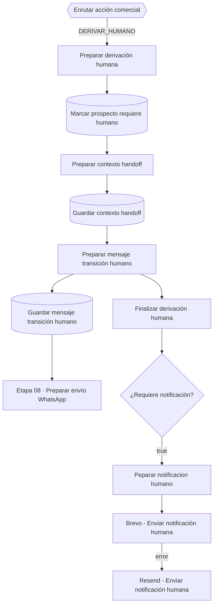

# Etapa 06 · Derivación humana

Rama `DERIVAR_HUMANO`: silencia al bot para este prospecto, guarda el handoff en la memoria comercial, responde al cliente con un mensaje de transición y avisa al equipo por correo. Las reglas de motivo, prioridad y textos están en [flujo-handoff.md](../flujo-handoff.md); aquí va la configuración de cada nodo.

"Finalizar derivación humana" cuelga directamente de "Preparar mensaje transición humano", en paralelo al INSERT del mensaje.

Credencial **Postgres account 2**, esquema **`pegaso`**.

## Nodos

### Preparar derivación humana · Code

Archivo: [`code/06-derivacion-humana/preparar-derivacion-humana.js`](../../code/06-derivacion-humana/preparar-derivacion-humana.js)

Único nodo que **decide** el handoff: motivo (de la IA o deducido de la intención), clasificación del handoff, prioridad y si se notifica. Guarda aparte el mensaje original del cliente (`mensaje_cliente_original`). Lanza error sin `conversacion_id` o `prospecto_id`. Respaldo: `$('Recuperar decisión comercial')`.

v3.1 reconoce los motivos de media del schema del cerebro: `ENVIA_COMPROBANTE` es cierre comercial con prioridad ALTA y notifica; `IMAGEN_REQUIERE_REVISION`, `ARCHIVO_NO_PROCESABLE` y `ARCHIVO_DISENO` siempre notifican.

### Marcar prospecto requiere humano · Postgres Update

Tabla `pegaso.prospectos`, columna de búsqueda `id`:

| Columna | Valor |
|---|---|
| `id` (búsqueda) | `{{ $json.prospecto_id }}` |
| `ultima_accion` | `DERIVAR_HUMANO` (fijo) |
| `requiere_humano` | `true` |
| `actualizado_at` | `{{ $now }}` |

No cambia `estado` (el catálogo tiene `REQUIERE_HUMANO`, pero no se usa). Desde aquí el IF "¿Requiere atención humana?" de la etapa 03 corta los mensajes siguientes.

Salida: la fila de `prospectos`.

### Preparar contexto handoff · Code

Archivo: [`code/06-derivacion-humana/preparar-contexto-handoff.js`](../../code/06-derivacion-humana/preparar-contexto-handoff.js)

Junta la fila del prospecto con `$('Preparar derivación humana')` (el contrato gana) y agrega `contexto_comercial.handoff`: `activo`, `motivo`, `intencion`, `clasificacion`, `prioridad`, `requiere_notificacion`, `mensaje_cliente`, `iniciado_at`.

### Guardar contexto handoff · Postgres Update

Tabla `pegaso.conversaciones`, columna de búsqueda `id`:

| Columna | Valor |
|---|---|
| `id` (búsqueda) | `{{ $('Preparar derivación humana').first().json.conversacion_id }}` |
| `ultimo_mensaje_at` | `{{ $now }}` |
| `contexto_comercial` | `{{ JSON.stringify($json.contexto_comercial) }}` |

Salida: la fila de `conversaciones`.

### Preparar mensaje transición humano · Code

Archivo: [`code/06-derivacion-humana/preparar-mensaje-transicion-humano.js`](../../code/06-derivacion-humana/preparar-mensaje-transicion-humano.js)

Recupera `$('Preparar contexto handoff')` y elige el texto fijo para el cliente según el motivo (tabla en [flujo-handoff.md](../flujo-handoff.md#mensaje-al-cliente)). v3.1: `ENVIA_COMPROBANTE` usa el texto de pago reportado, `IMAGEN_REQUIERE_REVISION` "…ya revisamos la imagen que nos envió." y `ARCHIVO_NO_PROCESABLE` / `ARCHIVO_DISENO` el de archivo. Salida: `mensaje_transicion` (= `mensaje_salida`), `tipo_mensaje_salida: HANDOFF_HUMANO` y el mensaje original del cliente por separado.

### Guardar mensaje transición humano · Postgres Insert

Tabla `pegaso.mensajes`:

| Columna | Valor |
|---|---|
| `id` | vacío |
| `conversacion_id` | `{{ $json.conversacion_id }}` |
| `cliente_id` | `{{ $json.cliente_id ?? null }}` |
| `direccion` | `SALIENTE` |
| `tipo` | `TEXTO` |
| `contenido` | `{{ $json.mensaje_transicion }}` |
| `mensaje_externo_id` | vacío |
| `enviado_at` | `{{ $now }}` |
| `procesado` | `false` → cambiar a **`true`** |

Cambio en n8n: poner `procesado = true`, igual que los salientes de 05 y 07. Un saliente siempre está "procesado" (lo escribió el bot); `false` en un saliente no significa nada para el debounce (solo lee ENTRANTE), pero confunde las consultas. Los mensajes **entrantes** del turno ya quedan `procesado = true` en "Confirmar turno conversacional" (etapa 04).

Salida: la fila insertada; va a la etapa 08.

### Finalizar derivación humana · Code

Archivo: [`code/06-derivacion-humana/finalizar-derivacion-humana.js`](../../code/06-derivacion-humana/finalizar-derivacion-humana.js)

Contrato final limpio (`flujo: DERIVACION_HUMANA`, identidad, motivo, prioridad, ambos mensajes) con `requiere_notificacion` como booleano.

### IF: ¿Requiere notificación? · IF

Condición: `{{ $json.requiere_notificacion }}` **is true**. `false` → fin sin correo.

### Peparar notificacion humano · Code

Archivo: [`code/06-derivacion-humana/preparar-notificacion-humano.js`](../../code/06-derivacion-humana/preparar-notificacion-humano.js)

Arma la categoría, la prioridad final, el asunto, el texto y el HTML del correo interno. Hoy `SOLICITA_DATOS_PAGO` cae en la categoría genérica y `SOLICITA_LLAMADA` baja la prioridad a MEDIA (pendiente técnico 11). v2.1: `ENVIA_COMPROBANTE` → `PAGO_REPORTADO`; `IMAGEN_REQUIERE_REVISION`, `ARCHIVO_NO_PROCESABLE` y `ARCHIVO_DISENO` → `ARCHIVO_REQUIERE_REVISION` ("📎 Pegaso - Archivo requiere revisión"). El "Último mensaje" del correo incluye la línea `[CONTEXTO DE IMAGEN …]` (nunca el enlace).

### Brevo / Resend - Enviar notificación humana · HTTP Request

POST a la API de Brevo; si falla (salida de error), Resend. Por documentar: URL, cuerpo y en qué campo usa cada uno el asunto y el HTML. Destinatarios y API keys se quedan en n8n, **no** en este repo.

## Efecto en la base

| Tabla | Cambio |
|---|---|
| `prospectos` | `requiere_humano = true`, `ultima_accion = DERIVAR_HUMANO` |
| `conversaciones` | `contexto_comercial.handoff`, `ultimo_mensaje_at` |
| `mensajes` | nueva fila SALIENTE con el mensaje de transición (`procesado = false` hasta aplicar el cambio a `true`); las ENTRANTE del turno ya quedaron `true` en la etapa 04 |

## Pruebas

`tests/fixtures/06-*.json`: derivación por datos de pago y por negociación sin motivo, falta de prospecto, contexto handoff, textos de transición (pago, reclamo, comprobante e imagen), contrato final y las variantes del correo (incluida imagen que requiere revisión).
