# Etapa 07 · Cotización

Rama `COTIZAR_P4`. Un segundo modelo de IA (el **extractor**) separa el pedido en detalles. El código aplica mínimo de impresión, catálogo, diseño y producibilidad, y calcula el precio. Guarda la cotización y responde al cliente. También actualiza la memoria comercial y lleva al prospecto a `COTIZADO`.

Las reglas (mínimos, medidas, precio, textos) están en [reglas-comerciales.md](../reglas-comerciales.md) §2–§8. Aquí va la configuración de cada nodo.

```mermaid
flowchart TD
    S{{Enrutar acción comercial}} -->|COTIZAR| XG[Extractor → Groq Chat Model]
    XG --> VG[Validar extracción Groq] --> IG{If GROQ}
    IG -->|false| XD[Extractor → DeepSeek Chat Model] --> VD[Validar extracción DeepSeek] --> I1{If1 / If2}
    I1 -->|false| XO[Extractor → OpenAI Chat Model1] --> VO[Validar extracción OpenApi] --> I2{If1 / If2}
    I2 -->|false| ERR[Error ninguna IA funciono]
    IG -->|true| AM[Aplicar mínimo de impresión]
    I1 -->|true| AM
    I2 -->|true| AM
    AM --> PD[Preparar datos cotización]
    PD --> EC[EDT Datos cotización] --> IC[(Insert cotización)]
    IC --> ED[EDT Datos del detalle] --> EX[EXPANDIR DETALLES<br/>1 item por detalle]
    EX --> RC[Resolver catálogo Pegaso] --> BD[(Buscar diseño existente)]
    BD --> RD[Resolver diseño] --> DE{¿Diseño existe?}
    DE -->|false| CD[(Crear diseño)] --> PC[Preparar diseño creado] --> UD[Unificar diseños<br/>Merge Append]
    DE -->|true| UD
    UD --> VP[Validar producibilidad P4] --> IP{IF: ¿Cotización producible?}
    IP -->|true| ID[(Insert cotizacion_detalles)] --> CP[Calcular precio detalle]
    CP --> CR[Calcular resumen cotización] --> UC[(Update rows in a table)]
    UC --> RDC[Recuperar detalles calculados] --> UDT[(Update cotizacion_detalles)]
    UDT --> PM[Preparar mensaje cotización] --> CM[Construir mensaje comercial]
    IP -->|false| NP[Construir mensaje no producible] --> CM
    CM --> GM[(Guardar mensaje comercial)]
    GM --> W[Etapa 08 · Preparar envío WhatsApp]
    GM --> AA[(Actualizar actividad conversación cotización)]
    AA --> PX[Preparar contexto post cotización] --> GX[(Guardar contexto post cotización)]
    GX --> RE[Resolver estado post cotización] --> IA{IF ¿Actualizar prospecto cotizado}
    IA -->|true| AP[(Actualizar prospecto cotizado)]
    AP -.-> FC[Finalizar cotización comercial]
    IA -.->|false| FC
```



Por documentar (líneas punteadas o supuestas):

- Cuál de "If1" / "If2" sigue a DeepSeek y cuál a OpenAI.
- Las entradas del Merge "Unificar diseños" (cuál es la 1 y cuál la 2).
- Dónde se conecta "Finalizar cotización comercial".

Credencial **Postgres account 2**, esquema **`pegaso`**. En los mapeos, las columnas que aparecen vacías no reciben valor.

## Extracción con IA

### Extractor → Groq Chat Model / DeepSeek Chat Model / OpenAI Chat Model1 · LLM

Prompt [`prompts/extractor-cotizacion.md`](../../prompts/extractor-cotizacion.md) y schema [`schemas/extractor-cotizacion.schema.json`](../../schemas/extractor-cotizacion.schema.json), iguales en los tres. El prompt lee el pedido consolidado de `$('Resolver contexto comercial')`:

- `cantidad_solicitada`, `cantidad_cotizable` y `cantidad_ajustada`;
- `producto`, `ancho_cm`, `alto_cm` y `forma`;
- `mensaje_actual`.

Devuelve `output.detalles[]` con `cantidad`, `producto`, `nombre`, `sabor`, `ancho_cm`, `alto_cm` y `forma`. El schema **no tiene `material`** (pendiente técnico 12).

El nodo de OpenAI se llama literalmente "Extractor → OpenAI Chat Model1" (con el 1).

### Validar extracción Groq / DeepSeek / OpenApi · Code

Archivo: [`code/07-cotizacion/validar-extraccion-cotizacion.js`](../../code/07-cotizacion/validar-extraccion-cotizacion.js) (los tres nodos comparten código).

Exige `output.detalles` como array no vacío. Valida los tipos: números para cantidad y medidas, texto para producto, nombre y sabor, todos admiten `null`. La forma debe estar en el enum: `RECTANGULAR`, `CUADRADA`, `CIRCULAR`, `IRREGULAR`, `NO_ESPECIFICADA` o `null`. No exige medidas ni cantidad.

Salida: `valid`, `reason`, `detalles` (vacío si es inválido) y `cantidad_detalles`.

### If GROQ / If1 / If2 · IF

Condición `{{ $json.valid }}` **is true**. Si es `true` va a "Aplicar mínimo de impresión"; si es `false` pasa al siguiente proveedor.

### Error ninguna IA funciono · Code

Archivo: [`code/07-cotizacion/error-ninguna-ia-cotizacion.js`](../../code/07-cotizacion/error-ninguna-ia-cotizacion.js)

Devuelve un objeto fijo (`status: AI_EXTRACTION_FAILED`, `error_code: ALL_AI_FAILED`, `details: []`). El cliente no recibe respuesta (pendientes técnicos 4 y 25).

## Preparación del pedido

### Aplicar mínimo de impresión · Code

Archivo: [`code/07-cotizacion/aplicar-minimo-impresion.js`](../../code/07-cotizacion/aplicar-minimo-impresion.js)

Por cada detalle: sin cantidad válida usa 1000 (`cantidad_asumida = true`); con cantidad redondea hacia arriba al múltiplo de 1000 (`minimo_aplicado` si cambió). Guarda `cantidad_original` y agrega `minimo_aplicado`, `cantidad_asumida` y `nota_minimo` globales.

### Preparar datos cotización · Code

Archivo: [`code/07-cotizacion/preparar-datos-cotizacion.js`](../../code/07-cotizacion/preparar-datos-cotizacion.js)

Normaliza cada detalle (números, textos recortados, forma en mayúsculas con `RECTANGULAR` por defecto) y descarta los que no tienen cantidad, ancho y alto positivos. El material se descarta.

Salida: `status`, que vale `READY_FOR_QUOTATION`, `NO_DETAILS` o `NO_VALID_DETAILS`, y `detalles`.

⚠️ No hay un IF después: aunque no queden detalles válidos, se crea la cotización y "EXPANDIR DETALLES" lanza error (pendiente técnico 46).

### EDT Datos cotización · Set (JSON)

```
={{
  {
    cliente_id: 1,
    contacto_id: 1,
    estado: "PENDIENTE",
    detalles: $json.details
  }
}}
```

⚠️ `cliente_id` y `contacto_id` están **fijos en 1**: todas las cotizaciones, diseños y mensajes no producibles quedan a nombre del cliente 1 (pendiente técnico 41). `$json.details` no existe (el campo es `detalles`), así que `detalles` queda vacío (pendiente técnico 44).

### Insert cotización · Postgres Insert

Tabla `pegaso.cotizaciones`. *Por documentar*: su mapeo de columnas. Devuelve la fila creada; su `id` es el `cotizacion_id` del resto de la etapa.

### EDT Datos del detalle · Set (JSON)

```
={{
  {
    "cotizacion_id": $json.id,
    "cliente_id": $json.cliente_id,
    "detalles": $('Preparar datos cotización').item.json.details
  }
}}
```

Solo sirven `cotizacion_id` y `cliente_id`; `detalles` queda vacío por la misma razón (pendiente 44). "EXPANDIR DETALLES" lee los detalles directamente de "Preparar datos cotización".

### EXPANDIR DETALLES · Code

Archivo: [`code/07-cotizacion/expandir-detalles.js`](../../code/07-cotizacion/expandir-detalles.js)

Emite **un item por detalle** con `cotizacion_id`, `cliente_id` y `detalle_index`. El nombre se elige por prioridad:

1. `nombre` explícito.
2. `producto`.
3. Nombre técnico, p. ej. "Etiqueta 10x5 cm rectangular".

Lanza error si falta `cotizacion_id`, si no hay detalles o si una medida o cantidad no es positiva.

⚠️ No propaga `cantidad_asumida`, y cuando `cantidad_original` es `null` la reemplaza por la cantidad. Si el cliente no indicó cantidad, el mensaje final dice "se ajustan así: 1.000 → 1.000" (pendiente técnico 45).

### Resolver catálogo Pegaso · Code

Archivo: [`code/07-cotizacion/resolver-catalogo-pegaso.js`](../../code/07-cotizacion/resolver-catalogo-pegaso.js)

Agrega `material_id`, `producto_id`, `material_resuelto` y `requiere_cotizacion_manual` según el catálogo fijo en código ([reglas §4](../reglas-comerciales.md#4-catálogo)). Sin material usa P4.

## Diseños

### Buscar diseño existente · Postgres Select

Tabla `pegaso.disenos`, **Return All**, 2 condiciones combinadas con **AND**, sin orden. *Por documentar*: las dos condiciones (la captura las muestra colapsadas). Corre una vez por detalle; si no encuentra filas y no tiene *Always Output Data*, conviene verificar que la rama no se detenga.

### Resolver diseño · Code

Archivo: [`code/07-cotizacion/resolver-diseno.js`](../../code/07-cotizacion/resolver-diseno.js)

Recorre los detalles de `$('Resolver catálogo Pegaso').all()` y busca, entre las filas recibidas, un diseño activo que coincida en:

- cliente, material, ancho, alto y forma;
- nombre, sin distinguir mayúsculas.

Salida por detalle: `diseno_id` (o `null`), `diseno_existente` y `diseno_nombre_resuelto`. El sabor no se compara (pendiente técnico 15).

### ¿Diseño existe? · IF

Condición `{{ $json.diseno_existente }}` **is true**.

### Crear diseño · Postgres Insert

Tabla `pegaso.disenos`:

| Columna | Valor |
|---|---|
| `id`, `codigo`, `archivo_original`, `notas` | vacíos |
| `cliente_id` | `{{ $json.cliente_id }}` (hoy siempre 1) |
| `material_id` | `{{ $json.material_id }}` |
| `nombre` | `{{ $json.nombre \|\| $json.producto }}` |
| `ancho_cm`, `alto_cm`, `forma` | `{{ $json.ancho_cm }}`, `{{ $json.alto_cm }}`, `{{ $json.forma }}` |
| `version` | `1` |
| `activo` | `true` |

### Preparar diseño creado · Code

Archivo: [`code/07-cotizacion/preparar-diseno-creado.js`](../../code/07-cotizacion/preparar-diseno-creado.js)

Relaciona cada fila creada con su detalle de `$('¿Diseño existe?').all()` (rama false), comparando cliente, material, medidas, forma y nombre. Si no lo encuentra, lanza error. Agrega `diseno_id` y `diseno_creado = true`.

### Unificar diseños · Merge

Modo Append: junta los detalles con diseño existente y los recién creados. El orden de salida **no es el de "EXPANDIR DETALLES"** cuando hay de los dos tipos (pendiente técnico 42). *Por documentar*: qué rama entra por cada entrada.

## Producibilidad y precio

### Validar producibilidad P4 · Code

Archivo: [`code/07-cotizacion/validar-producibilidad-p4.js`](../../code/07-cotizacion/validar-producibilidad-p4.js)

Si algún detalle no tiene medidas (`MEDIDAS_INCOMPLETAS`) o tiene un lado < 2 cm (`MEDIDA_NO_PRODUCIBLE`), bloquea la cotización completa. En ese caso devuelve **un solo item** con:

- `cotizacion_producible = false`;
- `motivo_bloqueo` y `detalles_invalidos`;
- `mensaje_comercial`.

Si todo es producible, conserva cada item con `cotizacion_producible = true`.

⚠️ Corre después de "Insert cotización" y "Crear diseño" (pendiente técnico 6), y el umbral no coincide con el del cerebro (pendiente 8).

### IF: ¿Cotización producible? · IF

Condición `{{ $json.cotizacion_producible }}` **is true**.

### Insert cotizacion_detalles · Postgres Insert

Tabla `pegaso.cotizacion_detalles`. Todas las columnas con `{{ $json.<columna> }}`:

- `cotizacion_id`, `material_id`, `diseno_id`, `producto_id`;
- `descripcion`, `cantidad`, `ancho_cm`, `alto_cm`, `forma`;
- `precio_unitario`, `precio_total`, `descuento`;
- `requiere_cotizacion_manual`, `observaciones`.

En este punto no hay precio, descuento, descripción ni observaciones, así que quedan en `null`. Nadie produce `descripcion`, y el nombre y el sabor del detalle no se guardan en esta tabla (pendiente técnico 48).

### Calcular precio detalle · Code

Archivo: [`code/07-cotizacion/calcular-precio-detalle.js`](../../code/07-cotizacion/calcular-precio-detalle.js) — **única fuente de la fórmula de precio** ([reglas §6](../reglas-comerciales.md#6-precio)).

Recibe las filas insertadas. Toma medidas, cantidad e ids de la fila, y nombre, sabor, `cantidad_original` y `minimo_aplicado` de `$('EXPANDIR DETALLES').all()[index]`.

⚠️ El emparejamiento es **por posición**, y tras "Unificar diseños" puede no coincidir: el precio es correcto, pero el nombre y la aclaración de cantidad pueden ser de otro detalle (pendiente técnico 42).

Salida por detalle: `precio_1000`, `precio_unitario`, `precio_total` (= `total`), `subtotal`, `iva`, `regla_precio`, `factor_aplicado` y campos de auditoría. Hay un error de redondeo con punto flotante (pendiente técnico 7).

### Calcular resumen cotización · Code

Archivo: [`code/07-cotizacion/calcular-resumen-cotizacion.js`](../../code/07-cotizacion/calcular-resumen-cotizacion.js)

Exige que todos los detalles sean de la misma cotización. Suma los `total` ya redondeados y deriva el subtotal y el IVA interno del 15 %. Devuelve **1 item** con:

- `cotizacion_id`, `subtotal`, `iva`, `total`, `descuento_total`;
- `reglas_precio_aplicadas`.

### Update rows in a table · Postgres Update

Tabla `pegaso.cotizaciones`, columna de búsqueda `id`:

| Columna | Valor |
|---|---|
| `id` (búsqueda) | `{{ $json.cotizacion_id }}` |
| `subtotal`, `iva`, `total` | `{{ $json.subtotal }}`, `{{ $json.iva }}`, `{{ $json.total }}` |
| `cliente_id`, `fecha_cotizacion`, `descuento` | vacíos |

Devuelve la fila de `cotizaciones`; "Preparar mensaje cotización" la lee con `$('Update rows in a table')` (el nombre del nodo es el genérico de n8n: si lo renombras, actualiza ese archivo).

### Recuperar detalles calculados · Code

Archivo: [`code/07-cotizacion/recuperar-detalles-calculados.js`](../../code/07-cotizacion/recuperar-detalles-calculados.js)

Reemite `$('Calcular precio detalle').all()` (el UPDATE anterior dejó un solo item).

### Update cotizacion_detalles · Postgres Update

Tabla `pegaso.cotizacion_detalles`, columna de búsqueda `id`:

| Columna | Valor |
|---|---|
| `id` (búsqueda) | `{{ $json.id }}` |
| `precio_unitario`, `precio_total` | `{{ $json.precio_unitario }}`, `{{ $json.precio_total }}` |
| `requiere_cotizacion_manual` | toggle **apagado** → siempre `false` |
| resto | vacíos |

⚠️ El toggle pisa con `false` el valor calculado (pendiente técnico 47).

## Mensaje y cierre

### Preparar mensaje cotización · Code

Archivo: [`code/07-cotizacion/preparar-mensaje-cotizacion.js`](../../code/07-cotizacion/preparar-mensaje-cotizacion.js)

Lee:

- el resumen de `$('Update rows in a table')`, con `cotizacion_id` = `id` de la fila;
- los detalles de `$('Recuperar detalles calculados')`;
- la identidad de `$('Recuperar decisión comercial')`.

Arma el texto de [reglas §7](../reglas-comerciales.md#7-mensaje-de-cotización) y un segundo mensaje sobre la variación de precio. Solo el primero se guarda y se envía (pendiente técnico 43).

### Construir mensaje no producible · Code

Archivo: [`code/07-cotizacion/construir-mensaje-no-producible.js`](../../code/07-cotizacion/construir-mensaje-no-producible.js)

Rama false. Con un lado ≤ 1 cm redacta el mensaje específico; con medidas entre 1 y 2 cm, uno genérico (pendiente 8). Marca `tipo_respuesta_comercial = NO_PRODUCIBLE`.

### Construir mensaje comercial · Code

Archivo: [`code/07-cotizacion/construir-mensaje-comercial.js`](../../code/07-cotizacion/construir-mensaje-comercial.js)

Punto de unión de las dos ramas. Exige `mensaje_comercial`. Normaliza la identidad: primero el input y, como respaldo, `$('Recuperar decisión comercial')`.

⚠️ En la rama no producible el input trae `cliente_id = 1` (pendiente 41).

### Guardar mensaje comercial · Postgres Insert

Tabla `pegaso.mensajes`:

| Columna | Valor |
|---|---|
| `id` | vacío |
| `conversacion_id` | `{{ $json.conversacion_id }}` |
| `cliente_id` | `{{ $json.cliente_id ?? null }}` |
| `direccion` | `SALIENTE` |
| `tipo` | `TEXTO` |
| `contenido` | `{{ $json.mensaje_comercial }}` |
| `enviado_at` | `{{ $now }}` |
| `procesado` | `true` |

Va a la etapa 08 y a "Actualizar actividad conversación cotización". En esta rama el mensaje **entrante no se marca procesado** (pendiente técnico 39).

### Actualizar actividad conversación cotización · Postgres Update

Tabla `pegaso.conversaciones`, búsqueda por `id`:

| Columna | Valor |
|---|---|
| `id` (búsqueda) | `{{ $('Recuperar decisión comercial').first().json.conversacion_id }}` |
| `ultimo_mensaje_at` | `{{ $now }}` |

"Guardar contexto post cotización" vuelve a escribir la misma columna (pendiente técnico 40).

### Preparar contexto post cotización · Code

Archivo: [`code/07-cotizacion/preparar-contexto-post-cotizacion.js`](../../code/07-cotizacion/preparar-contexto-post-cotizacion.js)

Detecta la rama con `.isExecuted`:

- "Preparar mensaje cotización" indica la rama producible;
- "Construir mensaje no producible" indica la no producible;
- si no corrió ninguna, usa como respaldo "Guardar mensaje comercial".

Parte del `contexto_comercial` de `$('Resolver contexto comercial')`.

- **Producible**: escribe `contexto_comercial.cotizacion` con `cotizacion_id`, medidas, `total` y `estado: COTIZADA`, y devuelve `actualizar_estado_prospecto = true`.
- **No producible**: guarda solo el intento fallido (`ultimo_error_produccion`). El motivo sale siempre `MEDIDAS_NO_PRODUCIBLES` (pendiente técnico 16). Devuelve `actualizar_estado_prospecto = false`.

Si no puede decidir, lanza error.

### Guardar contexto post cotización · Postgres Update

Tabla `pegaso.conversaciones`, búsqueda por `id`:

| Columna | Valor |
|---|---|
| `id` (búsqueda) | `{{ $json.conversacion_id }}` |
| `ultimo_mensaje_at` | `{{ $now }}` |
| `creada_at` | vacío |
| `contexto_comercial` | `{{ JSON.stringify($json.contexto_comercial) }}` |

### Resolver estado post cotización · Code

Archivo: [`code/07-cotizacion/resolver-estado-post-cotizacion.js`](../../code/07-cotizacion/resolver-estado-post-cotizacion.js)

Lee `$('Preparar contexto post cotización')`. Si hay prospecto, fija:

- `prospecto_id_estado_update`;
- `prospecto_estado_nuevo = COTIZADO`;
- `actualizar_estado_prospecto = true`.

⚠️ Lo hace también cuando la medida no era producible (pendiente técnico 5).

### IF ¿Actualizar prospecto cotizado · IF

Condición `{{ $json.actualizar_estado_prospecto }}` **is true**. El nombre del nodo no lleva el signo de cierre "?".

### Actualizar prospecto cotizado · Postgres Update

Tabla `pegaso.prospectos`, búsqueda por `id`:

| Columna | Valor |
|---|---|
| `id` (búsqueda) | `{{ $json.prospecto_id_estado_update }}` |
| `estado` | `{{ $json.prospecto_estado_nuevo }}` |
| `ultima_intencion` | `SOLICITAR_COTIZACION` (fijo) |
| `ultima_accion` | `COTIZAR_P4` (fijo) |
| `actualizado_at` | `{{ $now }}` |

### Finalizar cotización comercial · Code

Archivo: [`code/07-cotizacion/finalizar-cotizacion-comercial.js`](../../code/07-cotizacion/finalizar-cotizacion-comercial.js)

Lee `$('Resolver estado post cotización')` y devuelve el cierre:

- **Producible**: `flujo: COTIZACION`, `resultado_cotizacion: COTIZADA`.
- **No producible**: `flujo: COTIZACION_NO_PRODUCIBLE`, `estado_comercial: NO_COTIZABLE`, `siguiente_accion_esperada: SOLICITAR_NUEVA_MEDIDA`.

No escribe en la base.

## Efecto en la base

| Tabla | Producible | No producible |
|---|---|---|
| `cotizaciones` | nueva fila (cliente 1) con `subtotal`, `iva`, `total` | nueva fila sin totales (huérfana) |
| `disenos` | nuevos diseños si no existían (cliente 1) | igual |
| `cotizacion_detalles` | una fila por detalle con precio | nada |
| `mensajes` | SALIENTE `procesado = true`; la ENTRANTE queda `false` | igual (con `cliente_id = 1`) |
| `conversaciones` | `ultimo_mensaje_at` (dos veces) y `contexto_comercial.cotizacion` | `ultimo_mensaje_at` y el intento fallido en el contexto |
| `prospectos` | `estado = COTIZADO`, `ultima_intencion`, `ultima_accion` | igual (pendiente 5) |

## Pruebas

Los fixtures `tests/fixtures/07-*.json` encadenan el caso "etiquetas de 10x5 cm" sin cantidad: extracción → mínimo → expansión → catálogo → diseño existente → producibilidad → precio $36 → resumen → mensaje → contexto → estado → cierre. Usan los datos de Ana Pérez (conversación 41, prospecto 16, cotización 77).

La rama no producible usa 1x5. Además documentan los pendientes 5, 7, 8, 16, 41, 42, 44, 45 y 46.
