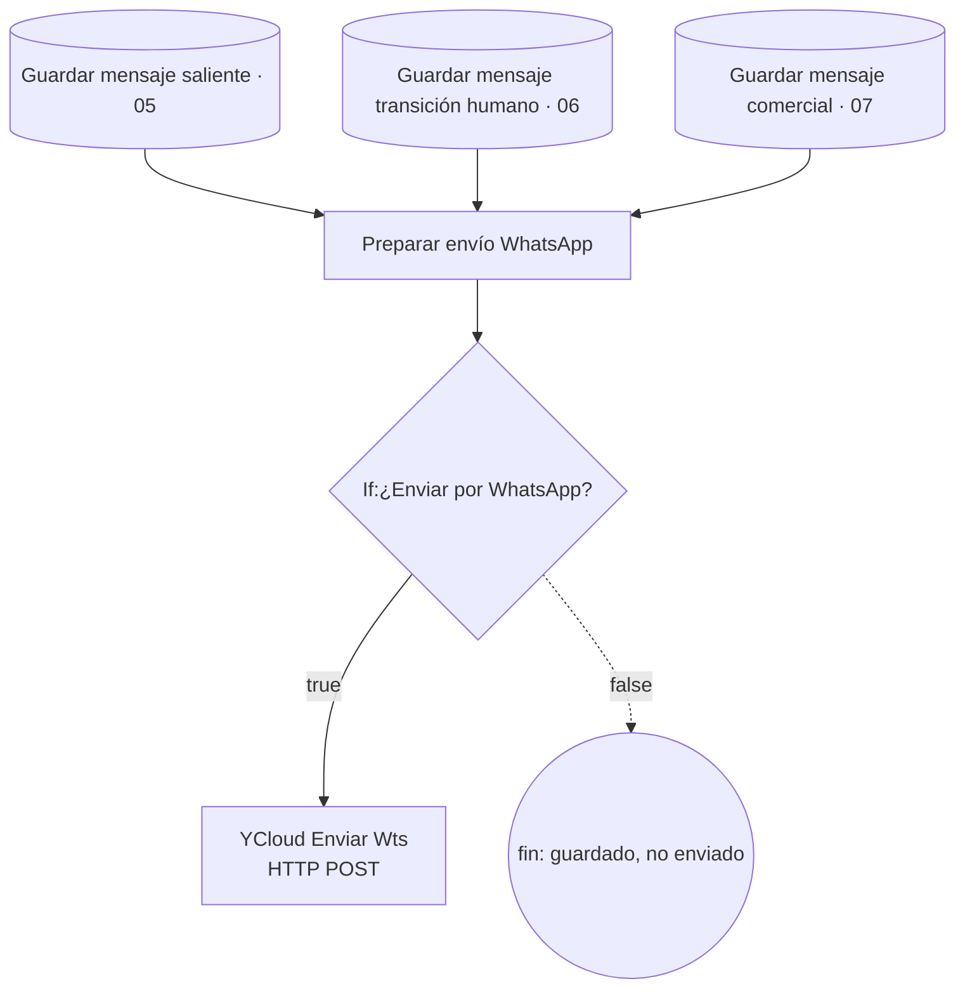

# Etapa 08 · Salida WhatsApp

Punto común de envío. Recibe la fila que acaba de insertarse en `mensajes` desde tres ramas y la manda al cliente por la API de YCloud, siempre que la ejecución haya nacido de un webhook real.

El mensaje **ya está guardado** antes de llegar aquí: si YCloud falla, en la base queda como enviado (`procesado = true` en 05 y 07). La respuesta de YCloud (id del mensaje, estado) no se guarda en ningún lado (pendiente técnico 39).

## Nodos

### Preparar envío WhatsApp · Code

Archivo: [`code/08-salida-whatsapp/preparar-envio-whatsapp.js`](../../code/08-salida-whatsapp/preparar-envio-whatsapp.js)

Entrada: la fila de `mensajes` (`id`, `conversacion_id`, `contenido`, `tipo`…).

1. **Texto**: `contenido`. Si viene vacío **lanza error** (pendiente técnico 22).
2. **Destino**: `telefono` del input (la fila de `mensajes` no lo tiene) o el de `$('Recuperar decisión comercial')`. Solo dígitos; sin teléfono lanza error.
3. **¿Webhook real?** Sí si `$('Preparar entrada WhatsApp')` corrió con `entrada_whatsapp_preparada` y canal `WHATSAPP`, o si `$('Normalizar evento WhatsApp').evento_whatsapp` es procesable, de canal `WHATSAPP` y origen `YCLOUD`. En ejecuciones con "Mensaje entrante TEST" esos nodos no corrieron y el resultado es `false`.
4. **Proveedor**: `evento_whatsapp.origen`. Solo `YCLOUD` se envía. Un webhook directo de Meta Cloud API queda como `ORIGEN_NO_ES_YCLOUD`.
5. **Emisor**: `evento_whatsapp.display_phone_number`. Si falta, usa el número fijo de Pegaso que está en el código (`593962645735`).
6. **Tipo**: solo `TEXTO`.

Salida principal:

| Campo | Contenido |
|---|---|
| `enviar_whatsapp` | `true` solo si todo lo anterior se cumple |
| `motivo_no_envio` | `EJECUCION_NO_ORIGINADA_EN_WEBHOOK_WHATSAPP`, `ORIGEN_NO_ES_YCLOUD`, `TIPO_MENSAJE_NO_SOPORTADO`… o `null` |
| `ycloud_request.body` | `{ from: "+593…", to: "+593…", type: "text", text: { body } }` |
| `mensaje_db_id`, `conversacion_id`, `telefono_destino`, `telefono_emisor` | diagnóstico |
| `waba_id`, `mensaje_entrante_id` | del evento entrante, para trazabilidad |

### If:¿Enviar por WhatsApp? · IF

Condición `{{ $json.enviar_whatsapp }}` **is true**, sin *Convert types*. La salida false no tiene nodos: el mensaje queda solo en la base.

### YCloud Enviar Wts · HTTP Request

| Parámetro | Valor |
|---|---|
| Method | `POST` |
| URL | `https://api.ycloud.com/v2/whatsapp/messages` |
| Authentication | Generic Credential Type → **Header Auth** (credencial "Header Auth account 2", guarda la API key de YCloud) |
| Send Headers | `Content-Type: application/json` |
| Send Body | JSON, *Using JSON*: `{{ $json.ycloud_request.body }}` |

La API key vive solo en la credencial de n8n; no se versiona. *Options* está vacío. *Verificar* en la pestaña Settings si tiene *Retry On Fail* u *On Error*: sin ellos, un error de YCloud hace fallar la ejecución después de haber guardado el mensaje.

## Efecto

No escribe en la base. Envía un mensaje de WhatsApp desde el número de Pegaso al cliente.

## Pruebas

`tests/fixtures/08-*.json`: envío desde un webhook de YCloud, ejecución manual de prueba (no envía y usa el emisor de respaldo), webhook directo de Meta (no envía) y mensaje sin texto (error, pendiente 22).
