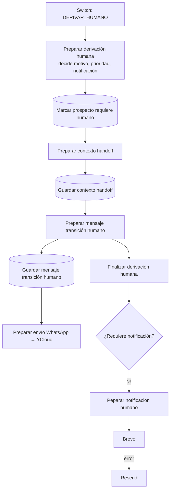

# Flujo de derivación humana (handoff)

Qué pasa cuando el bot decide que una persona del equipo debe continuar la conversación. Código en `code/06-derivacion-humana/`; configuración de cada nodo en [etapas/06-derivacion-humana.md](etapas/06-derivacion-humana.md).

## Cuándo se deriva

La IA elige `accion = DERIVAR_HUMANO` y el validador lo **exige** en estas intenciones:

| Intención del cliente | Ejemplo | Motivo esperado |
|---|---|---|
| REPORTAR_PAGO | "ya le transferí", envía comprobante | REPORTA_PAGO / ENVIA_COMPROBANTE |
| CONFIRMAR_PEDIDO | "sí, hagámoslo" | CONFIRMAR_PEDIDO |
| SOLICITAR_LLAMADA | "llámeme" | SOLICITA_LLAMADA |
| SOLICITAR_HUMANO | "quiero hablar con una persona" | SOLICITA_HABLAR_CON_PERSONA |
| NEGOCIAR | "¿me deja más barato?" | NEGOCIACION |
| RECLAMO | queja por pedido | RECLAMO |
| CONSULTAR_PAGO concreto | "pásame una cuenta" | SOLICITA_DATOS_PAGO (clasificación A) |

Una pregunta general sobre cómo pagar ("¿cómo es el pago?") **no** deriva: responde con `INFORMAR_METODOLOGIA_PAGO`.

Además, "Normalizar decisión IA" (etapa 04) **fuerza** la derivación por evidencia multimedia del turno, aunque el cerebro no la haya pedido:

| Evidencia (de [imágenes del turno](etapas/03-conversacion.md#imágenes-del-turno)) | Decisión | Motivo |
|---|---|---|
| Imagen analizada como comprobante de pago | `REPORTAR_PAGO` + `DERIVAR_HUMANO` (clasificación A, ALTA). El bot **no** confirma el pago | ENVIA_COMPROBANTE |
| Imagen ilegible, ambigua, de confianza baja, no analizada o con fallo de descarga/IA | `DERIVAR_HUMANO` | IMAGEN_REQUIERE_REVISION |
| Audio, video, documento, imagen GIF/HEIC | `DERIVAR_HUMANO` | ARCHIVO_NO_PROCESABLE |

Si el cerebro ya derivó por otro motivo, se respeta el suyo. Una imagen clara (botella, etiqueta, logo, foto no relacionada) **no** deriva: el cerebro sigue la conversación normal con el contexto visual.

## Recorrido

1. **Preparar derivación humana** (`preparar-derivacion-humana.js`): es el **único nodo que decide** motivo, clasificación del handoff, prioridad y si se notifica. Los siguientes solo conservan esas decisiones.
2. **Marcar prospecto requiere humano** (Postgres): `prospectos.requiere_humano = true` y `ultima_accion = DERIVAR_HUMANO`; el `estado` no cambia. Desde aquí el bot deja de responder a este prospecto (IF "¿Requiere atención humana?" de la etapa 03).
3. **Preparar contexto handoff** (`preparar-contexto-handoff.js`): escribe `contexto_comercial.handoff` con `activo`, `motivo`, `intencion`, `clasificacion`, `prioridad`, `requiere_notificacion`, `mensaje_cliente`, `iniciado_at`.
4. **Preparar mensaje transición humano** (`preparar-mensaje-transicion-humano.js`): elige el texto para el cliente según el motivo.
5. **Guardar mensaje transición humano** (Postgres; `procesado` debe pasar de `false` a `true`, ver [etapas/06](etapas/06-derivacion-humana.md)) y envío por WhatsApp. Los mensajes entrantes del turno que provocó el handoff ya quedaron `procesado = true` en "Confirmar turno conversacional" (etapa 04). Si el cliente escribe varias partes ("Si estoy de acuerdo" / "páseme una cuenta" / "por favor"), hay un solo handoff y un solo correo: el turno se agrupa antes del cerebro.
6. **Finalizar derivación humana** (`finalizar-derivacion-humana.js`): sale de "Preparar mensaje transición humano" en paralelo al guardado y arma el contrato final limpio.
7. **Peparar notificacion humano** (`preparar-notificacion-humano.js`): arma el correo interno (asunto, texto y HTML). Lo envía **Brevo**; si Brevo falla, **Resend**.

## Decisiones de Preparar derivación humana

**Motivo** (si la IA no lo trae, se deduce de la intención):

| Intención | Motivo |
|---|---|
| CONSULTAR_PAGO | SOLICITA_DATOS_PAGO |
| REPORTAR_PAGO | REPORTA_PAGO |
| CONFIRMAR_PEDIDO | DESEA_CONTINUAR_PEDIDO |
| NEGOCIAR | NEGOCIACION_COMERCIAL |
| RECLAMO | RECLAMO |
| SOLICITAR_LLAMADA | SOLICITA_LLAMADA |
| otra | ATENCION_COMERCIAL |

**Clasificación del handoff**: pago / reporte de pago / continuar pedido → `CIERRE_COMERCIAL`; reclamo → `POSTVENTA`; negociación → `NEGOCIACION`; llamada → `CONTACTO_DIRECTO`; resto → `REVISION_COMERCIAL`.

**Prioridad**:

- `ALTA`: SOLICITA_DATOS_PAGO, REPORTA_PAGO, ENVIA_COMPROBANTE, DESEA_CONTINUAR_PEDIDO, RECLAMO.
- `MEDIA`: NEGOCIACION_COMERCIAL, SOLICITA_LLAMADA (si no era ya ALTA).
- `NORMAL`: resto.

ENVIA_COMPROBANTE se clasifica como `CIERRE_COMERCIAL`, igual que REPORTA_PAGO.

**Notificación por correo**: sí cuando la IA lo pide, la prioridad es ALTA o el motivo es uno de SOLICITA_DATOS_PAGO, REPORTA_PAGO, ENVIA_COMPROBANTE, DESEA_CONTINUAR_PEDIDO, NEGOCIACION_COMERCIAL, RECLAMO, SOLICITA_LLAMADA, ARCHIVO_REQUIERE_REVISION, DISENO_REQUIERE_REVISION, IMAGEN_REQUIERE_REVISION, ARCHIVO_NO_PROCESABLE, ARCHIVO_DISENO, COTIZACION_ESPECIAL. En la práctica, solo `ATENCION_COMERCIAL` con prioridad normal se queda sin correo.

## Mensaje al cliente

| Motivo | Texto |
|---|---|
| Datos de pago | En breve le pasamos nuestros datos personales y números de cuenta. |
| Reporte de pago (REPORTA_PAGO, ENVIA_COMPROBANTE) | Gracias. Permítame un momento por favor, ya verificamos su pago para continuar con el pedido. |
| Continuar pedido | …ya verificamos los datos para continuar con su pedido. |
| Llamada | …ya verificamos su solicitud. |
| Imagen (IMAGEN_REQUIERE_REVISION, IMAGEN_NO_ANALIZABLE) | Permítame un momento por favor, ya revisamos la imagen que nos envió. |
| Archivo / diseño (incl. ARCHIVO_NO_PROCESABLE, ARCHIVO_DISENO) | …ya revisamos el archivo que nos envió. |
| Negociación | …ya verificamos su requerimiento. |
| Reclamo | Gracias por indicarnos lo ocurrido. … ya revisamos su caso. |
| Por defecto | Permítame un momento por favor, ya verificamos su requerimiento. |

## Correo interno

Generado en `preparar-notificacion-humano.js`. Destinatarios, remitente y API keys están en los nodos HTTP de Brevo y Resend en n8n.

| Categoría | Prioridad | Asunto |
|---|---|---|
| INTERESADO_PAGO | ALTA | 🔥 Pegaso - Prospecto solicita datos de pago |
| PAGO_REPORTADO | ALTA | 💰 Pegaso - Prospecto reportó un pago |
| RECLAMO | ALTA | ⚠️ Pegaso - Reclamo requiere atención |
| ARCHIVO_REQUIERE_REVISION | — | 📎 Pegaso - Archivo requiere revisión |
| SOLICITA_CONTACTO | MEDIA | Pegaso - Prospecto requiere revisión |
| NEGOCIACION | — | Pegaso - Prospecto requiere revisión |
| REVISION_GENERAL | — | Pegaso - Prospecto requiere revisión |

ENVIA_COMPROBANTE cae en PAGO_REPORTADO; IMAGEN_REQUIERE_REVISION, ARCHIVO_NO_PROCESABLE y ARCHIVO_DISENO en ARCHIVO_REQUIERE_REVISION.

⚠️ Las categorías del correo usan nombres de motivo distintos a los que genera "Preparar derivación humana" (por ejemplo `SOLICITA_DATOS_PAGO` no se reconoce y cae en REVISION_GENERAL). Ver [pendientes-tecnicos.md](pendientes-tecnicos.md).

## Cómo vuelve el bot a atender

El handoff no tiene salida automática: mientras `prospectos.requiere_humano = true`, cada mensaje nuevo del prospecto se guarda y el flujo termina en "Finalizar mensaje atención humana". Para devolver la conversación al bot hay que poner `requiere_humano = false` en la base de datos.
