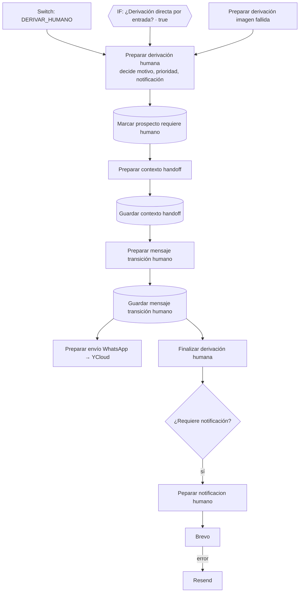

# Flujo de derivación humana (handoff)

Qué pasa cuando el bot decide que una persona del equipo debe continuar la conversación. Código en `code/06-derivacion-humana/`; configuración de cada nodo en [etapas/06-derivacion-humana.md](etapas/06-derivacion-humana.md).

## Cuándo se deriva

La IA elige `accion = DERIVAR_HUMANO` y el validador lo **exige** en estas intenciones:

| Intención del cliente | Ejemplo | Motivo esperado |
|---|---|---|
| REPORTAR_PAGO | "ya le transferí", envía comprobante | REPORTA_PAGO / ENVIA_COMPROBANTE |
| CONFIRMAR_PEDIDO | "sí, hagámoslo" | CONFIRMAR_PEDIDO |
| SOLICITAR_LLAMADA | "llámeme" | SOLICITA_LLAMADA |
| SOLICITAR_HUMANO | "quiero hablar con una persona" | SOLICITA_HABLAR_CON_PERSONA |
| NEGOCIAR | "¿me deja más barato?" | NEGOCIACION |
| RECLAMO | queja por pedido | RECLAMO |
| CONSULTAR_PAGO concreto | "pásame una cuenta" | SOLICITA_DATOS_PAGO (clasificación A) |

Una pregunta general sobre cómo pagar ("¿cómo es el pago?") **no** deriva: responde con `INFORMAR_METODOLOGIA_PAGO`.

Además, "Normalizar decisión IA" (etapa 04) **fuerza** la derivación por evidencia multimedia del turno, aunque el cerebro no la haya pedido:

| Evidencia (de [imágenes del turno](etapas/03-conversacion.md#imágenes-del-turno)) | Decisión | Motivo |
|---|---|---|
| Imagen analizada como comprobante de pago | `REPORTAR_PAGO` + `DERIVAR_HUMANO` (clasificación A, ALTA). El bot **no** confirma el pago | ENVIA_COMPROBANTE |
| Imagen analizada pero ilegible, ambigua o de confianza baja (`requiere_revision_humana`) | `DERIVAR_HUMANO` | IMAGEN_REQUIERE_REVISION |
| Audio, video, documento, imagen GIF/HEIC | `DERIVAR_HUMANO` | ARCHIVO_NO_PROCESABLE |

Si el cerebro ya derivó por un motivo concreto, se respeta el suyo (si derivó con `NINGUNO` u `OTRO`, gana el de la evidencia). Una imagen clara (botella, etiqueta, logo, foto no relacionada) **no** deriva: el cerebro sigue la conversación normal con el contexto visual.

## Derivaciones directas (sin cerebro)

Dos casos llegan a "Preparar derivación humana" sin pasar por la IA comercial, y usan la **misma** ruta (persistencia, mensaje de transición y notificación):

| Origen | Cuándo | Entra por | Motivo / clasificación / prioridad | `origen_derivacion` |
|---|---|---|---|---|
| Entrada no soportada | Ubicación, contacto, interactivo o tipo desconocido (etapa 01) | "IF: ¿Derivación directa por entrada?" (true), después de "IF: ¿Procesar turno?" | `ENTRADA_NO_SOPORTADA` / `REVISION_COMERCIAL` / MEDIA (o `IMAGEN_REQUIERE_REVISION` / `ARCHIVO_NO_PROCESABLE` si la media llegó sin `media_id`) | `ENTRADA_NO_SOPORTADA` |
| Imagen fallida | La imagen falla en Groq, DeepSeek **y** OpenAI (descarga fallida, IA caída o salida inválida) | "Preparar derivación imagen fallida", desde "IF ¿Análisis OpenAI válido?" (false) | `IMAGEN_REQUIERE_REVISION` / `REVISION_IMAGEN` / MEDIA, `intencion = OTRO`, `derivacion_directa_motivo = FALLO_TOTAL_ANALISIS_IMAGEN`, `analisis_imagen_fallido = true` | `ANALISIS_IMAGEN` |

Las dos marcan `derivacion_directa = true` y notifican siempre. Ninguna confirma el turno en "Confirmar turno conversacional" (etapa 04, que solo corre con el cerebro): el mensaje de transición SALIENTE cierra el turno y el siguiente mensaje del cliente ya encuentra `requiere_humano = true`.

## Recorrido

1. **Preparar derivación humana** (`preparar-derivacion-humana.js`): es el **único nodo que decide** motivo, clasificación del handoff, prioridad y si se notifica. Los siguientes solo conservan esas decisiones. Recupera la identidad de nodos anteriores si la entrada no la trae (las derivaciones directas no pasan por "Recuperar decisión comercial").
2. **Marcar prospecto requiere humano** (Postgres): `prospectos.requiere_humano = true` y `ultima_accion = DERIVAR_HUMANO`; el `estado` no cambia. Desde aquí el bot deja de responder a este prospecto (IF "¿Requiere atención humana?" de la etapa 03).
3. **Preparar contexto handoff** (`preparar-contexto-handoff.js`): escribe `contexto_comercial.handoff` con `activo`, `motivo`, `intencion`, `clasificacion`, `prioridad`, `requiere_notificacion`, `mensaje_cliente`, `origen`, `iniciado_at`.
4. **Preparar mensaje transición humano** (`preparar-mensaje-transicion-humano.js`): elige el texto para el cliente según el motivo.
5. **Guardar mensaje transición humano** (Postgres; `procesado` debe pasar de `false` a `true`, ver [etapas/06](etapas/06-derivacion-humana.md)) y envío por WhatsApp. Los mensajes entrantes del turno que provocó el handoff ya quedaron `procesado = true` en "Confirmar turno conversacional" (etapa 04). Si el cliente escribe varias partes ("Si estoy de acuerdo" / "páseme una cuenta" / "por favor"), hay un solo handoff y un solo correo: el turno se agrupa antes del cerebro.
6. **Finalizar derivación humana** (`finalizar-derivacion-humana.js`): arma el contrato final limpio. Puede colgar de "Guardar mensaje transición humano" o, en paralelo al guardado, de "Preparar mensaje transición humano": lee el contrato con `$()`.
7. **Peparar notificacion humano** (`preparar-notificacion-humano.js`): arma el correo interno (asunto, texto y HTML). Lo envía **Brevo**; solo si Brevo falla (su salida de error), **Resend**.

## Decisiones de Preparar derivación humana

**Motivo**: se respeta el que trae la IA o la derivación directa. Si es `NINGUNO`, no viene, o es `OTRO` con una intención concreta, se deduce de la intención:

| Intención | Motivo |
|---|---|
| CONSULTAR_PAGO | SOLICITA_DATOS_PAGO |
| REPORTAR_PAGO | REPORTA_PAGO |
| CONFIRMAR_PEDIDO / ACEPTAR_COTIZACION | DESEA_CONTINUAR_PEDIDO |
| NEGOCIAR | NEGOCIACION_COMERCIAL |
| RECLAMO | RECLAMO |
| SOLICITAR_LLAMADA | SOLICITA_LLAMADA |
| SOLICITAR_HUMANO | SOLICITA_HABLAR_CON_PERSONA |
| otra | ATENCION_COMERCIAL (u `OTRO` si ese era el motivo) |

**Clasificación del handoff** (si no viene): pago / reporte de pago / comprobante / continuar pedido → `CIERRE_COMERCIAL`; reclamo y problemas → `POSTVENTA`; negociación → `NEGOCIACION`; llamada o persona → `CONTACTO_DIRECTO`; imagen → `REVISION_IMAGEN`; archivo o diseño → `REVISION_ARCHIVO`; resto (incluida entrada no soportada) → `REVISION_COMERCIAL`.

**Prioridad**: la **mayor** entre la recibida y la mínima del motivo. Nunca baja una ALTA que haya puesto la IA.

- Mínima `ALTA`: SOLICITA_DATOS_PAGO, REPORTA_PAGO, ENVIA_COMPROBANTE, DESEA_CONTINUAR_PEDIDO, CONFIRMAR_PEDIDO, RECLAMO, PROBLEMA_PAGO, PROBLEMA_PEDIDO, PROBLEMA_ENTREGA.
- Mínima `MEDIA`: NEGOCIACION_COMERCIAL, NEGOCIACION, SOLICITA_LLAMADA, SOLICITA_HABLAR_CON_PERSONA, IMAGEN_REQUIERE_REVISION, ARCHIVO_NO_PROCESABLE, ARCHIVO_DISENO, DISENO_ESPECIAL, ENTRADA_NO_SOPORTADA.
- `NORMAL`: resto.

**Notificación por correo**: sí cuando se pide, la prioridad es ALTA o el motivo está en las listas ALTA o MEDIA de arriba (o es ARCHIVO_REQUIERE_REVISION, DISENO_REQUIERE_REVISION, COTIZACION_ESPECIAL). Una notificación pedida nunca se apaga. En la práctica, solo `ATENCION_COMERCIAL` con prioridad normal se queda sin correo.

Ejemplo: "Hola. Envíeme un número de cuenta por favor." → `CONSULTAR_PAGO` / `DERIVAR_HUMANO` / `SOLICITA_DATOS_PAGO` / `CIERRE_COMERCIAL` / ALTA / notifica.

## Mensaje al cliente

| Motivo | Texto |
|---|---|
| Datos de pago | En breve le pasamos nuestros datos personales y números de cuenta. |
| Reporte de pago (REPORTA_PAGO, ENVIA_COMPROBANTE) | Gracias. Permítame un momento por favor, ya verificamos su pago para continuar con el pedido. |
| Continuar pedido | …ya verificamos los datos para continuar con su pedido. |
| Llamada | …ya verificamos su solicitud. |
| Imagen (IMAGEN_REQUIERE_REVISION, IMAGEN_NO_ANALIZABLE) | Permítame un momento por favor, ya revisamos la imagen que nos envió. |
| Archivo / diseño (incl. ARCHIVO_NO_PROCESABLE, ARCHIVO_DISENO) | …ya revisamos el archivo que nos envió. |
| Entrada no soportada (ENTRADA_NO_SOPORTADA) | …ya revisamos el mensaje que nos envió. |
| Negociación | …ya verificamos su requerimiento. |
| Reclamo | Gracias por indicarnos lo ocurrido. … ya revisamos su caso. |
| Por defecto | Permítame un momento por favor, ya verificamos su requerimiento. |

## Correo interno

Generado en `preparar-notificacion-humano.js`. Destinatarios, remitente y API keys están en los nodos HTTP de Brevo y Resend en n8n (placeholders en [etapas/06](etapas/06-derivacion-humana.md#brevo---enviar-notificación-humana--resend---enviar-notificación-humana--http-request)).

| Categoría | Motivos | Prioridad mínima | Asunto |
|---|---|---|---|
| INTERESADO_PAGO | SOLICITA_DATOS_PAGO (y variantes) | ALTA | 🔥 Pegaso - Prospecto solicita datos de pago |
| PAGO_REPORTADO | REPORTA_PAGO, ENVIA_COMPROBANTE | ALTA | 💰 Pegaso - Prospecto reportó un pago |
| CONTINUAR_PEDIDO | DESEA_CONTINUAR_PEDIDO, CONFIRMAR_PEDIDO | ALTA | 🔥 Pegaso - Prospecto quiere continuar con su pedido |
| RECLAMO | RECLAMO, PROBLEMA_* | ALTA | ⚠️ Pegaso - Reclamo requiere atención |
| SOLICITA_CONTACTO | SOLICITA_LLAMADA, SOLICITA_HABLAR_CON_PERSONA | MEDIA | 📞 Pegaso - Prospecto solicita contacto |
| NEGOCIACION | NEGOCIACION_COMERCIAL, NEGOCIACION | MEDIA | 💬 Pegaso - Prospecto quiere negociar |
| ARCHIVO_REQUIERE_REVISION | IMAGEN_REQUIERE_REVISION, ARCHIVO_NO_PROCESABLE, ARCHIVO_DISENO | MEDIA | 📎 Pegaso - Archivo requiere revisión |
| ENTRADA_REQUIERE_REVISION | ENTRADA_NO_SOPORTADA | MEDIA | 📎 Pegaso - Mensaje no soportado requiere revisión |
| REVISION_GENERAL | resto (antes se intenta por intención) | — | Pegaso - Prospecto requiere revisión |

La prioridad del correo es la mayor entre la del handoff y la mínima de la categoría: una llamada que llegó ALTA sigue ALTA. El correo lleva Prioridad, Categoría, Motivo, Intención, Origen, Prospecto, Teléfono, Ciudad, Clasificación y el último mensaje real del cliente.

## Cómo vuelve el bot a atender

El handoff no tiene salida automática: mientras `prospectos.requiere_humano = true`, cada mensaje nuevo del prospecto se guarda y el flujo termina en "Finalizar mensaje atención humana". Para devolver la conversación al bot hay que poner `requiere_humano = false` en la base de datos.
